# 操作系统·5 设备管理

## 考纲内容

1. I/O管理基础
   - 设备：设备的基本概念，设备的分类，I/O接口。
   - I/O控制方式：轮询方式，中断方式，DMA方式。
   - I/O软件层次结构：中断处理程序，驱动程序，设备独立性软件，用户层I/O软件。
   - 输入输出应用程序接口：字符设备接口，块设备接口，网络设备接口，阻塞/非阻塞I/O。
2. 设备独立软件
   - 缓冲区管理。
   - 设备分配与回收。
   - 假脱机技术SPOOLing。
   - 设备驱动程序接口。
3. 外存管理
   - 磁盘：磁盘结构，格式化，分区，磁盘调度方法。
   - 固态硬盘：读写性能特效，磨损均衡。

## I/O概述

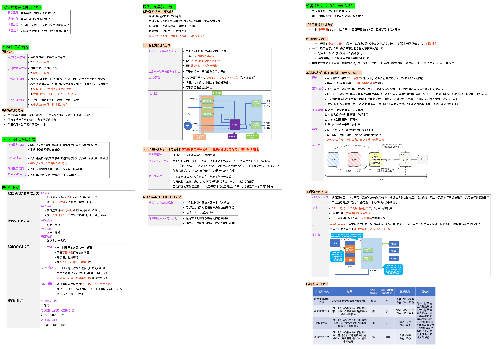

### I/O设备基本概念

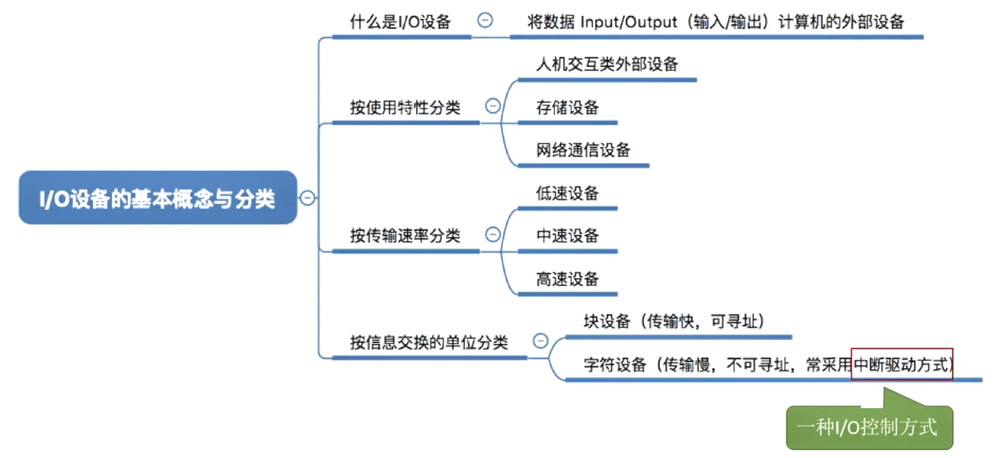

> [!NOTE] **I/O 设备基本概念**：
>
> - **定义**：输入/输出设备是计算机与外界交互的硬件。
> - **抽象**：UNIX 系统将设备抽象为 **特殊文件**，通过文件接口管理。

#### I/O设备分类

> [!NOTE] **I/O 设备分类**：
>
> - **按交换单位**：块设备（磁盘，可寻址）/ 字符设备（键盘，不可寻址）。
> - **按传输速率**：低速、中速、高速。
> - **按使用特性**：人机交互、存储、网络通信。

### I/O接口/设备控制器

- I/O设备由机械部件和电子部件（I/O控制器或设备控制器）组成。
- 通过I/O逻辑实现设备控制。
- I/O设备的机械部件主要用来执行具体I/O操作。如鼠标/键盘的按钮，显示器的LED屏，移动硬盘的磁臂、磁盘盘面。
- I/O设备的电子部件通常是一块插入主板扩充槽的印刷电路板。
- CPU无法直接控制I/O设备的机械部件，因此I/O设备还要有一个电子部件作为CPU和I/O设备机械部件之间的“中介”，用于实现CPU对设备的控制。

#### 设备控制器的组成

**I/O接口**（**设备控制器**）位于CPU与设备之间，它既要与CPU通信，又要与设备通信，还要具有按CPU发来的命令去控制设备工作的功能

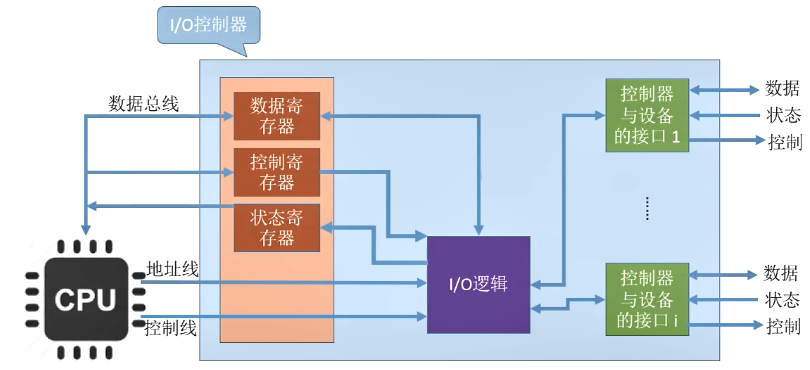

如图所示，主要由三部分组成：

1.  CPU与设备控制器的接口
    - 用于实现CPU与控制器之间的通信

    - 该接口有三类信号线
      - CPU通过**控制线**发出命令
      - 通过**地址线**指明要操作的设备
      - 通过**数据线**来取出（输入）数据或放入（输出）数据。

    - 会设置相应的寄存器用于暂时存放数据
      - 数据寄存器
        - 存放从设备送来的输入数据或从CPU送来的输出数据
      - 控制寄存器
        - 存放从CPU送来的控制信息
      - 状态寄存器
        - 存放从CPU送来的设备的状态信息

2.  I/O逻辑
    - 负责接收和识别CPU的各种命令（如地址译码），并负责对设备发出命令。

3.  控制器与设备的接口
    - 用于实现控制器与设备之间的通信，包括数据、状态和控制。

> 【注意】：
>
> 1. 一个I/O控制器可能会对应多个设备。
> 2. 寄存器可能有多个（如每个控制/状态寄存器对应一个具体的设备），且这些寄存器都要有相应的地址，才能方便CPU操作。
>    - 有的计算机会让这些寄存器占用内存地址的一部分，称为内存映像I/O
>    - 另一些计算机则采用I/O专用地址，即寄存器独立编址。
>
> [!TIP] **I/O 端口编址方式**：
>
> 1. **独立编址**：专用 I/O 指令，不占用内存空间，但指令集复杂。
> 2. **统一编址 (内存映射 I/O)**：寄存器占用内存地址，可使用内存指令访问，更灵活。

#### I/O控制器功能

- 接受和识别CPU发出的命令
  - 如CPU发来的Read/Write命令，I/O控制器中会有相应的控制寄存器来存放命令和参数。
- 数据交换
  - I/O控制器中会设置相应的数据寄存器
  - 输出时，数据寄存器用于暂存CPU发来的数据，之后再由控制器传送设备
  - 输入时，数据寄存器用于暂存设备发来的数据，之后CPU从数据寄存器中取走数据。
- 标识和报告设备的状态，以供CPU处理
  - I/O控制器中会有相应的状态寄存器，用于记录I/O设备的当前状态。如 $1$ 表示空闲，$0$表示忙碌。
- 地址识别
  - 类似于内存的地址，为了区分设备控制器中的各个寄存器，也需要给各个寄存器设置一个特定的“地址”
  - I/O控制器通过CPU提供的“地址”来判断CPU要读/写的是哪个寄存器。

#### I/O 端口

I/O端口是指**设备控制器**中可被CPU直接访问的寄存器，主要有以下三类寄存器：

1.  数据寄存器：实现CPU和外设之间的数据缓冲。
2.  状态寄存器：获取执行结果和设备的状态信息， 以让CPU知道是否准备好。
3.  控制寄存器：由CPU写入，以便启动命令或更改设备模式

为了实现CPU与I/O端口进行通信，有两种方法：

1.  独立编址：为每个端口分配一个I/O端口号所有I/O端口形成I/O端口空间，普通用户程序不能对其进行访问，只有操作系统使用特殊的I/O指令才能访问端口。
2.  统一编址：又称内存映射I/O，每个端口被分配唯一的内存地址，且不会有内存被分配这一地址，通常分配给端口的地址靠近地址空间的顶端

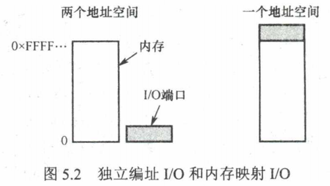

### I/O控制方式

设备管理的主要任务之一是控制设备和内存或CPU之间的数据传送

I/O控制方式主要分为

1. 程序直接控制方式
2. 中断驱动方式
3. DMA方式
4. 通道控制方式

> 对于每种方式需要注意的问题
>
> 1. 完成一次读写操作的流程：
> 2. CPU干预的频率：
> 3. 数据传送的单位：
> 4. 数据的流向：
> 5. 主要缺点和主要优点

> [!IMPORTANT]
> **程序直接控制方式**：CPU 需要不断轮询检查设备状态，导致 CPU 长期处于“忙等”状态，利用率极低。数据传送以
> **字** 为单位。

> [!IMPORTANT]
> **中断驱动方式**：允许 I/O 设备主动请求服务。CPU 发出命令后可切换到其他进程，直到设备发出中断信号。相比程序直接控制，大大提高了 CPU 利用率，但由于每个字仍需 CPU 中转，频繁中断仍有一定开销。

> 中断处理过程
>
> - **中断隐指令**的主要任务（$1 $到$ 3$）：由硬件自动完成
>   1. 关中断：在中断服务程序中，为了保护中断现场（即CPU主要寄存器中的内容）期间不被新的中断所打断，必须关中断，从而保证被中断的程序在中断服务程序执行完毕之后能接着正确地执行下去。
>      - 在保护断点和现场的过程中，CPU不能响应更高级中断源的中断请求
>      - 否则，若断点或现场保存不完整，在中断服务程序结束后，就不能正确地恢复并继续执行现行程序
>   2. 保存断点：为了保证在中断服务程序执行完毕后能正确地返回到原来的程序，必须将原来程序的断点（即程序计数器PC的内容）保存起来。
>      - 可以存入堆栈寄存器，也可以存入指定单元。
>      - 异常指令通常并没有执行成功，**异常处理后要重新执行**，所以其**断点是当前指令的地址**，**中断的断点则是下一条指令的地址**。
>   3. 引出中断服务程序：识别中断源，引出中断服务程序的实质就是取出中断服务程序的入口地址(起始地址)并传送给**程序计数器**PC。有两种方法识别中断源：
>      1. 软件查询法/非向量中断。
>         - 由测试程序按一定优先排队次序检查各个设备的“中断触发器”。
>         - 当遇到第一个‘1’标志时，即找到了优先进行处理的中断源，通常取出其设备码，根据设备码转入相应的中断服务程序。
>      2. 硬件向量法：每个中断有类型号，每个中断类型号对应一个中断服务程序，每个程序有一个入口地址，CPU需要找到这个地址，这就是**中断向量**（也就是入口地址）。
>         - 由中断向量地址形成硬件产生中断向量地址（中断类型号），再由向量地址找到入口地址。
>         - 系统中保存中断向量的存储器就是中断向量表。
>           - **中断向量就是服务程序的入口地址，中断向量地址是入口地址的地址**
>         - **采用中断向量法的中断被称为向量中断**
>
> - 中断服务程序的任务（$4 $到$ 9$）：由中断服务程序完成 4. 保存现场和中断屏蔽字：-
>   **保存程序断点PC由中断隐指令完成** - 可以使用堆栈，也可以使用特定存储单元。-
>   **现场和断点都不能被中断服务程序破坏**。-
>   **现场信息是用户可见的寄存器的内容**，现场信息因为用指令可直接访问，所以通常在中断服务程序中通过指令把它们保存到栈中，即**由软件实现** - 保存通用寄存器和状态寄存器的内容，由中断服务程序完成，例如保存ACC寄存器的值 - 而**断点信息**由CPU在中断响应时自动保存到栈或专门寄存器中，即**由硬件实现**。
>   5.  开中断。允许更高级中断请求得到响应，实现中断嵌套。
>   6.  中断服务（设备服务）：主体部分，如通过程序控制需打印的字符代码送入打印机的缓冲存储器中。
>       - 此时可能修改ACC寄存器的值
>   7.  关中断。保证在恢复现场和屏蔽字时不被中断。
>   8.  恢复现场：通过出栈指令或取数指令把之前保存的信息送回寄存器中。
>       - 恢复ACC寄存器的值
>   9.  开中断，中断返回：通过中断返回指令回到原程序断点处。

> [!IMPORTANT] **DMA 方式 (Direct Memory Access)**：
>
> 1. 数据单位：**块**。
> 2. 流向：设备 $\leftrightarrow$ 内存（不再经 CPU 中转）。
> 3. 干预：仅在块传输开始和结束时。这极大释放了 CPU，适用于高速、大批量数据的块设备。

- DMA控制器结构：与I/O控制器结构类似：
  - 主机控制器接口：
    - **命令/状态寄存器**CR（Command Register）：用于存放CPU发来的I/O命令，或设备的状态信息。
    - **内存地址寄存器**MAR（Memory Address
      Register）：在输入时，MAR表示数据应放到内存中的什么位置，输出时MAR表示要输出的数据放在内存中的什么位置。
    - **数据寄存器**DR（Data Register）：暂存从设备到内存，或从内存到设备的数据。
    - **数据计数器**DC（Data Counter）：存放本次要传送的字（节）数。
  - I/O控制逻辑：用于实现设备控制。
  - 块设备控制器接口。

  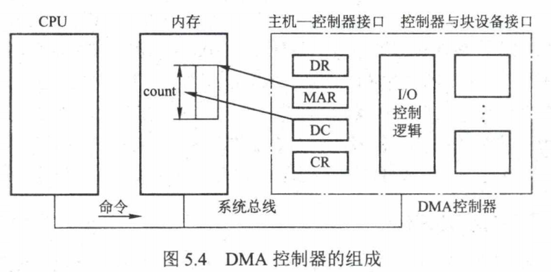

- 完成读写的流程：
  1. CPU接收到I/O设备的DMA请求后给DMA控制器发出一条命令，同时设置**内存地址寄存器**MAR和**数据计数器**DC初值，启动DMA控制器
     - CPU指明此次要进行的操作，如读操作说明要读入多少数据、数据要存放在内存的什么位置、数据在外部设备上的地址。
  2. CPU转向其他工作，DMA控制器根据CPU所给参数完成工作。
     - DMA控制器直接与存储器交互，传送整个数据块，每次传送一个字，这个过程不需要CPU参与
  3. 完成工作后DMA控制器向CPU发送一个中断信号
     - CPU处理中断。
     - 只有在传送开始和结束时才需要CPU的参与

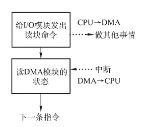

> [!IMPORTANT] **I/O 控制方式对比**：
>
> 1. **程序直接控制**：CPU 轮询，浪费严重，以 **字** 为单位。
> 2. **中断驱动**：设备主动中断，提高 CPU 并行度，以 **字** 为单位。
> 3. **DMA 方式**：专用控制器，直接在设备与内存间搬运，以 **块** 为单位。
> 4. **通道控制**：专用处理机，可执行通道程序，管理大量设备，以 **一组块** 为单位。

DMA的控制器与CPU分时使用内存，通常采用以下三种方法：停止CPU访内存、周期挪用、DMA与CPU交替访内存。（计算机组成原理会具体讲到）

> DMA传送方式
>
> 当I/O设备和CPU同时访问主存时，可能发生冲突，为了有效地使用主存，DMA控制器与CPU通常采用以下三种方法使用主存：
>
> 1. 停止CPU访问主存：当I/O设备有DMA请求时，由DMA控制器向CPU发送一个停止信号， 使CPU脱离总线，停止访问主存，直到DMA传送一块数据结束
>    - 控制简单。
>    - CPU处于不工作状态或保持状态。
>    - 未充分发挥CPU对主存的利用率。
>
>      
>
> 2. 周期挪用（周期窃取）：当I/O接口没有DMA请求时，CPU按程序要求访问内存，一旦I/O接口有DMA请求，则I/O接口挪用一个或几个周期
>    - 周期指主存的存取周期
>    - 当I/O设备有DMA请求时，会遇到3种情况
>      1. CPU此时不访存：不冲突。
>         - 如CPU正在执行乘法指令
>      2. CPU正在访存：此时必须**待存取周期结束后**，CPU再将总线占有权让出给DMA。
>      3. CPU、DMA同时请求访存：DMA的I/O访存优先，挪用几个存取周期。传输一个字后立刻释放总线，是一种单字传送方式。
>         - I/O访存优先级高于CPU访存，因为**I/O不立即访存就可能丢失数据**
>    - 缺点：数据输入或输出过程中实际占用了CPU时间
> 3. DMA和CPU交替访存：将一个CPU周期分为两个周期，一个给DMA使用一个给CPU使用：
>    - 例如，若CPU的工作周期是$1.2\mu s $，主存的存取周期小于$ 0.6\mu
>      s$，则可将一个CPU周期分为C1和C2两个周期，其中C1专供DMA访存，C2专供CPU访存
>    - 不需要总线使用权的申请、建立和归还过程。
>    - 效率高，但实现起来有困难，基本上不被使用。
>    - 适用于CPU的工作周期比主存存取周期长的情况
>
>      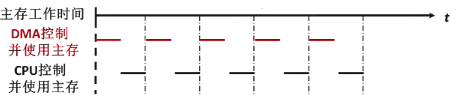

> [!NOTE] **I/O 控制方式演进**： **程序轮询** $\to$ **中断驱动** $\to$ **DMA** $\to$
> **通道**。本质上是不断减小 CPU 的干预频率，让 CPU 能更多地处理逻辑运算，而将繁琐的数据搬运交给专用控制器或处理机。

### I/O软件层次结构

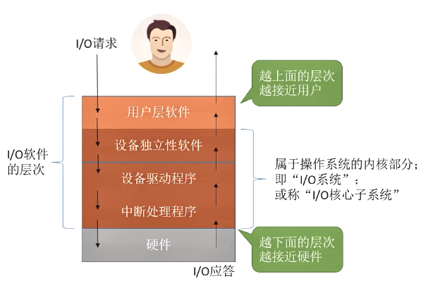

> [!IMPORTANT] **I/O 软件层次结构** (由下至上)：
>
> 1. **硬件**
> 2. **中断处理程序**：屏蔽硬件中断细节。
> 3. **设备驱动程序**：屏蔽不同厂家设备的差异。
> 4. **设备独立性软件**：提供统一接口 (LUT)、缓冲管理、保护等。
> 5. **用户层软件**：提供库函数和系统调用接口。
>
>    ***
>
> 请说明以下各工作是在哪一层完成的：
>
> 1.  为磁盘读操作计算磁道、扇区和磁头，
>     - 与具体的磁盘类型有关，因此为了能够让操作系统尽可能多地支持各种不同型号的设备，应由厂商所编写的**设备驱动程序**完成
> 2.  向设备寄存器写命令。
>     - 与具体的磁盘类型有关，因此为了能够让操作系统尽可能多地支持各种不同型号的设备，应由厂商所编写的**设备驱动程序**完成
> 3.  检查用户是否有权使用设备。
>     - 涉及安全与权限问题，应由与设备无关的**操作系统**完成
> 4.  将二进制整数转换成ASCII码以便打印
>     - 应由**用户层**来完成，因为只有用户知道将二进制整数转换为ASCII码的格式
>       - 即使用二进制还是十进制、有没有特别的分隔符等

#### 用户层软件

- 用户层软件实现了与用户交互的接口，用户可直接使用/调用该层提供的、与I/O操作相关的库函数对设备进行操作。
- 一般而言，大部分的I/O软件都在操作系统内部，但仍有一小部分在用户层，包括与用户程序链接在一起的库函数。**用户层软件必须通过一组系统调用来获取操作系统服务**
- 用户层软件将用户请求翻译成格式化的I/O请求，并通过“系统调用”请求操作系统内核的服务。
  - 例如Windows API

#### 设备独立性软件/设备无关性软件

- 用于实现用户程序与设备驱动器的统一接口、设备命令、设备的保护及设备的分配与释放等，同时为设备管理和数据传送提供必要的存储空间
  - 与设备的硬件特性无关的功能几乎都在这一层实现。
  - **实现系统调用**

- 为实现设备独立性而引入了逻辑设备和物理设备这两个概念。
  - 在应用程序中，使用逻辑设备名来请求使用某类设备
    - 使用逻辑设备名的好处是：
      1.  增加设备分配的灵活性
      2.  易于实现I/O重定向，所谓I/O重定向，是指用于I/O操作的设备可以更换(即重定向)，而不必改变应用程序。

    - 用户或用户层软件发出I/O操作相关系统调用的系统调用时，需要指明此次要操作的I/O设备的逻辑设备名
    - 如去学校打印店打印时，需要选择扣印机$1 $/打印机$ 2$/打印机$3$，其实这些都是逻辑设备名
    - 设备独立性软件需要通过**逻辑设备表LUT**（Logical
      UnitTable）来确定逻辑设备对应的物理设备，并找到该设备对应的设备驱动程序。
    - 操作系统系统可以采用两种方式管理**逻辑设备表**LUT：
      1. 整个系统只设置一张**逻辑设备表**LUT
         - 这就意味着所有用户不能使用相同的逻辑设备名
         - 因此这种方式只适用于单用户操作系统。
      2. 为每个用户设置一张**逻辑设备表**LUT
         - 各个用户使用的逻辑设备名可以重复，适用于多用户操作系统
         - 系统会在用户登录时为其建立一个用户管理进程，而LUT就存放在用户管理进程的PCB中。

  - 而在系统实际执行时，必须将逻辑设备名映射成物理设备名使用

- 设备独立性
  - 为了实现设备独立性，必须再在驱动程序之上设置一层设备独立性软件。
  - 总体而言，设备独立性软件的主要功能可分为以下两个方面：
    1.  执行所有设备的公有操作，包括
        1.  对设备的分配与回收
        2.  将逻辑设备名映射为物理设备名
        3.  对设备进行保护，禁止用户直接访问设备
            - 原理类似与文件保护
            - 设备被看做是一种特殊的文件，不同用户对各个文件的访问权限是不一样的
            - 同理，对设备的访问权限也不一样。
        4.  缓冲管理
            - 可以通过缓冲技术屏蔽设备之间数据交换单位大小和传输速度的差异。
        5.  差错控制
        6.  提供独立于设备的大小统一的逻辑块，屏蔽设备之间信息交换单位大小和传输速率的差异。
    2.  向用户层(或文件层)提供统一接口，无论何种设备，它们向用户所提供的接口应是相同的。
        - 例如，对各种设备的读/写操作，在应用程序中都统一使用`read/write`命令等

#### 设备驱动程序

- 与硬件直接相关，负责具体实现系统对设备发出的操作指令，驱动I/O设备工作的驱动程序。
- 通常，**每类**设备配置一个**设备驱动程序**，它是I/O进程与设备控制器之间的通信程序，**通常以一个独立**进程**的形式存在**。
- 设备驱动程序向上层用户程序提供一组标准接口，设备具体的差别被设备驱动程序所封装，用于接收上层软件发来的抽象I/O要求
  - 如read和write命令，转换为具体要求后， 发送给设备控制器，控制I/O设备工作

  - **包括计算柱面号、磁头号和扇区号的工作**

  - 包括设置设备寄存器、检查设备状态等。

- 它也将由设备控制器发来的信号传送给上层软件，从而为I/O内核子系统隐藏设备控制器之间的差异
- 不同的I/O设备有不同的硬件特性，**具体细节只有设备的厂家才知道**，因此厂家需要根据设备的硬件特性设计并提供相应的驱动程序。
  - 例如佳能打印机的厂家规定状态寄存器为`0`代表空闲，`1`代表忙碌，且有两个数据寄存器
  - 但是惠普打印机的厂家规定状态寄存器为`1`代表空闲，`0`代表忙碌，且有一个数据寄存器

#### 中断处理程序

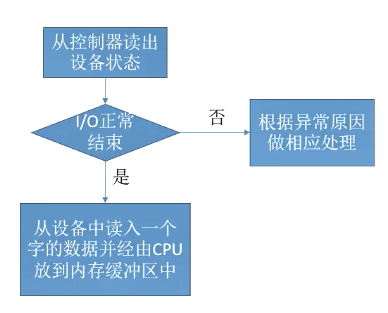

> [!TIP] **中断处理流程**：
>
> 1. 硬件自动完成（中断隐指令）：关中断 $\to$ 保存断点 $\to$ 引出服务程序。
> 2. 软件完成（服务程序）：保存现场 $\to$ 处理请求 $\to$ 恢复现场 $\to$ 中断返回。

- 中断处理层的主要任务有：进行进程**上下文的切换**，对**处理中断信号源**进行测试，**读取设备状态和修改进程状态**等。
  - 由于中断处理与硬件紧密相关，对用户而言，应尽量加以屏蔽，因此**应放在操作系统的底层**，系统的其余部分尽可能少地与之发生联系。

### 应用程序I/O接口

在I/O系统与高层之间的接口中，根据设备类型的不同，又进一步分为若干接口

- 字符设备接口。
  - 字符设备是指数据的存取和传输是以字符为单位的设备，基本特征是传输速率较低、**不可寻址**，并且在输入/输出时通常采用**中断驱动方式**。

  - `get/put`系统调用：向字符设备读/写一个字符
    - 由于字符设备不可寻址，只能采取**顺序存取方式**，通常为字符设备建立一个字符缓冲区，用户程序通过`get`操作从缓冲区获取字符，通过`put`操作将字符输出到缓冲区

  - 字符设备都属于**独占设备**，为此接口中还需要提供打开和关闭操作，以实现互斥共享

    > 相对的是共享设备，共享设备是指**一段时间内**允许多个进程同时访问的设备

- 块设备接口（Block Device Interface）：
  - 块设备是指数据的存取和传输是以数据块为单位的设备，典型的块设备是**磁盘**。基本特征是传输速率较高、**可寻址**。
    - 磁盘设备的I/O常采用DMA方式
  - 隐藏了磁盘的二维结构：**块设备接口将磁盘的所有扇区从0到n-1依次编号**，将二维结构变为一种线性序列
    - 在原本的二维结构中，每个扇区的地址需要用（磁道号，扇区号）来表示。
  - 将抽象命令映射为低层操作：块设备接口支持上层发来的对文件或设备的打开、读、写和关闭等抽象命令
    - 该接口将上述命令映射为设备能识别的较低层的具体操作。
  - 内存映射接口通过内存的字节数组来访问磁盘，而不提供读/写磁盘操作。
    - 映射文件到内存的系统调用返回包含文件副本的一个虚拟内存地址。
    - 只在需要访问内存映像时，才由虚拟存储器实际调页。
    - 内存映射文件的访问如同内存读写一样简单，极大地方便了程序员。
  - `read/write`系统调用
    - 向块设备的读写指针位置读/写多个字符
    - 这些系统调用将数据以块为单位进行传输，可以随机访问块设备中的数据。
  - `seek`系统调用
    - 修改读写指针位置
  - `ioctl`系统调用
    - 用于向块设备发送特定的控制命令，如格式化设备、获取设备信息等。
  - 缓存管理
    - 块设备接口通常会提供缓存机制，将常用的数据块缓存在内存中，以提高访问速度。

- 网络设备接口（Network Device Interface​）：许多操作系统提供的网络I/O接口为网络套接字接口
  - `socket`系统调用
    - 用于创建套接字，建立网络连接。

    - 套接字接口的系统调用使应用程序创建的本地套接字连接到远程应用程序创建的套接字，通过此连接发送和接收数据

    - 须指明网络协议(UDP/TCP)

      > 【扩展】：套接字
      >
      > - 套接字（Socket）是一种抽象概念，用于在计算机网络中实现进程间的通信。它提供了一种标准的接口，使得应用程序能够通过网络发送和接收数据。套接字可以用于不同的网络通信协议，如TCP（传输控制协议）和UDP（用户数据报协议）。
      >
      >   套接字通常由以下两个主要组件组成：
      >   1. IP地址：套接字使用IP地址来标识主机或网络上的特定设备。IP地址可以是IPv4地址（如`192.168.0.1`）或IPv6地址
      >      1. 如`2001:0db8:85a3:0000:0000:8a2e:0370:7334`
      >   2. 端口号：套接字使用端口号来标识特定的应用程序或进程。端口号是一个 $16$ 位的整数，范围从
      >      $0$ 到$65535(2^{16}-1)$。其中，0到 $1023$
      >      的端口号被称为“知名端口”，用于一些常见的网络服务，而 $1024$
      >      到$65535$的端口号被称为“动态端口”，可以由应用程序自由选择使用。

  - `send/recv`系统调用
    - 用于在网络上发送和接收数据。数据可以是字节流或数据包形式。

  - `bind/connect`系统调用
    - 用于绑定本地地址或连接到远程地址。

  - `listen/accept`系统调用
    - 用于监听连接请求并接受连接。

  - `ioctl`系统调用
    - 用于发送特定的控制命令给网络设备。

    > 【例题】：对于两个主机，主机$1 $&主机$ 2$，主机 $1$ 存在用户进程 $P1，P2，$ 主机 $2$
    > 存在用户进程 $P3，$ 现在P1要通过网络向P3发送信息 请说明如何利用socket等系统调用实现本过程
    >
    > 1. 在主机 $1$
    >    上的用户进程P1中创建一个套接字（socket），使用`socket`系统调用。套接字可以是面向连接的（TCP）或无连接的（UDP），具体取决于通信需求。
    > 2. 使用`bind`系统调用将套接字与主机 $1$ 上的特定端口绑定，以便其他主机可以通过该端口与主机 $1$
    >    上的进程P1进行通信。
    > 3. 在主机 $1$ 上的用户进程P1中使用`connect`系统调用，指定主机2的IP地址和端口号，以建立与主机
    >    $2$ 的网络连接。
    > 4. 一旦连接建立，主机 $1$
    >    上的用户进程P1可以使用`send`或`write`系统调用将要发送的信息写入套接字的发送缓冲区。
    > 5. 在主机 $2$ 上，运行用户进程P3并创建一个套接字，使用`socket`系统调用。
    > 6. 使用`bind`系统调用将套接字与主机 $2$ 上的特定端口绑定，以接收来自主机 $1$ 的信息。
    > 7. 使用`listen`系统调用将套接字设置为监听状态，等待主机 $1$ 上的用户进程P1的连接请求。
    > 8. 一旦连接请求到达，主机 $2$
    >    上的用户进程P3可以使用`recv`或`read`系统调用从套接字的接收缓冲区读取主机 $1$ 发送的信息。

- 阻塞或非阻塞I/O（Blocking or Non-blocking I/O）：操作系统的I/O接口还涉及两种模式，阻塞和非阻塞
  - 阻塞I/O
    - 在阻塞I/O模式下，应用程序在执行I/O操作时会被阻塞，直到操作完成或出现错误
    - 阻塞I/O将等待直到数据准备就绪才能进行读取或写入操作。
    - **大多数操作系统提供的I/O接口都是采用阻塞I/O**
  - 非阻塞I/O
    - 在非阻塞I/O模式下，应用程序在执行I/O操作时不会被阻塞，而是立即返回，无论数据是否准备就绪
    - 如果数据未准备好，非阻塞I/O将返回一个错误或特殊的值，应用程序可以继续执行其他任务，然后定期检查I/O状态，直到数据就绪。
  - 异步I/O
    - 异步I/O是一种高级I/O模式，应用程序发起一个I/O操作后，可以继续执行其他任务，而无需等待I/O操作的完成
    - 当I/O操作完成时，系统会通知应用程序，并提供数据
    - 异步I/O通常需要使用特定的系统调用或库函数来实现，如`aio_read/aio_write`等。

## I/O核心子系统

### I/O核心子系统概述

实现功能：

- 用户层软件：假脱机技术。
- 设备独立性软件：
  - I/O调度：用某种算法确定一个好的顺序来处理各个I/O请求。
  - 设备保护：将设备看作文件，具有FCB。
  - 设备分配与回收。
  - 缓冲区管理（即缓冲与高速缓存）。

### 设备独立性软件

- 与设备无关的软件是I/O系统的最高层软件，它的下层是设备驱动程序，其间的界限因操作系统和设备的不同而有所差异。
- 比如，一些本应由设备独立性软件实现的功能，也可能放在设备驱动程序中实现。
- 这样的差异主要是出于对操作系统、设备独立性软件和设备驱动程序运行效率等多方面因素的权衡。
- 总体而言，**设备独立性软件包括执行所有设备公有操作的软件**

> 具体见上，这里重复一遍
>
> 总体而言，设备独立性软件的主要功能可分为以下两个方面：
>
> 1.  执行所有设备的公有操作，包括
>     1.  对设备的分配与回收
>     2.  将逻辑设备名映射为物理设备名
>     3.  对设备进行保护，禁止用户直接访问设备
>         - 原理类似与文件保护
>         - 设备被看做是一种特殊的文件，不同用户对各个文件的访问权限是不一样的
>         - 同理，对设备的访问权限也不一样。
>     4.  缓冲管理
>         - 可以通过缓冲技术屏蔽设备之间数据交换单位大小和传输速度的差异。
>     5.  差错控制
>     6.  提供独立于设备的大小统一的逻辑块，屏蔽设备之间信息交换单位大小和传输速率的差异。
> 2.  向用户层(或文件层)提供统一接口，无论何种设备，它们向用户所提供的接口应是相同的。
>     - 例如，对各种设备的读/写操作，在应用程序中都统一使用`read/write`命令等

### 缓冲区管理

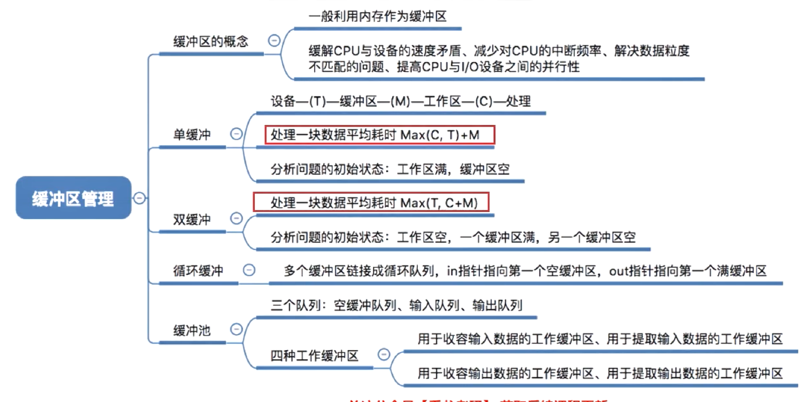

#### 磁盘高速缓存Disk Cache

- 利用内存中的存储空间暂存从磁盘中读出的一系列盘块中的信息，逻辑上是属于磁盘，物理上驻留在内存中，也被复制到CPU的二级和一级高速缓存中。
- 不过，**磁盘高速缓存技术**不同于通常意义下的介于CPU与内存之间的小容量**高速存储器**（即Cache），而是指利用内存中的存储空间来暂存从磁盘中读出的一系列盘块中的信息
- 分为两种形式
  - 在内存中开辟出一个单独的存储空间作为磁盘高速缓存，大小固定
  - 另一种把未利用的内存空间作为缓冲池，供请求分页系统和磁盘I/O时共享。

#### 缓冲区概念Buffer

- 缓冲区是一个存储区域，可以由专门的硬件寄存器组成，也可利用内存作为缓冲区。

- 使用硬件作为缓冲区的成本较高，容量也较小
  - 一般仅用在对速度要求非常高的场合
  - 如存储器管理中所用的联想寄存器，由于对页表的访问频率极高，因此使用速度很快的联想寄存器来存放页表项的副本

- 一般情况下，更多的是利用内存作为缓冲区
  - “设备独立性软件”的缓冲区管理就是要组织管理好这些缓冲区。

> [!IMPORTANT] **缓冲区的主要目的**：
>
> 1. 缓和 CPU 与设备间的速度不匹配。
> 2. 减少 CPU 中断频率。
> 3. 解决数据粒度不匹配问题。
> 4. 提高 CPU 与设备的并行性。

- 其实现方法如下：
  1.  采用硬件缓冲器，但由于成本太高，除一些关键部位外，一般不采用硬件缓冲器。
  2.  采用缓冲区（位于内存区域）。

> [!NOTE] **缓冲区管理术语**：
>
> - $T$ (Input)：设备 $\to$ 缓冲区。
> - $M$ (Move)：缓冲区 $\to$ 用户区。
> - $C$ (Compute)：CPU 处理数据。

> 对于循环缓冲和缓冲池，只需要定性地了解它们的机理，而不去定量研充它们平均处理一块数据所需要的时间。
>
> 而对于单缓冲和双缓冲，需要按照下面的模板分析，就可以解决任何计算单缓冲和双缓冲情况下数据块处理时间的问题，以不变应万变

#### 单缓冲

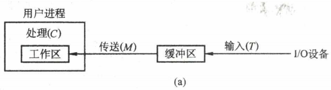

- 在主存中设置一个缓冲区，当设备和处理机交换数据时，先将数据写入缓冲区，然后需要数据的设备或处理机从缓冲区取走数据，**在缓冲区写入或取出的过程中，另一方需等待**
  - 若两个相互通信的机器只设置**单缓冲区**，在**任一时刻只能实现数据的单向传输**

- 假设某用户进程请求某种块设备读入若干块的数据
  - 若采用单缓冲的策略，操作系统会在主存中为其分配一个缓冲区
    - 若题目中没有特别说明，一个缓冲区的大小就是一个块
  - 当缓冲区数据非空时，不能往缓冲区冲入数据，只能从缓冲区把数据传出
  - 当缓冲区为空时，可以 往缓冲区冲入数据，但必须把缓冲区充满以后，才能从缓冲区把数据传出。

> 常考题型：计算每处理一块数据平均需要多久?~~真题好像就没考过处理一块数据的时间，我补充的连续处理N块的题型在下面~~
>
> - 技巧：
>   - 假定一个初始状态：在单缓冲中，这种初始状态为：工作区是满的，缓冲区是空的
>     - 如题目无明确说明，通常认为缓冲区的大小和工作区的大小相等
>     - 这种初始状态是处理一块数据的时间~~，但是408真题没考过~~
>   - 分析下次到达相同状态需要多少时间
>   - 即可得到处理一块数据平均所需时间

> [!IMPORTANT] **缓冲区处理时间计算**（每块）：
>
> - **单缓冲**：$\max(C, T) + M$
> - **双缓冲**：$\max(T, C+M)$ 其中 $T $ 为输入时间，$ M$ 为传送时间，$C$ 为处理时间。

#### 循环缓冲

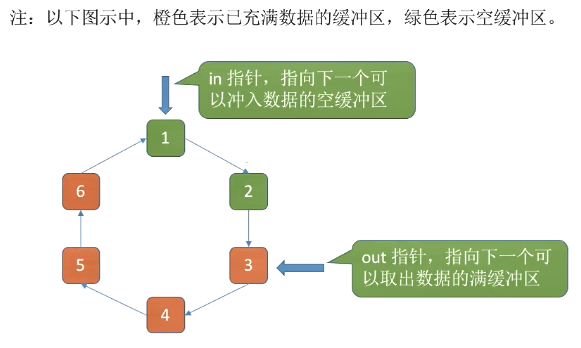

> [!NOTE] **缓冲区管理**：
>
> 1. **单缓冲**：设备 $\to$ 缓冲 $\to $ 用户。$ T$ 和 $C$ 可并行，平均时间 $\max(C, T) + M$。
> 2. **双缓冲**：解决单缓冲下设备和 CPU 速度不匹配。平均时间 $\max(C+M, T)$。
> 3. **循环缓冲**：多个缓冲区组成环。
> 4. **缓冲池**：系统公用缓冲区，分为空、输入、输出三个队列。

#### 高速缓存与缓冲区的对比

高速缓存是可以保存数据拷贝的高速存储器，访问高速缓存比访问原始数据更高效，速度更快

|  &nbsp;  |                                                   高速缓存                                                   |                                                                       缓冲区                                                                       |
| :------: | :----------------------------------------------------------------------------------------------------------: | :------------------------------------------------------------------------------------------------------------------------------------------------: |
|  相同点  |                                         都介于高速设备和低速设备之间                                         |                                                            都介于高速设备和低速设备之间                                                            |
| 存放数据 |                 存放的是低速设备上的某些数据的复制数据，即高速缓存上有的，低速设备上面必然有                 | 存放的是低速设备传递给高速设备的数据（或相反），而这些数据在低速设备（或高速设备）上却不一定有备份，这些数据再从缓冲区传送到高速设备（或低速设备） |
|   目的   | 高速缓存存放的是高速设备经常要访问的数据，若高速设备要访问的数据不在高速缓存中，则高速设备就需要访问低速设备 |                                     高逑设备和低速设备的通信都要经过缓冲区，高速设备永远不会直接去访问低速设备                                     |

### 设备分配回收

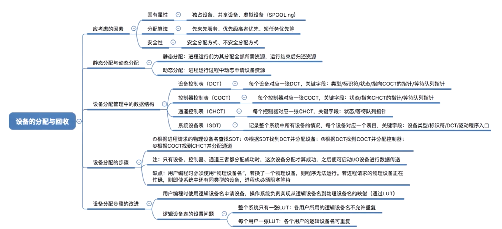

- 独享分配。
- 共享分配。
- 虚拟分配。

#### 设备分配策略

- 设备特性：
  1.  独占设备：同时只能被一个进程访问。如打印机、磁带机。
      - 独占式使用设备。进程分配到独占设备后，便由其独占，直至该进程释放该设备
      - 破坏了“请求和保持”条件，**不会发生死锁**

  2.  共享设备：同时能被多个进程访问，不会死锁。如磁盘。可寻址和可随机访问。
      - 分时式共享使用设备。对于共享设备，可同时分配给多个进程，通过分时共享使用
      - **可能死锁**

  3.  虚拟设备：将独占设备改造成共享的虚拟设备。
      - 以SPOOLing方式使用的外部设备。SPOOLing技术实现了虚拟设备功能，**可以将设备同时分配给多个进程**。这种技术实质上就是实现了对设备的I/O操作的批处理

- 设备分配原则
  - 设备分配应根据设备特性、用户要求和系统配置情况。既要充分发挥设备的使用效率，又要避免造成进程死锁，还要将用户程序和具体设备隔离开。

- 设备分配方式
  - 静态分配
    - **静态分配主要用于对独占设备的分配**，它在用户作业开始执行前，由系统一次性分配该作业所要求的全部设备、 控制器。
    - 一旦分配，这些设备、控制器就一直为该作业所占用，直到该作业被撤销。
    - 静态分配方式**不会出现死锁**，但设备的使用效率低。

  - 动态分配
    - 动态分配在进程执行过程中根据执行需要进行。
    - 当进程需要设备时，通过系统调用命令向系统提出设备请求，由系统按某种策略给进程分配所需要的设备、控制器，一旦用完，便立即释放。
    - 这种方式**有利于提高设备利用率**，但若分配算法使用不当，则**有可能造成进程死锁**

    > 对于独占设备，既可以采用动态分配方式，又可以采用静态分配方式，但往往采用静态分配方式。
    >
    > 共享设备可被多个进程所共享，一般采用动态分配方式，但在每个I/O传输的单位时间内只被一个进程所占有，通常采用先请求先分配和优先级高者优先的分配算法

- 分配算法：
  - 先请求先分配。
  - 优先级高者优先。

> [!IMPORTANT] **设备分配安全性**：
>
> - **安全分配**：进程发出 I/O 后阻塞，不满足“请求和保持”条件，**无死锁**，但串行效率低。
> - **不安全分配**：进程发出 I/O 后继续运行，可申请多个设备，**可能死锁**，但并行效率高。

- 独立性。

#### 设备分配数据结构

- 一个通道可控制多个设备控制器，每个设备控制器可控制多个设备。

- 设备控制表DCT：系统为每个设备配置一张DCT，用于记录设备情况：
  - 设备类型：如打印机/扫描仪/键盘

  - 设备标识符：物理设备名
    - 系统中的每个设备的物理设备名唯一

  - 设备状态：忙碌/空闲/故障……。

  - 指向控制器表的指针：每个设备由一个控制器控制，该指针可找到相应控制器的信息。

  - 重复执行次数或时间：当重复执行多次I/O操作后仍不成功，才认为此次I/O失败。

  - 设备队列的队首指针：指向正在等待该设备的进程队列
    - 即由进程PCB组成的队列

    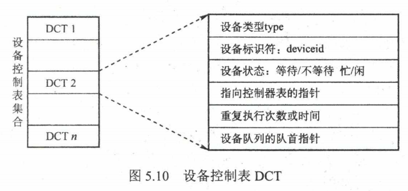

- 控制器控制表COCT：每个设备控制器都会对应一张**控制器控制表**COCT。因此每个**控制器控制表**COCT有一个表项存放指向相应**通道控制表**CHCT的指针，而一个通道可为多个设备控制器服务，因此**通道控制表**CHCT中必定有一个指针，指向一个表，这个表上的信息表达的是**通道控制表**CHCT提供服务的那几个设备控制器
  - 控制器标识符：各个控制器的唯一ID。

  - 控制器状态：忙碌/空闲/故障……

  - 指向通道表的指针：每个控制器由一个通道控制，该指针可找到相应从属 通道的信息。

  - 控制器队列的队首指针：指向正在等待该控制器的进程队列
    - 即由进程PCB组成的队列

  - 控制器队列的队尾指针：指向控制器的队尾。

    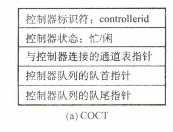

- 通道控制表CHCT：每个通道都会对应一张CHCT。操作系统根据CHCT的信息对通道进行操作和管理：
  - 通道标识符：各个通道的唯一ID。

  - 通道状态：忙碌/空闲/故障……

  - 与通道连接的控制器表首址：可通过该指针找到该通道管理的**控制器控制表**COCT。

  - 通道队列的队首指针：指向正在等待该通道的进程队列（由进程PCB组成队列）。

  - 通道队列的队尾指针：指向通道队列的队尾。

    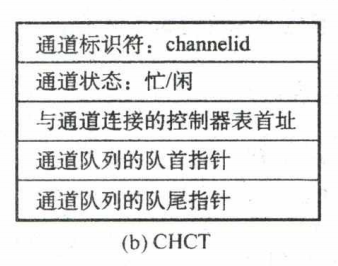

- 系统设备表SDT，**整个系统只有一张**，记录了系统中全部设备的情况，每个设备对应一个表目：
  - 设备类型：打印机/扫描仪/键盘。

  - 设备标识符：物理设备名。

  - **设备控制表**DCT

  - 驱动程序入口：对应设备驱动的程序地址。

    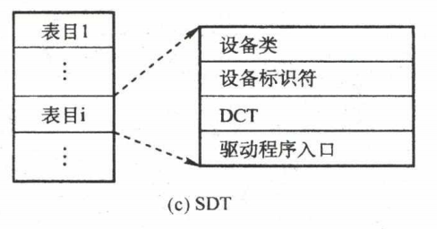

> [!IMPORTANT] **设备分配数据结构**：
>
> - **SDT** (系统设备表)：整个系统一张。
> - **DCT** (设备控制表)：每个设备一张。
> - **COCT** (控制器表)：每个控制器一张。
> - **CHCT** (通道表)：每个通道一张。层次：$SDT \to DCT \to COCT \to CHCT$。

#### 设备名映射

为了提高分配灵活性，使用了设备独立性，使用逻辑设备名来使用设备。

所以系统中设置了一张**逻辑设备表**LUT。包括设备逻辑名、物理逻辑名、设备驱动程序入口。

有两种方式设置LUT：

- 系统只有一张，所以只适合单用户系统。
- 每个用户一张，当用户登录，系统就为用户创建一个进程并建立一张LUT并放入PCB中。

优点：

- 逻辑设备表（LUT）建立了逻辑设备名与物理设备名之间的映射关系。
- 某用户进程第一次使用设备时使用逻辑设备名向操作系统发出请求，操作系统根据用户进程指定的设备类型（逻辑设备名）查找系统设备表，找到一个空闲设备分配给进程，并在LUT中增加相应表项。
- 如果之后用户进程再次通过相同的逻辑设备名请求使用设备，则操作系统通过LUT表即可知道用户进程实际要使用的是哪个物理设备了，并且也能知道该设备的驱动程序入口地址。

> [!TIP] **设备分配过程**：
>
> 1. 查找系统设备表 (SDT)。
> 2. 查找设备控制表 (DCT)。
> 3. 查找控制器控制表 (COCT)。
> 4. 查找通道控制表 (CHCT)。
> 5. 三者均分配成功后，才可启动 I/O。

缺点:

1. 用户编程时必须使用“物理设备名”，底层细节对用户不透明，不方便编程。
2. 若换了一个物理设备，则程序无法运行。
3. 若进程请求的物理设备正在忙碌，则即使系统中还有同类型的设备，进程也必须阻塞等待这个名字设备。

改进方法：建立逻辑设备名与物理设备名的映射机制，用户编程时只需提供逻辑设备名。

1. 根据进程请求的逻辑设备名查找SDT
   - 用户编程时提供的逻辑设备名其实就是“设备类型”
2. 查找SDT，找到用户进程指定类型的、并且空闲的设备，将其分配给该进程
   - 操作系统在逻辑设备表（LUT）中新增一个表项。
3. 根据DCT找到COCT，若控制器忙碌则将进程PCB挂到控制器等待队列中，不忙碌则将控制器分配给进程。
4. 根据COCT找到CHCT，若通道忙碌则将进程PCB挂到通道等待队列中，不忙碌则将通道分配给进程。

### 假脱机SPOOLing技术

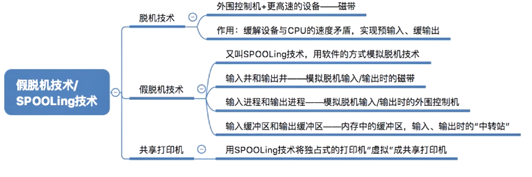

#### 脱机技术

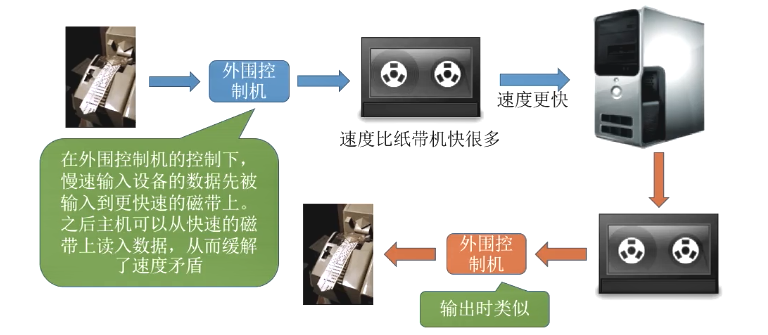

- **脱机输入/输出技术**是一种计算机技术：是操作系统中采用的一项将独占设备改造成共享设备的技术
  - 该技术利用**专门的外围控制机**，将低速I/O设备上的数据传送到高速磁盘上，或者相反
    - 需要专门硬件
    - SPOOLing技术是纯软件技术
  - 是指在不受主机控制的外部设备上进行数据处理
  - 或与实时控制系统、主机不直接相连的数据处理
  - 常用于主机速度不高的数据处理中提高设备的利用率。
- 输入输出设备速度慢，远小于CPU处理速率
  - 而CPU要处理就必须等待输入输出设备，导致CPU资源浪费
  - 而脱机技术能让数据更快进出CPU，从而速度加快。
- 脱机技术的一些常见应用包括：
  1. 批处理作业：批处理作业是一种在离线状态下进行的大量数据处理任务。通过脱机技术，可以将任务提交到离线处理系统，然后系统按照预定的顺序和条件进行处理，最后生成结果报告或输出文件。
  2. 数据备份和恢复：脱机技术可以用于数据备份和恢复操作。将数据从实时系统中复制到离线存储介质（如磁带或光盘），以便在需要时进行恢复或还原。
  3. 数据迁移：脱机技术可以用于大规模数据的迁移操作。通过将数据离线复制到目标系统或介质，然后在目标系统上进行数据加载和处理，可以提高迁移过程的效率和稳定性。
  4. 数据转换和格式化：脱机技术可以用于数据的转换和格式化操作。数据可以在离线状态下进行转换、重组或重新格式化，以满足不同系统或应用的需求。

> [!IMPORTANT] **SPOOLing 技术 (假脱机)**：
>
> 1. **核心部件**：在磁盘上开辟 **输入井** 和 **输出井**，用 **软件** 模拟脱机 I/O。
> 2. **共享化**：将 **独占设备**（如打印机）虚拟化为 **共享设备**。
> 3. **过程**：数据先存入输入/输出井，由假脱机管理进程按需调度物理设备。

> 若输入输出缓冲区共用一个磁盘空间时，应该保证输入输出缓冲区大小之和小于磁盘大小，且输入缓冲区大小小于磁盘大小，否则会发生死锁
>
> 【例题】
>
> - 一个SPOOLing系统由输入进程I、用户进程P、输出进程0、输入缓冲区、输出缓冲区组成。
> - 进程I通过输入缓冲区为进程P输入数据，进程P的处理结果通过输出缓冲区交给进程O输出。
> - 进程间数据交换以等长度的数据块为单位。这些数据块均存储在同一磁盘上。
> - 因此，SPOOLing系统的数据块通信原语保证始终满足$i+o\le max$
>   - 其中max为磁盘容量（以该数据块为单位）
>   - i为磁盘上输入数据块的总数
>   - o为磁盘上输出数据块的总数。
> - 该SPOOLing系统运行时：
>   - 只要有输入数据，进程I终究会将它放入输入缓冲区
>   - 只要输入缓冲区有数据块，进程P终究会读入、处理，并产生结果数据，写到输出缓冲区
>   - 只要输出缓冲区有数据块，进程O终究会输出它。
> - 请说明该SPOOLing系统在什么情况下死锁。
> - 请说明如何修正约束条件以避免死锁，同时仍允许输入数据块和输出数据块均存储在同一个磁盘上。
>
> ---
>
> 【解】：
>
> 此系统的示意图如下图所示
>
> 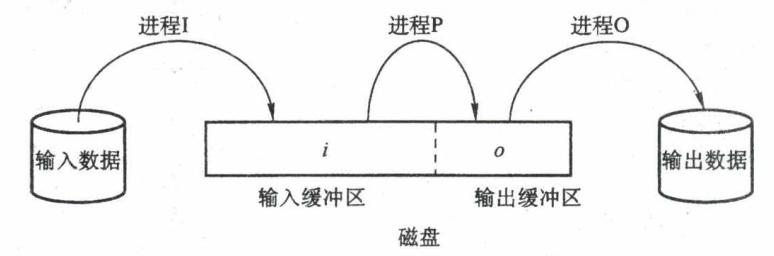
>
> - 下面找到一种导致该SPOOLing系统死锁的情况：
>   - 当磁盘上输入数据块总数i = max时，磁盘上输出数据块的总数o必然为0。
>   - 此时
>     - 进程`I`发现输入缓冲区已满，所以不能再把输入数据放入缓冲区
>     - 进程`P`此时有一个处理完的数据，打算把结果数据放入缓冲区，但也发现没有空闲的空间可以放结果数据
>       - 因为`o=0`所以没有输出数据可以输出，于是进程0也无事可做
>   - 这时进程`I、P、O`各自都等待着一个事件的发生，若没有外力的作用，它们将一直等待下去，这种僵局显然是死锁。
> - 只需将条件修改为$i+o\le max $，且$ i<max$，就不会再发生死锁。

#### 共享打印机/SPOOLingSPOOLing实例

- 打印机是一种独占式设备，而通过假脱机技术变成共享设备。
  - 独占式设备（Exclusive Device）是指一种只能被一个进程或用户独占使用的设备
    - 当一个进程或用户在使用独占式设备时，其他进程或用户无法同时访问该设备
    - 这意味着在任何给定的时刻，只有一个进程或用户可以对该设备进行操作
  - 共享设备（Shared Device）是指多个进程或用户可以同时访问和使用的设备
    - 共享设备可以同时为多个进程或用户提供服务，而不需要独占访问
    - 多个进程或用户可以并发地对共享设备进行读取、写入或控制操作，共享设备会根据调度算法和访问控制策略来处理并发访问请求。

当多个用户进程提出输出打印的请求时，系统会答应它们的请求，但是并不是真正把打印机分配给他们，而是由假脱机管理进程处理：

1. 在磁盘输出井中为进程申请一个空闲缓冲区，并将要打印的数据送入其中。
   - 空闲缓冲区是在磁盘上的

2. 为用户进程申请一张空白的打印请求表，并将用户的打印请求填入表中，再将该表挂到假脱机文件队列（打印任务队列）上。

   > 这两项工作完成后，虽然还没有任何实际的打印输出，但是对于用户进程而言，其打印任务已完成。
   >
   > 对用户而言，系统并非立即执行真实的打印操作，而只是立即将数据输出到缓冲区，真正的打印操作是在打印机空闲且该打印任务已排在等待队列队首时进行的。

3. 当打印机空闲时
   - 输出进程会从文件队列的队头取出一张打印请求表
   - 并根据表中的要求将要打印的数据从输出井传送到输出缓冲区
   - 再输出到打印机进行打印
   - 用这种方式可依次处理完全部的打印任务。

#### 设备驱动程序接口

- 如果每个设备驱动程序与操作系统的接口都不同，那么每次出现一个新设备时，都必须为此修改操作系统。
  - 因此，要求每个设备驱动程序与操作系统之间都有着相同或相近的接口。
  - 这样会使得添加一个新设备驱动程序变得很容易，同时也便于开发人员编制设备驱动程序。
- 对于每种设备类型，例如磁盘，操作系统都要定义一组驱动程序必须支持的函数。
  - 对磁盘而言，这些函数自然包含读、写、格式化等。驱动程序中通常包含一张表格，这张表格具有针对这些函数指向驱动程序自身的指针。
  - 装载驱动程序时，操作系统记录这个函数指针表的地址，所以当操作系统需要调用一个函数时，它可以通过这张表格发出间接调用。
  - 这个函数指针表定义了驱动程序与操作系统其余部分之间的接口。.给定类型的所有设备都必须服从这一要求。
- 与设备无关的软件还要负责将符号化的设备名映射到适当的驱动程序上。
  - 例如，在UNIX中，设备名/dev/disk0唯一确定了一个特殊文件的i结点，这个i结点包含了主设备号（用于定位相应的驱动程序）和次设备号（用来确定要读写的具体设备）。
- 在UNIX和Windows中，设备是作为命名对象出现在文件系统中的，因此针对文件的常规保护规则也适用于I/O设备。
  - 系统管理员可以为每个设备设置适当的访问权限

## 磁盘系统

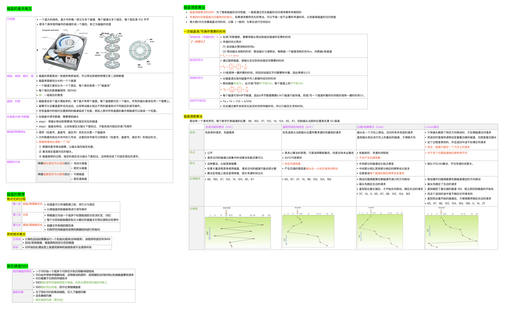

### 磁盘概念

> [!IMPORTANT] **磁盘物理结构**：
>
> 1. **盘面**：每个盘面对应一个磁头。
> 2. **磁道**：盘面上的同心圆。
> 3. **柱面**：所有盘面上相同位置的磁道组成柱面。
> 4. **扇区**：磁道上的最小存储单位（可寻址单位）。

#### 磁盘类别

磁盘的分类：

- 磁头可以移动的称为**活动头磁盘**，磁臂可以来回伸缩来带动磁头定位磁道。
- 磁头不可移动的称为**固定头磁盘**，这种磁盘中每个磁道有一个磁头。
- 盘片可以更换的称为**可换盘磁盘**。
- 盘片不可更换的称为**固定盘磁盘**。

固态硬盘SSD基于闪存技术，是一种容量更大的 $U$ 盘。

- 由一个或多个闪存芯片和闪存翻译层构成。
- 一个闪存由 $B$ 块组成，每块由 $P$ 页组成。存取以页为单位，一般每页$512B\sim4KB $，每块$ 32\sim128
  $页，每块$ 16KB\sim512KB$。
- 闪存磨损速度很快，为了弥补寿命缺陷其磨损均衡技术分为两种：
  - 动态磨损均衡：自动选择较新块写入。
  - 静态磨损均衡：SSD自动检测并数据分配。（更好）

### 磁盘的管理

#### 安装操作系统顺序

1. ROM引导程序。
2. 磁盘引导程序
3. 分区引导程序。
4. 操作系统初始化程序。

#### 磁盘初始化

1. 进行**低级格式化/物理格式化**：**扇区的划分**
   - 低级格式化为每个扇区使用特殊的数据结构填充磁盘
   - 将磁盘的各个磁道划分为扇区一个扇区通常可分为头部、数据区域（通常为 $512B$
     大小）、尾部三个部分组成
     - 头部和尾部包含了一些磁盘控制器的使用信息
     - 管理扇区所需要的各种数据结构一般存放在头、尾两个部分，包括扇区校验码
     - 如奇偶校验、CRC循环冗余校验码等，校验码用于校验扇区中的数据是否发生错误
   - 大多数磁盘**在工厂时**作为制造过程的一部分**就已经低级格式化**，这种格式化能够让制造商测试磁盘，并且初始化逻辑块号到无损磁盘扇区的映射。
   - 对于许多磁盘，当磁盘控制器低级格式化时，还能指定在头部和尾部之间留下多长的数据区，通常选择256或512字节等。

2. 将磁盘**分区**
   - 操作系统将自己的数据结构记录到磁盘上
   - 分为两步
     1. **磁盘分区**（即我们熟悉的C盘、D盘等形式的分区）：每个分区的起始扇区和大小都记录在磁盘主引导记录MBR的分区表中
     2. 物理分区进行**逻辑格式化**（创建文件系统）：操作系统将初始的文件系统数据结构存储到磁盘上
        - 这些数据结构包括空闲空间和已分配的空间以及一个初始为空的目录
        - **建立文件系统根目录**
        - 如位示图、空闲分区表
   - 因扇区的单位太小，**为了提高效率**，操作系统**将多个相邻的扇区组合在一起**，**形成一簇**（在Linux中称为**块**）。
   - 为了**更高效地管理磁盘**，**一簇只能存放一个文件的内容**，**文件所占用的空间只能是簇的整数倍**
   - 如果文件大小小于一簇（甚至是0字节），也要占用一簇的空间

3. 引导块
   - **初始化程序/自举程序**
     - 计算机**开机时**需要进行一系列初始化的工作，这些初始化工作是通过执行**初始化程序/自举程序**完成的。
     - 自举程序初始化CPU、寄存器、设备控制器和内存等，接着启动操作系统
     - 自举程序找到磁盘上的**操作系统内核**，将它**加载到内存**， 并**转到起始地址**，从而开始操作系统的运行

     - 自举程序通常放在ROM（只读存储器）中，ROM中的数据在出厂时就写入了，并且以后不能再修改。
     - 为了避免改变自举代码而需要改变ROM硬件的问题，**通常只在ROM中保留很小的自举装入程序**，而将**完整功能的引导程序保存在磁盘的**启动块**上**

   - **启动块**
     - 完整的自举程序放在磁盘的启动块（即引导块/启动分区）上，启动块位于磁盘的固定位置。
     - 具有启动分区的磁盘称为**启动磁盘/系统磁盘**。

   - **引导块**
     - 开机时计算机先运行自举装入程序出通过执行该程序就可找到**引导块**，并将完整的自举程序读入内存，完成初始化。

   - 引导控制块
     - 引导控制块记录系统从该分区引导操作系统所需要的信息
     - 若没有操作系统这块内容为空，一般为分区的第一块
     - UFS为引导块，NTFS为分区引导扇区。

   - 分区控制块包括分区详细信息。UFS为超级块，而NTFS称为主控文件表。

   - 下面以Windows为例来分析引导过程。
     - Windows允许将磁盘分为多个分区，有一个分区为**引导分区**，它包含操作系统和设备驱动程序。
     - Windows系统**将**引导代码**存储在**磁盘的第0号扇区，它称为\***\*主引导记录**MBR\*\*。
       - 除了包含引导代码，MBR还包含一个磁盘分区表和一个标志（以指示从哪个分区引导系统）
     - 引导首先运行ROM中的代码，这个代码指示系统从**主引导记录**MBR中读取引导代码
     - 当系统找到引导分区时，读取分区的第一个扇区，称为**引导扇区**，并继续余下的引导过程，包括加载各种系统服务

     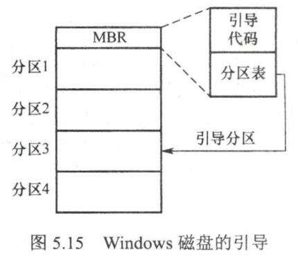

4. 坏块：对坏块的处理实质上就是用某种机制使系统不去使用坏块
   - 坏块
     - 损坏、无法正常使用的扇区就是“坏块”，属于硬件故障，操作系统是无法修复的
     - 部分磁盘甚至在出厂时就有坏块
     - 应该将坏块标记出来，以免错误地使用到它
   - 坏扇区：手动处理
     - 对于简单磁盘，可以在逻辑格式化时（建立文件系统时）对整个磁盘进行坏块检查，标明哪些扇区是坏扇区
     - 比如在FAT表上标明
     - 在这种方式中，**坏块对操作系统不透明**
   - 坏块链表：控制器维护磁盘内的坏块列表
     - 对于复杂的磁盘，磁盘控制器（磁盘设备内部的一个硬件部件）会维护一个坏块链表。
     - 在磁盘出厂前进行**低级格式化/物理格式化**时就将坏块链进行初始化，并在磁盘的使用过程中不断更新。
       - **低级格式化将一些块保留作为备用，操作系统看不到这些块**
     - 控制器会保留一些“备用扇区”，用于替换坏块。这种方案称为**扇区备用**
     - **这种处理方式中，坏块对操作系统透明。**

### 磁盘操作

> [!IMPORTANT] **磁盘存取时间计算** ($T_a$)：
>
> 1. **寻道时间** $T_s = s + m \times n$（磁头移动到目标磁道的时间）。
> 2. **延迟时间** $T_r = \frac{1}{2r}$（目标扇区转到磁头下的时间）。
> 3. **传输时间** $T_t = \frac{b}{rN}$（读写 $b $ 字节的时间，$ N$ 为每道字节数）。

#### 平均存取时间优化方法

- 磁盘寻块时间分为三个部分，即寻道时间$T_s $，延迟时间$ T_r $，传输时间$
  T_t$，寻道时间和延迟时间属于"找”的时间，凡是“找”的时间都可以通过一定的方法削减，但**传输时间是磁盘本身性质所决定的，不能通过一定的措施减少**
- 可以**通过**磁盘调度算法**尽可能优化**寻道时间**$T_s$**。

减少延迟时间也是提高磁盘传输效率的重要因素

- 磁盘地址结构设计
  - 为什么磁盘的物理地址是（柱面号，盘面号，扇区号）而不是（盘面号，柱面号，扇区号）?
    - 因为读取地址连续的磁盘块时，采用（柱面号，盘面号，扇区号）的地址结构可以减少磁头移动消耗的时间。
  - （柱面号，盘面号，扇区号）若要连续读取物理地址 $(000，00，000)\sim(000，01，111)$ 的扇区，读取完
    $(000，00，000)\sim(000，00，111)$
    由于柱面号/磁道号相同，只是盘面号不同，因此不需要移动磁头臂。只需要激活相邻盘面的磁头即可。
  - 若物理地址结构是（盘面号，柱面号，扇区号），且需要连续读取物理地址
    $(00， 000，000)\sim(00，001，111)$ 的扇区，则 $(00，000，000)\sim(00，000，111)$
    转两圈可读完，之后再读取物理地址相邻的区域，即$(00，001，000)\sim(00，001，111)$，需要启动磁头臂，将磁头移动到下一个磁道，花费时间更多。
- 交替编号：让逻辑上相邻的扇区在物理上有一定的间隔，可以使读取连续的逻辑扇区所需要的延迟时间更小。
  - 对磁盘片组中的不同盘面错位命名，假设每个盘面有8个扇区，磁盘片组共8个盘面，则可以采用如图5.22所示的编号
- 错位命名：
  - 磁盘是连续自转设备，磁头读/写一个物理块后，需要经过短暂的处理时间才能开始读/写下一块。
    - 若相邻的盘面相对位置相同处扇区编号相同，则会出现不能连续读取的问题。
  - 假设逻辑记录数据连续存放在磁盘空间中，若在盘面上按扇区交替编号连续存放，则连续读/写多条记录时能减少磁头的延迟时间
    - 所以使用错位命名，同一柱面不同盘面的扇区编号不同，从而有足够的时间来处理。
  - 同柱面不同盘面的扇区若能错位编号，连续读/写相邻两个盘面的逻辑记录时也能减少磁头延迟时间

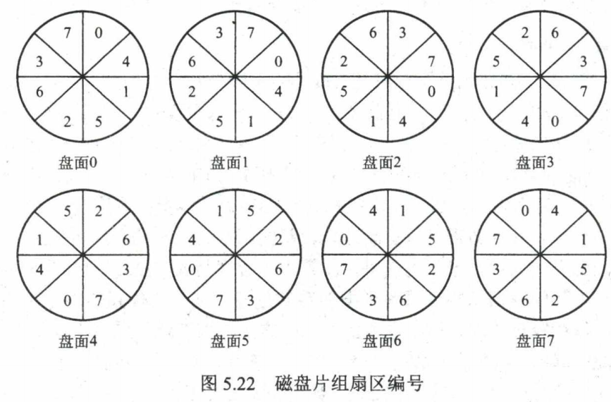

> - 提前读：在读磁盘当前块时，把下一磁盘块也读入内存缓冲区。
> - 延迟写：仅在缓冲区首部设置延迟写标志，然后释放此缓冲区并将其链入空闲缓冲区链表的尾部，当其他进程申请到此缓冲区时，才真正把缓冲区信息写入磁盘块。
> - 虚拟盘：是指用内存空间去仿真磁盘，又叫RAM盘。虚拟盘是一种易失性存储器。虚拟盘常用于存放临时文件。

### 磁盘调度算法

磁盘调度算法用来优化寻道时间。

> 【例题】：
>
> 假设某磁盘的磁道为 $0\sim200$
> 号，磁头的初始位置是$100$​​号磁道，此时磁头正在往磁道号增大的方向，有多个进程先后陆续地请求访问的磁道号依次为
>
> $$
> 55,58, 39, 18, 90, 160, 150, 38, 184
> $$

> [!TIP] **磁盘调度算法对比**：
>
> 1. **FCFS** (先来先服务)：最公平，但寻道距离长。
> 2. **SSTF** (最短寻道优先)：贪心，寻道性能好，但可能导致 **饥饿**。
> 3. **SCAN** (电梯算法)：不仅寻道近，且保证每个请求都能满足，解决饥饿。
> 4. **LOOK**：SCAN 的改进，磁头移动到最外/内侧请求即可返回，不用到边缘。
> 5. **C-SCAN/C-LOOK**：单向扫描，响应时间更均匀。

<!-- #### N步扫描算法-->

- 即NStepSCAN算法
  - 在SSTF，SCAN及CSCAN几种调度算法中，都可能会出现磁臂停留在某处不动的情况
    - 例如，有一个或几个进程对某一磁道有较高的访问频率
    - 即这个(些)进程反复请求对某一磁道的I/O操作，从而垄断了整个磁盘设备

  - 我们把这一现象称为“磁臂粘着”（Armstickiness）
  - 在高密度磁盘上更容易出现此情况

- $N$步SCAN算法的实现
  - $N $步SCAN算法是将磁盘请求队列分成若干个长度为$ N$的子队列
  - 磁盘调度将按FCFS算法依次处理这些子序列
  - 而每处理一个队列时又是按SCAN算法，对一个队列处理完毕后，再处理其他队列
  - 当正在处理某子序列时，如果又出现新的磁盘I/O请求，便将新请求进程放入其他队列，这样就可避免出现粘着现象。

- 当 $N$ 值取得很大时，会使 $N$ 步扫描法的性能接近于SCAN算法的性能
- 当 $N=1$ 时，$N$步SCAN算法便蜕化为FCFS算法。

#### 分步扫描算法

- 即FSCAN算法，实质上是 $N$ 步SCAN算法的简化，即FSCAN只将磁盘请求队列分成两个子队列。
- 一个是当前所有请求磁盘I/O的进程形成的队列，由磁盘调度按SCAN算法进行处理。在扫描期间，将新出现的所有请求磁盘I/O的进程，放入另一个等待处理的请求队列。这样，所有的新请求都将被推迟到下一次扫描时处理。

### 固态硬盘SSD

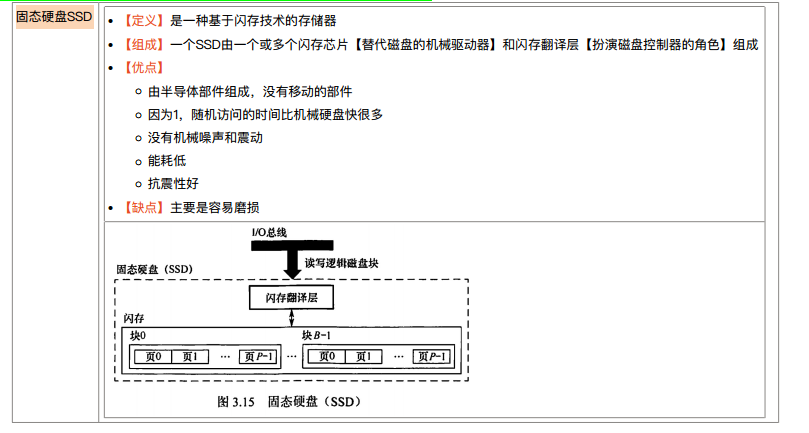

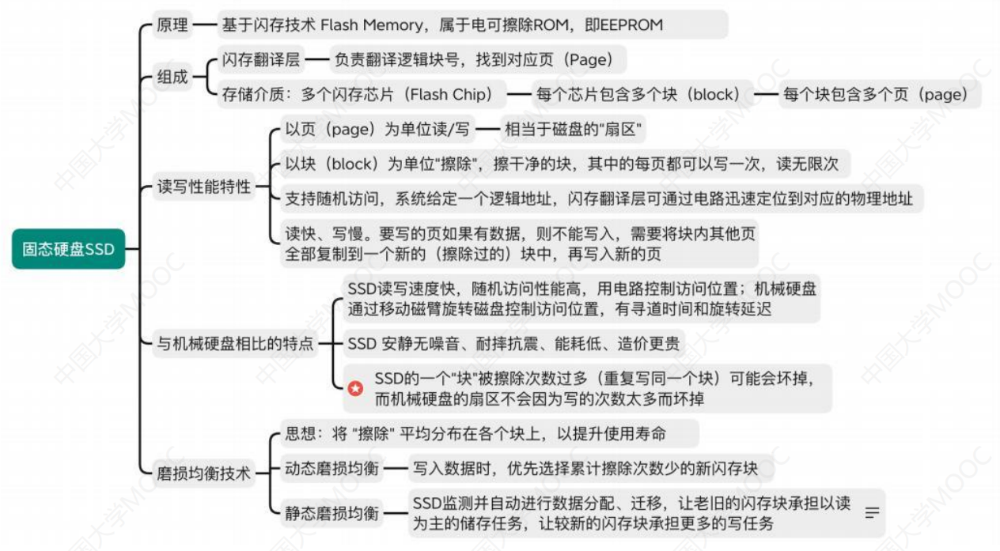

#### 组成

- 闪存翻译层
  - 闪存翻译层（$Flash \;Translation\; Layer，FTL$）是固态硬盘SSD中的一项关键技术，它负责管理闪存芯片中的数据存储和访问。
    - 由于闪存芯片的特性，FTL在逻辑层和物理层之间建立了一个映射关系，使得操作系统和应用程序可以像访问传统硬盘一样访问闪存芯片中的数据。
  - FTL的主要功能包括以下几个方面：
    1. 块管理：闪存芯片的最小单位是一个块（Block），通常是几十至几百个连续的页（Page）组成。
       - FTL负责将逻辑块地址（$LBA，Logical\; Block \;Address $）映射到物理块地址（$ PBA，Physical\;
         Block\; Address$），以管理块的分配和回收。
    2. 垃圾回收：由于闪存芯片的特性，不能直接在已使用的块中进行数据覆写。
       - 当需要更新或删除数据时，FTL会将新数据写入新的块中，然后标记旧块为无效。
       - 垃圾回收算法会定期检查并回收这些无效块，以释放空间供后续写入操作使用。
    3. 写放大和写放大抑制：闪存芯片的写操作需要先擦除整个块，然后再写入数据。由于擦除操作的开销较大，频繁的小写操作会导致写放大现象，降低固态硬盘的性能和寿命。FTL通过采用写放大抑制技术，将多个小写操作合并为一个较大的写操作，减少写放大的影响。
    4. 均衡算法：为了延长闪存芯片的寿命，FTL会尽可能均衡地使用所有块，避免部分块的擦写次数过多而导致寿命损耗不均。均衡算法会根据块的使用情况和寿命预测，动态调整块的分配策略。
    5. 错误处理和纠错码：闪存芯片在使用过程中可能会出现数据错误或损坏。FTL会通过纠错码和错误检测机制，检测和纠正数据错误，确保数据的完整性和可靠性。
- 存储介质
  - 固态硬盘 $（Solid \;State\; Drive，SSD）$ 的存储介质主要是闪存芯片（NAND Flash）。
    - 闪存芯片是一种非易失性存储器，使用电子器件来存储数据。
  - 闪存芯片的基本构成单元是存储单元，每个存储单元可以存储多个位的数据。常见的闪存芯片组织结构包括页（Page）、块（Block）和平面（Plane）：
    - 页（Page）：闪存芯片中最小的可编程单元是页。页通常是几KB大小，常见的大小为 $4KB$
      或$8KB$。数据可以以页为单位进行读取和写入。
    - 块（Block）：一组页构成了一个块，通常由几十至几百个连续的页组成。块是闪存芯片的最小擦除单元，即擦除操作需要对整个块进行，而不能只擦除单个页。
    - 平面（Plane）：闪存芯片中的块可以组织成多个平面。每个平面可以独立进行操作，使得同时进行读取和写入操作更高效。

#### 与机械硬盘相比的特点

$SSD（Solid\; State \;Drive）$和机械硬盘在存储技术和性能方面有许多不同之处，它们的主要特点如下：

1. 存储介质
   - SSD使用闪存芯片作为存储介质，而机械硬盘使用旋转磁盘和机械臂。闪存芯片具有非易失性，即使断电也能保持数据，而机械硬盘需要电源供应才能正常工作。
2. 读写速度
   - SSD的读写速度通常比机械硬盘快得多。由于闪存芯片的特性，SSD具有较低的访问延迟和更高的随机访问速度，使得数据的读取和写入更加快速和高效。
3. 震动和噪音
   - 由于机械硬盘中有旋转的磁盘和机械臂的运动，机械硬盘会产生震动和噪音。而SSD没有移动部件，因此没有震动和噪音，运行更加静音。
4. 耐用性
   - 但是SSD的一个"块"被擦除次数过多（重复写同一个块）可能会坏掉，而机械硬盘的扇区不会因为写的次数太多而坏掉
   - 但引入磨损均衡技术后，SSD的闪存芯片具有较长的寿命，可以承受更多的写入操作。相比之下，机械硬盘的磁头和磁盘表面容易受到损坏，使用寿命较短。
5. 能耗
   - SSD的能耗通常比机械硬盘低。闪存芯片不需要机械臂的移动和磁盘的旋转，因此功耗更低。
6. 尺寸和重量
   - 由于没有机械部件，SSD的体积较小、重量较轻，适合在笔记本电脑和便携设备中使用。机械硬盘由于有机械部件，体积较大、重量较重。
7. 价格
   - 相比之下，SSD的价格通常更高。虽然SSD的价格在逐渐下降，但相同容量的机械硬盘仍然更便宜。

#### 磨损均衡技术

由于闪存芯片在写入操作时的特性，会导致一些闪存块的擦除次数较多，而其他块很少使用，从而导致磨损不均衡。这种磨损不均衡可能会导致某些块提前失效，影响整个存储系统的可靠性和寿命。

为了解决这个问题，磨损均衡技术采取了以下几种方法：

1. 闪存块的循环使用：磨损均衡技术会对闪存块进行循环使用，使得每个块的擦除次数尽量均衡。当一个块被写满后，系统会将其中的数据转移到其他块中，并擦除原块，然后重新分配给下一个需要写入数据的操作。
2. 块迁移：磨损均衡技术会根据块的使用情况和磨损程度，将一些较少使用的块中的数据迁移到更多使用的块中。这样可以减少某些块的擦除次数，从而达到均衡磨损的目的。
3. 块级别的负载均衡：磨损均衡技术会监控闪存块的使用情况，根据块的负载情况进行调度和均衡。例如，将较多写入操作的块和较少写入操作的块进行分散和平衡，使得整个存储系统的磨损更加均衡。
4. 块的磨损预测：磨损均衡技术会对闪存块的使用情况和擦除次数进行监测和预测。通过分析块的磨损情况，可以提前采取措施，如块迁移或更换，以避免块的早期失效。
