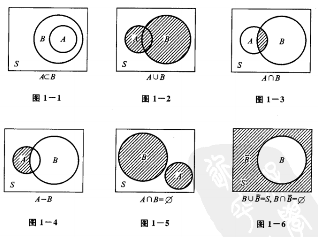

# 概率论·1 随机事件与概率

## 考纲内容

- 随机事件与样本空间
- 事件的关系与运算
- 完备事件组
- 概率的概念
- 概率的基本性质
- 古典型概率
- 几何型概率
- 条件概率
- 概率的基本公式
- 事件的独立性
- 独立重复试验

## 一、样本空间与随机事件

> 考纲摘要：了解样本空间(基本事件空间)的概念，理解随机事件的概念，掌握事件的关系及运算

### 1. 相关概念的定义

- **随机试验**：具有以下三种特点的试验称作**随机试验**：
  1. 可以在相同的条件下重复地进行
  2. 每次试验的可能结果不止一个，并且能事先明确试验的所有可能结果
  3. 进行一次试验前不能确定哪个结果会出现
- **样本空间**：将随机试验 $E$ 的所有可能结果组成的集合称为 $E$ 的**样本空间**，记作
  $S$，其中的每个元素称作**样本点**
- **随机事件**：称试验 $E$ 的样本空间 $S$ 的子集为 $E$
  的**随机事件**，简称**事件**。在每次试验中，当且仅当这一子集中的一个样本点出现时，称这一**事件发生**
  - **基本事件**：由一个样本点组成的单点集称作**基本事件**
  - **必然事件**：样本空间 $S$ 包含所有样本点，每次试验它是必然发生的，因此称之为**必然事件**
  - **不可能事件**：空集 $\varnothing$ 不包含任何样本点，每次试验它都不会发生，因此称之为**不可能事件**

### 2. 事件的关系及运算

- 若 $A\subset B$，则称事件 $B$ 包含事件 $A$，这指的是事件 $A$ 的发生必然导致事件 $B$ 的发生若
  $A=B$，则称事件 $A$ 与事件 $B$ **相等**
- 事件 $A\cup B=\{x|x\in A\lor x\in B\}$ 称作事件 $A$ 与事件 $B$ 的**和事件**，可以记作 $A+B$
- 事件 $A\cap B=\{x|x\in A\land x\in B\}$ 称作事件 $A$ 与事件 $B$ 的**积事件**，简记为 AB
- 事件 $A-B=\{x|x\in A\land x\notin B\}$ 称作事件 $A$ 与事件 $B$ 的**差事件**，$A-B=A\overline B$
- 如果 $A\cap B=\varnothing$，称事件 $A$ 与事件 $B$ 是**互不相容的**（或**互斥的**）
- 如果 $A\cup B=S\land A\cap B=\varnothing$，则称事件 $A$ 与事件 $B$
  互为**逆事件**（或互为**对立事件**），记作 $B=\overline A=S-A$

事件运算的性质：

- **交换律**：$A\cup B=B\cup A,A\cap B=B\cap A$
- **结合律**： $A\cup (B\cup C)=(A\cup B)\cup C$ $A\cap (B\cap C)=(A\cap B)\cap C$
- **分配律**： $A\cup (B\cap C)=(A\cup B)\cap (A\cup C)$ $A\cap (B\cup C)=(A\cap B)\cup (A\cap C)$
- **德·摩根律**：$\overline{A\cup B}=\overline A\cap\overline B,\overline{A\cap B}=\overline A\cup\overline B$

## 二、概率

> 考纲摘要：
>
> 1. 理解概率的概念，掌握概率的基本性质
> 2. 掌握概率的加法公式、减法公式

### 1. 频率

在相同的条件下，进行 $n$ 次试验，其中，$A$ 发生的次数 $n_A$ 称为事件 $A$ 发生的**频数**，比值
$\cfrac{n_A}{n}$ 称作事件 $A$ 发生的**频率**，记作 $f_n (A)$,

性质：

- $0\le f_n (A)\le1$
- $f_n (S)=1$
- 若
  $A_1,A_2,\cdots,A_k$ 是两两互不相容的事件，则 $f_n (\bigcup_{i=1}^kA_i)=\sum_{i=1}^kf_n (A_i)$

### 2. 概率的定义及其性质

设 $E$ 是随机试验，$S$ 是它的样本空间，对于 $E$ 的每个事件 $A$ 赋予一个实数 $P(A)$，称作事件 $A$
的**概率**，集合函数 $P$ 满足以下条件：

- **非负性**：$\forall A\subset S,P(A)\ge0$
- **规范性**：$P(S)=1$
- **可列可加性**：设 $A_1,A_2,\cdots$ 是两两互不相容的事件，则
  $P(A_1\cup A_2\cup\cdots)=P(A_1)+P(A_2)+\cdots$

当试验次数 $n\to\infty$ 时，$f_n (A)=P(A)$

概率的性质：

- $P(\varnothing)=0$
- **有限可加性**：若 $A_1,A_2,\cdots,A_n$ 是两两互不相容的事件，则
  $P(\bigcup_{i=1}^nA_i)=\sum_{i=1}^nP (A_i)$
- 若 $A\subset B$，则 $P(B-A)=P(B)-P(A),P(B)\ge P(A)$ （可以理解为这是从 B 中”挖掉“一块 A）
- $\forall A\subset S,P(A)\le 1$
- **逆事件的概率**：$P(\overline A)=1-P(A)$
- **加法公式**：$P(A\cup B)=P(A)+P(B)-P(AB)$
- **减法公式**：$P(A-B)=P(A)-P(AB)$，特别地，如果 $B\subset A$，则 $P(A-B)=P(A)-P(B)$

## 三、古典概型

> 考纲摘要：会计算古典型概率和几何型概率

### 1. 古典概型的定义

具有以下特点的试验称作**等可能概型**（古典概型）：

- 试验的样本空间只包含有限个元素
- 试验中的每个**基本事件**发生的可能性相同

设试验的样本空间为
$S=\{e_1,e_2,\cdots,e_n\}$，则有：$P(\{e_1\})=P(\{e_2\})=\cdots=P(\{e_n\})$，$P(\{e_i\})=\cfrac1n,i=1,2,\cdots,n$
若事件 $A$ 包含 $k$ 个基本事件，则 $P(A)=\cfrac kn$

> 组合数：$C_n^m=\cfrac{n!}{m!(n-m)!}$

### 2. 超几何分布（不放回抽样）

设 $N$ 件产品中有 $K$ 件次品，从中任取 $n$ 件，求恰好取到 $k$ 件次品的概率。

所有取法的数量是 $C_N^n$ 种，$K$ 件次品中取 $k$ 件的取法有 $C_K^k$ 种，$N-K$ 件正品中取 $n-k$
件的取法有 $C_{N-K}^{n-k}$ 种，因此恰好取到 $k$ 件次品的取法有 $C_K^kC_{N-K}^{n-k}$ 种，所求概率即为

$$
P(A)=\frac{C_K^kC_{N-K}^{n-k}}{C_N^n}
$$

这就是**超几何分布**的概率公式。

### 3. 几何概型

若随机试验的样本空间 $S$
是一个区域（线段、平面图形或空间立体），且每个样本点出现的概率只与该区域的几何度量（长度、面积或体积）成正比，则称此模型为**几何概型**。

$$
P(A) = \frac{L(A)}{L(S)}
$$

其中 $L$ 表示几何度量。

### 4. 例题

**抽签的公平性**：袋中有 $a$ 只白球、$b$ 只黑球，$k$ 个人依次不放回地各取一球，求第 $k$
人取到白球的概率。

把 $a+b$ 只球视为可辨的，样本点总数为 $(a+b)!$ 种排列。第 $k$ 个位置放白球的排法有
$a\cdot(a+b-1)!$ 种，故

$$
P=\frac{a\cdot(a+b-1)!}{(a+b)!}=\frac{a}{a+b}
$$

与 $k$ 无关，说明**抽签与顺序无关**，这是古典概型的经典结论。

**分房问题**：将 $n$ 个人随机分配到 $N$ 个房间（$n\le N$），求恰好有 $n$
个房间各住一人的概率。总分法 $N^n$ 种，符合要求的有 $A_N^n$ 种，故 $P=\dfrac{A_N^n}{N^n}$。

## 四、条件概率

> 考纲摘要：理解条件概率的概念，掌握乘法公式

### 1. 条件概率的定义

设 $A,B$ 是两个事件，且 $P(A)>0$，称 $P(B|A)=\cfrac{P(AB)}{P(A)}$ 为在事件
$A$ 发生的前提下事件 $B$ 发生的**条件概率** 它显然符合概率定义中的三个条件：

- 非负性：$\forall B\in S,P(B|A)\ge 0$
- 规范性：$P(S|A)=0$
- 可列可加性：设 $B_1,B_2,\cdots B_n$ 是两两互不相容的事件，则有
  $P(\bigcup_{i=1}^n B_i|A)=\sum_{i=1}^nP (B_i|A)$

**乘法定理**：设 $P(A)>0$，则有 $P(AB)=P(B|A)P(A)$，该式也称作**乘法公式**

### 2. 全概率公式和贝叶斯公式

> 考纲摘要：掌握全概率公式以及贝叶斯（Bayes）公式

设 $S$ 是事件 $E$ 的样本空间， $B_1,B_2,\cdots,B_n\subset E$，如果：

- $B_jB_j=\varnothing,i\ne j,i,j=1,2,\cdots,n$
- $\bigcup_{i=1}^nB_i=S$

则称 $B_1,B_2,\cdots B_n$ 是样本空间 $S$ 的一个**划分**。

基于此，**全概率公式**如下所示：

$$
P(A)=\sum_{i=1}^nP(A|B_i)
$$

在很多实际问题中 $P(A)$ 不易直接求得，但却容易找到
$S$ 的一个划分 $B_1,B_2,\cdots B_n$ 且 $P(B_i)$ 和 $P(A|B_i)$
已知或容易求得，那么就可以根据全概率公式求出 $P(A)$

同样基于以上**划分**定义中的符号，给出**贝叶斯公式**：

$$
P(B_i|A)=\cfrac{P(A|B_i)P(B_i)}{\sum_{j=1}^nP(A|B_j)P(B_j)},i=1,2,\cdots,n
$$

当 $n=2$ 时的上述公式较为常用，如下所示：

- 全概率公式：$P(A)=P(A|B)P(B)+P(A|\overline B)P(\overline B)$
- 贝叶斯公式：$P(B|A)=\cfrac{P(AB)}{P(A)}=\cfrac{P(A|B)(B)}{P(A|B)P(B)+P(A|\overline B)P(\overline B)}$

## 五、事件独立性

> 考纲摘要：理解事件独立性的概念，掌握用事件独立性进行概率计算、理解独立重复试验的概念，掌握计算有关事件概率的方法

设 $A,B$ 是两事件，如果满足等式 $P(AB)=P(A)P(B)$，则称事件 $A,B$ **相互独立**，简称**独立**

设 $P(A)>0,P(B)>0$，则事件独立的性质如下：

- $P(B|A)=P(B),P(A|B)=P(A)$
- $A与\overline B,\overline A与B,\overline A与\overline B$ 也相互独立

推广到 3 个事件相互独立的定义：设 $A,B,C$ 是 3 个事件，则三者相互独立的条件为：

$$
\begin{cases}
P(AB)=P(A)P(B)\\
P(AC)=P(A)P(C)\\
P(BC)=P(B)P(C)\\
P(ABC)=P(A)P(B)P(C)
\end{cases}
$$

推广到 $n$ 个事件 $A_1,A_2,\cdots,A_n$ 相互独立的定义：任意 $r,r\le n$
个事件的积事件的概率都等于这 $r$ 个事件的概率之积。

### 2. 独立重复试验 (伯努利试验)

在相同条件下重复进行 $n$ 次试验，若各次试验的结果相互独立，则称此为 **$n$
重独立重复试验**。若每次试验中事件 $A$ 发生的概率为 $p$ ($0 < p < 1$)，则在 $n$
重独立重复试验中，$A$ 恰好发生 $k$ 次的概率为：

$$
P_n(k) = C_n^k p^k(1-p)^{n-k}, \quad k=0,1,\dots,n
$$

这就是**二项分布**的概率公式。

### 经典错题

#### 1. 题干、参考答案与误解

问题如下：

设事件 $A,B,C$ 两两独立，满足 $ABC=\varnothing,P(A)=P(B)=P(C),P(A\cup B\cup C)=\frac9{16}$，求 $P(A)$

参考答案给出的解法：

$$
P(A\cup B\cup C)=P(A)+P(B)+P(C)-P(AB)-P(AC)-P(BC)+P(ABC)\\
3P(A)-3P(A)^2=\frac9{16},
P(A)=\frac14
$$

但我的想法如下，首先，我们有：

$$
\overline{A\cup B\cup C}=\overline{A}\cap\overline{B}\cap\overline{C}
$$

因此，

$$
P(\overline{A\cup B\cup C})=P(\overline{A}\cap\overline{B}\cap\overline{C})=1-P(A\cup B\cup C)=\frac7{16}\\
$$

由于 $A,B,C$ 两两独立，因此 $\overline{A},\overline{B},\overline{C}$ 两两独立，因此：

$$
P(\overline{A}\cap\overline{B}\cap\overline{C})=P(\overline{A})^3=\frac7{16},\\
P(\overline{A})=\sqrt[3]{\frac7{16}},P(A)=1-\sqrt[3]{\frac7{16}}
$$

我的想法中哪一步出了错误，导致我得出了错误的结果？

$$
1-\sqrt[3]{\frac7{16}}
$$

#### 2. ChatGPT-o1-preview 的解释

你的错误出在以下步骤：

$$
P(\overline{A}\cap\overline{B}\cap\overline{C}) = P(\overline{A})^3
$$

这个等式的成立需要 $\overline{A}, \overline{B}, \overline{C}$
**相互独立**，也就是说，三个事件之间是**完全独立**的。但在题目中，事件 $A,B,C$ 仅仅是**两两独立**，并不是**相互独立**。因此，它们的补集
$\overline{A}, \overline{B}, \overline{C}$ 也仅仅是两两独立，并不是相互独立。

由于 $\overline{A}, \overline{B}, \overline{C}$
不是相互独立的，所以不能直接将它们的联合概率表示为各自概率的乘积，即：

$$
P(\overline{A}\cap\overline{B}\cap\overline{C}) \neq P(\overline{A}) \times P(\overline{B}) \times P(\overline{C})
$$

正确的做法是利用两两独立的性质计算 $P(A\cup B\cup C)$：

1. 首先写出三个事件的并的概率公式：

$$
P(A\cup B\cup C) = P(A) + P(B) + P(C) - P(AB) - P(AC) - P(BC) + P(ABC)
$$

2. 由于 $ABC = \emptyset$，所以 $P(ABC) = 0$。并且 $P(A) = P(B) = P(C) = p$。

3. 利用两两独立的性质，计算 $P(AB) = P(A)P(B) = p^2$，同理 $P(AC) = p^2$，$P(BC) = p^2$。

4. 将已知的 $P(A\cup B\cup C) = \frac{9}{16}$ 带入，得到方程：

$$
3p - 3p^2 = \frac{9}{16}
$$

5. 解方程，得到 $p = \frac{1}{4}$。

因此，你的错误在于错误地假设了互补事件的相互独立性，从而导致了错误的计算。

**总结**：你错误地假设了 $\overline{A}, \overline{B}, \overline{C}$
相互独立，而实际上它们只是两两独立，这使得
$P(\overline{A}\cap\overline{B}\cap\overline{C}) \neq P(\overline{A})^3$。

你的错误在于假设了 $\overline{A}, \overline{B}, \overline{C}$ 彼此独立，从而错误地使用了
$P(\overline{A} \cap \overline{B} \cap \overline{C}) = P(\overline{A})^3$；实际上，$\overline{A}, \overline{B}, \overline{C}$
仅是两两独立，不能将联合概率表示为概率的乘积。
