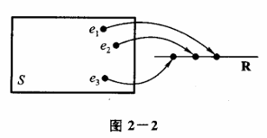

# 概率论·2 随机变量及其分布

## 考纲内容

- 随机变量，随机变量分布函数的概念及其性质
- 离散型随机变量的概率分布
- 连续型随机变量的概率密度
- 常见随机变量的分布
  - 离散型：$0-1 $ 分布、二项分布 B (n,p)、几何分布、超几何分布、泊松(Poisson)分布 $ P (\lambda)$
  - 连续型：均匀分布 U (a,b) 、正态分布 $N (\mu,\sigma^2)$、指数分布，指数分布 $E (\lambda)$
- 随机变量函数的分布

## 一、随机变量

### 1. 随机变量

> 考纲摘要：理解随机变量的概念，理解分布函数 $F(x)=P\{X\le x\}(-\infty<x<+\infty)$
> 的概念及性质，会计算与随机变量相联系的事件的概率

随机变量被定义为样本空间到实数集的映射，如下图所示：

一个示例如下：

> 将一枚硬币抛掷三次，观察出现正面和反面的情况，样本空间是 $S=\{HHH,HHT,HTH,THH,HTT,THT,TTH,TTT\}$
> 一个随机变量的定义如下：
>
> $$
> X=X(e)=\begin{cases}
> 3,&e=HHH,\\
> 2,&e=HHT,HTH,THH,\\
> 1,&e=HTT,THT,TTH,\\
> 0,&e=TTT
> \end{cases}
> $$
>
> 这里，$X$ 的实际含义就是“H出现的次数”

### 2. 分布函数

设 $X $ 是一个随机变量，$ x$ 是任意实数，函数

$$
F(x)=P\{X\le x\},x\in \R
$$

称为 $X$ 的**分布函数**

由于 $\forall x_1,x_2\in \R,P\{x_1<X\le x_2\}=P\{X\le x_2\}-P\{X\le x_1\}=F (x_2)-F (x_1)$
因此，如果已知 $X$ 的分布函数，就可以知道它落在任意区间上的概率

分布函数 F (x) 的性质：

- F (x) 是一个不减函数
- $0\le F (x)\le 1$，且有 $\lim_{x\to-\infty}F (x)=0,\lim_{x\to+\infty}F (x)=1$
- $\lim_{\Delta x\to 0^+}F (x+\Delta x)=F (x)$，也就是说 F (x) 是右连续的

## 二、离散型随机变量及其分布率

> 考纲摘要：
>
> 1. 理解离散型随机变量及其概率分布的概念
> 2. 掌握 $0-1 $ 分布、二项分布 B(n,p)、几何分布、超几何分布、泊松(Poisson)分布 $ P(\lambda)$
>    及其应用

有些随机变量，它全部可能取到的值是有限个或可列无限多个，这种随机变量称为**离散型随机变量**

### 1. $(0-1)$ 分布

设随机变量 $X $ 只可能取 $ 0,1 $ 两个值，其分布律为 $ P\{X=k\}=p^k (1-p)^{1-k}$，也可以写成下表：

| $X $   | $ 0$   | $1$ |
| ------ | ------ | --- |
| $p_k $ | $ 1-p$ | p   |

### 2. 伯努利试验与二项分布 B (n,p)

**伯努利试验**：设试验 $E $ 只有两种可能的结果，分别记为事件 $ A$ 和其对立事件
$\overline A$。如果每次试验只有这两个结果中的一个出现，则称该试验为**伯努利试验**。

**$n $ 重伯努利试验**：将试验 $ E$ 独立地重复进行 $n $ 次，称这 $ n$ 次独立的伯努利试验为**$n$
重伯努利试验**。

以随机变量 $X $ 表示在 $ n$ 重伯努利试验中事件 $A $ 发生的次数，则 $ X$ 的概率分布为：

$$
P\{X=k\} = C_n^k p^k (1-p)^{n-k}, \quad k=0,1,2,\dots,n
$$

其中，$p $ 是事件 $ A$ 发生的概率，$1-p=q$ 是事件 $\overline A$ 发生的概率，$\C_n^k$
是组合数，表示从 $n $ 次试验中恰好选取 $ k$ 次事件 $A$ 发生的方式数。

**二项分布**：随机变量 $X $ 的分布称为**参数为 $ n$ 和 $p $ 的二项分布**，记作 $ X \sim B (n,p)$。

二项分布也可以理解为 $(p + q)^n $ 的展开式中含 $ p^k q^{n-k}$ 项的系数，即二项式定理的应用。

**数学期望**：$E (X) = np$

**方差**：$D (X) = np (1-p)$

### 3. 几何分布 G (p)

在独立重复试验中，首次成功之前失败的次数

参数：单次成功的概率 $p $，$ X\sim G (p)$ 的概率分布为：

$$
P\{X=k\}=(1-p)^kp
$$

数学期望：$E (X)=\frac{1}{p}$ （若 $X $ 表示首次成功所需的试验次数）方差：$ D (X)=\frac{1-p}{p^2}$

> 注：若 $X $ 表示首次成功前失败的次数，则 $ E(X) = \frac{1-p}{p}$。考研通常指前者（试验次数）。

### 4. 超几何分布 H (N,K,n)

N 个球中有 K 个白球，抽取 $n$ 次，抽取结果中白球个数的分布

$X\sim H (N,K,n)$ 的概率分布为：

$$
P\{X=k\}=\frac{C_K^kC_{N-K}^{n-k}}{C_N^n}
E(X)=\frac{nK}{N}\\
D(X)=n\frac KN\cdot\frac{N-K}{N}\cdot\frac{N-n}{N-1}
$$

### 5. 泊松分布 $P (\lambda)$

> 考纲摘要：了解泊松定理的结论和应用条件，会用泊松分布近似表示二项分布

设随机变量 $X $ 的所有可能取值为 $ 0,1,2,\cdots$，而各个值的概率为：

$$
P\{X=k\}=\frac{\lambda^k e^{-\lambda}}{k!}, \quad k=0,1,2,\cdots
$$

其中 $\lambda > 0 $ 是常数，则称 $ X$ 服从参数为
$\lambda $ 的**泊松分布**，记作 $ X \sim P (\lambda)$。

泊松分布的数学期望和方差为：

$$
E(X) = \lambda, \quad \text{Var}(X) = \lambda
$$

#### 泊松定理

泊松定理是二项分布向泊松分布的渐近近似。当二项分布的试验次数 $n $ 很大，且成功概率 $ p$
很小时，二项分布可以用泊松分布近似。

设 $n $ 是任意正整数，$ p$ 是一个随 $n $ 变化的概率，满足 $ np = \lambda$，其中 $\lambda$
为常数，则对于任一固定的非负整数 $k$，有：

$$
\lim_{n \to \infty} \C_k^n p^k (1-p)^{n-k} = \frac{\lambda^k e^{-\lambda}}{k!}
$$

这表示当 $n $ 很大且 $ p$ 很小时，二项分布 B (n, p) 近似于泊松分布 $P (\lambda = np)$。

## 三、连续型随机变量

> 考纲摘要：理解连续型随机变量及其概率密度的概念，掌握均匀分布 U(a,b) 、正态分布
> $N(\mu,\sigma^2)$、指数分布及其应用，其中参数为 $\lambda(\lambda>0)$ 的指数分布 $E(\lambda)$
> 的概率密度为
>
> $$
> f(x)=\begin{cases}\lambda e^{-\lambda x},&x>0\\0,&x\le0\end{cases}
> $$

### 1. 概率密度

如果对于随机变量 $X$ 的分布函数 F (x)，存在非负函数 f (x)，使得：

$$
\forall x\in\R,F(x)=\int_{-\infty}^xf(t)\mathrm dt
$$

则称 $X $ 为**连续型随机变量**，其中函数 f (x) 称为 $ X$ 的**概率密度函数**，它具有以下性质：

- $f (x)\ge0$
- $\int_{-\infty}^\infty f (x)\mathrm dx=1$
- $\forall x_1,x_2\in\R (x_1\le x_2),P\{x_1<x\le x_2\}=F (x_2)-F (x_1)=\int_{x_1}^{x_2}f (x)\mathrm dx$
- 如果 f (x) 在点 $x $ 处连续，则有 $ F'(x)=f (x)$

### 2. 均匀分布 U (a,b)

如果随机变量 $X$ 的概率密度为：

$$
f(x)=\begin{cases}
\cfrac1{b-a},&a<x<b\\
0,&others
\end{cases}
$$

则称 $X$ 在区间 $(a,b)$ 上服从**均匀分布**，记作 $X\sim U (a,b)$，显然，其分布函数如下所示：

$$
F(x)=\begin{cases}
0,&x<a\\
\cfrac{x-a}{b-a},&a\le x<b\\
1,&x\ge b
\end{cases}
$$

其数学期望 $E (X)=\cfrac{a+b}{2}$

### 3. 指数分布 $E (\lambda)$

如果随机变量 $X$ 的概率密度为：

$$
f(x)=\begin{cases}
\lambda e^{-\lambda x},&x>0\\
0,&x\le 0
\end{cases}
$$

其中常数 $\lambda>0 $，则称 $ X$ 是服从参数 $\lambda$ 的指数分布，记作
$X\sim E (\lambda)$，显然，其分布函数如下所示：

$$
F(x)=\begin{cases}
1-e^{-\lambda x},&x>0\\
0,&x\le 0
\end{cases}
$$

指数分布的性质具有**无记忆性**，即满足该等式：$P\{X>s+t|X>s\}=P\{X>t\}$

### 4. 正态分布 $N (\mu,\sigma^2)$

如果随机变量 $X$ 的概率密度为：

$$
f(x)=\cfrac1{\sqrt{2\pi}\sigma}\exp\left[{-\frac{(x-\mu)^2}{2\sigma^2}}\right],-\infty<x<\infty
$$

其中，$\mu,\sigma (\sigma>0)$ 为常数，则称 $X$ 是服从参数 $\mu,\sigma$
的**正态分布**（高斯分布），记作 $X\sim N (\mu,\sigma^2)$，其性质如下：

- f (x) 的图像关于直线 $x=\mu$ 对称，也就是说：$\forall h>0,P\{\mu-h<X\le\mu\}=P\{\mu<X\le\mu+h\}$
- $x=\mu $ 是 f (x) 的最大值点，且 $ f (\mu)=\cfrac1{\sqrt{2\pi}\sigma}$
- f (x) 的图像在 $x=\mu+\sigma $ 处有拐点，曲线的渐近线是 $ x$ 轴，改变 $\mu$
  的值不会改变图像的形状，只会将其沿着 $x$ 轴平移， $\mu$ 完全确定了曲线的位置，也称作**位置参数**

其分布函数为：

$$
F(x)=\cfrac1{\sqrt{2\pi}\sigma}\int_{-\infty}^x \exp\left[{-\frac{(t-\mu)^2}{2\sigma^2}}\right]\mathrm dt
$$

特别地，$\mu=0,\sigma=1$ 时，称作**标准正态分布**，其概率密度函数与分布函数分别表示成：

$$
\varphi(x)=\frac1{\sqrt{2\pi}}\exp[-x^2/2]
\\
\Phi(x)=\frac1{\sqrt{2\pi}}\int_{-\infty}^x\exp[-t^2/2]\mathrm dt
\\
\text{性质：}
\\
1. \varphi(x) \text{ 是偶函数，} \varphi(-x) = \varphi(x)
\\
2. \Phi(-x)=1-\Phi(x)
\\
3. P\{|X| \le a\} = 2\Phi(a) - 1
$$

计算正态分布时，以下引理是有用的：若 $X\sim N (\mu,\sigma^2)$，则
$\cfrac{X-\mu}{\sigma}\sim N (0,1)$，其分布函数：

$$
F(x)=P\{X\le x\}=\{\frac{X-\mu}{\sigma}\le\frac{x-\mu}{\sigma}\}=\Phi(\frac{x-\mu}\sigma)
$$

这样一来，就可以通过标准正态分布的分布函数的函数值表来计算任意正态分布的分布函数值，根据此，还可以得到以下结论：

- $P\{\mu-\sigma<X<\mu+\sigma\}=\Phi (1)-\Phi (-1)\approx 68.26\%$
- $P\{\mu-2\sigma<X<\mu+2\sigma\}=\Phi (2)-\Phi (-2)\approx 95.44\%$
- $P\{\mu-3\sigma<X<\mu+3\sigma\}=\Phi (3)-\Phi (-3)\approx 99.74\%$

正态分布中随机变量落在 $(\mu-3\sigma,\mu+3\sigma)$ 上几乎是肯定的是，这就是所谓**3σ法则**

## 四、随机变量函数的分布

> 考纲摘要：会求随机变量函数的分布

### 1. 随机变量的函数的分布

设有随机变量 X,Y，其中，$Y=g (X)$，如果已知 $X $ 的概率密度或分布函数，就可以求出 $ Y$
的概率密度和分布函数

$$
F_Y(y)=P\{Y\le y\}=P\{g(X)\le y\}
$$

然后解不等式 $g (X)\le y $，设解出的区间为 $ D$，而这个区间的界定显然与 $y$ 有关，因此
$F_Y (y)=P\{X|X\in D\}$，这样一来，就可以找到 $F_Y (y)$ 使用 $F_X (y)$ 来表示的式子，进而求出
$F_Y (y)$。例如：

#### $\chi^2$ 分布

> 设 $X\sim N(0,1)$，求 $Y=X^2$ 的概率密度：
>
> $$
> F_Y(y)=F\{Y\le y\}=F\{X^2\le y\}=F\{-\sqrt y\le X\le \sqrt y\}=F_X(\sqrt y)-F_X(-\sqrt y)\\
> f_Y(y)=F_Y'(y)=\frac{f_X(\sqrt y)+f_X(-\sqrt y)}{2\sqrt y}=\frac{\cfrac{1}{\sqrt 2\pi}e^{-y/2}+\cfrac{1}{\sqrt 2\pi}e^{-y/2}}{2\sqrt y}=\frac{1}{\sqrt{2\pi}}y^{-1/2}e^{-y/2}
> $$
>
> $Y$ 落在 $(-\infty,0]$ 上是不可能的，因此 $Y$ 的概率密度函数为：
>
> $$
> f_Y(y)=\begin{cases}
> \cfrac{1}{\sqrt{2\pi}}y^{-1/2}e^{-y/2},&y>0\\
> 0,&y\le0
> \end{cases}
> $$
>
> 这个 $Y$ 也称为**服从自由度为 1 的 $\chi^2$ 分布**

定理：设随机变量
$X $ 具有概率密度 $ f_X (x),-\infty<x<\infty $，又设函数 g (x) 处处可导且 $ g'(x)>0$ （或恒有
$g'(x)<0 $），则 $ Y=g (X)$ 是连续型随机变量，其概率密度为：

$$
f_Y(y)=\begin{cases}
f_X[h(y)]|h'(y)|,&\alpha<y<\beta\\
0,&others
\end{cases}
$$

其中，$\alpha=\min\{g (-\infty),g (\infty)\},\beta=\max\{g (-\infty),g (\infty)\},h (y)=g^{-1}(y)$

---

## 常见分布速查表

| 分布      | 记号              | E(X)         | D(X)           |
| --------- | ----------------- | ------------ | -------------- |
| 0-1 分布  | B(1,p)            | $p$          | p(1-p)         |
| 二项分布  | B(n,p)            | np           | np(1-p)        |
| 泊松分布  | $P(\lambda)$      | $\lambda$    | $\lambda$      |
| 几何分布  | G(p)              | $1/p$        | $(1-p)/p^2$    |
| 均匀分布  | U(a,b)            | $(a+b)/2$    | $(b-a)^2/12$   |
| 指数分布  | $E(\lambda)$      | $1/\lambda $ | $ 1/\lambda^2$ |
| 正态分布  | $N(\mu,\sigma^2)$ | $\mu$        | $\sigma^2$     |
| 卡方分布  | $\chi^2(n)$       | $n $         | $ 2n$          |
| $t $ 分布 | t(n)              | $ 0$         | n/(n-2)        |

## 易错辨析

| 易错表述                       | 正确理解                                         |
| ------------------------------ | ------------------------------------------------ |
| "$P(A)=0 $ 则 $ A$ 不可能发生" | ❌ 连续型中 $P(X=a)=0 $ 但 $ a$ 可能取到         |
| "不相关等于独立"               | ❌ 仅**二维正态**时不相关 $\Leftrightarrow$ 独立 |
| "$E(XY)=E(X)E(Y)$ 总成立"      | ❌ 仅在**独立**时成立（不相关仅对线性无关）      |
