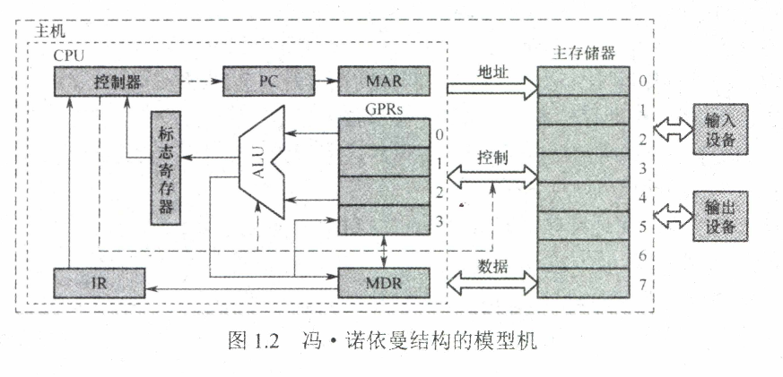
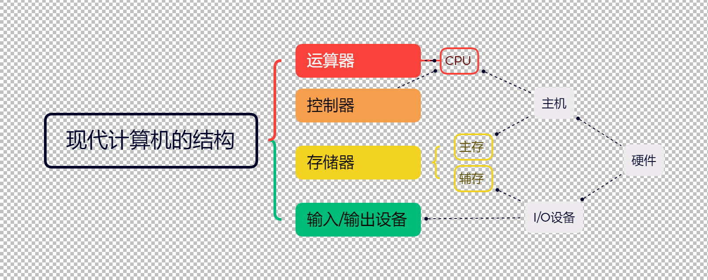
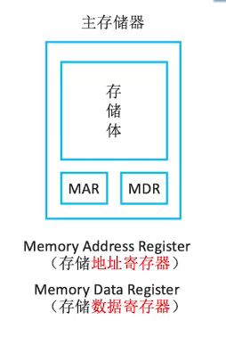
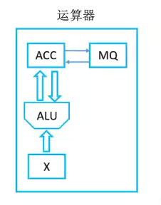
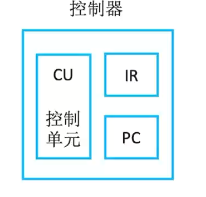
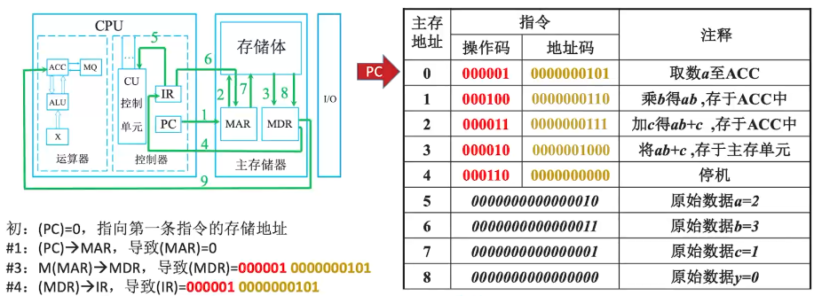
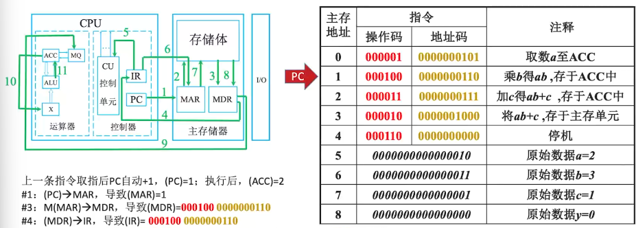
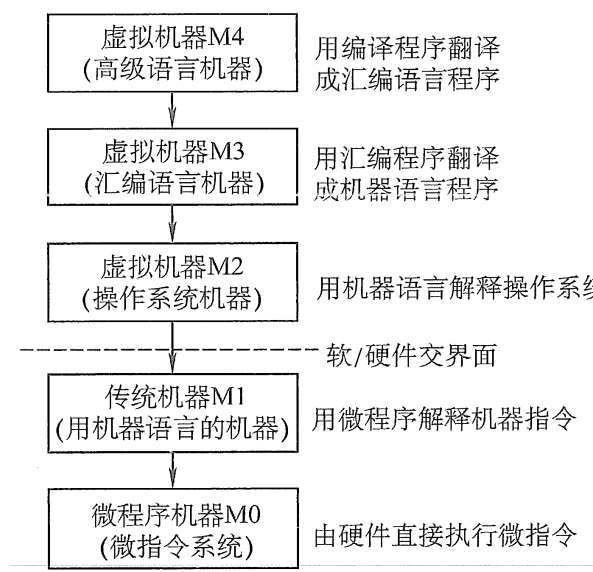
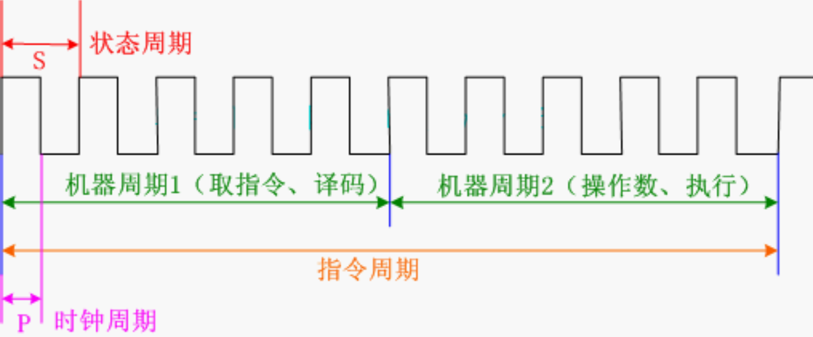

# 计算机组成原理·1 计算机系统概述

## 【导语】

## 考纲内容

1. **计箅机系统层次结构**
   - 计算机系统的基本组成
   - 计算机硬件的基本组成
   - 计算机软件和硬件的关系
   - 计算机系统的工作原理：**存储程序**方式、高级语言程序与机器语言程序的转换程序和指令的执行过程

2. **计算机性能指标**
   - 吞吐量、响应时间、CPU时钟周期、主频、CPI、CPU执行时间、MIPS

   - FLOPS：MFLOPS、GFLOPS、TFLOPS、PFLOPS、EFLOPS、ZFLOPS

## \*计算机发展历程

| 发展阶段 |   时间    |         逻辑元件         | 速度（次/秒） |      内存      |              外存              |
| :------: | :-------: | :----------------------: | :-----------: | :------------: | :----------------------------: |
|  第一代  | 1946-1957 |          电子管          |   几千-几方   | 汞延迟线、磁鼓 |         穿孔卡片、纸带         |
|  第二代  | 1958-1964 |          晶体管          |  几万-几干万  |   磁芯存储器   |              磁带              |
|  第三代  | 1964-1971 |     中小规模集成电路     | 几十万-几百万 |  半导体存储器  |           磁带、磁盘           |
|  第四代  | 1972-现在 | 大规模、超大规模集成电路 |  上千万-万亿  |  半导体存储器  | 磁盘、磁带、光盘、半导体存储器 |

- 第一代使用纸带磁带编程。
- 第二代出现了面向过程的程序设计语言FORTRAN，有了操作系统雏形。
- 第三代主要用于科学计算等专业用途，高级语言快速发展，开始有了分时系统。
- 第四代开始出现CPU、PC，如Windows、MacOS等。

> [!NOTE] **摩尔定律 (Moore's
> Law)**：当价格不变时，集成电路上可容纳的晶体管数目，约每隔 18-24 个月便会增加一倍，性能也将提升一倍。

> [!IMPORTANT] **计算机体系结构 vs. 计算机组成**：
>
> - **体系结构 (Architecture)**：程序员所见到的计算机属性（指令集、数据类型、寻址方式等）。**有无**该功能。
> - **计算机组成 (Organization)**：如何实现体系结构（具体逻辑设计、控制信号、部件连接等）。**如何**实现该功能。
> - **例子**：是否支持乘法指令属于体系结构；是用加法器实现乘法还是用专门的乘法器实现属于计算机组成。

#### 冯诺依曼结构



> [!IMPORTANT] **冯·诺依曼结构核心**：
>
> 1. **五大部件**：输入设备、存储器、运算器、控制器、输出设备。
> 2. **存储程序**：指令和数据同等地位存入存储器，按地址寻访。
> 3. **二进制表示**：指令和数据均以二进制表示。
> 4. **以运算器为中心**：I/O 设备与存储器间的数据传送通过运算器。
>
> - **注意**：现代计算机以 **存储器** 为中心。

现代计算机：以存储器为中心

CPU(Central Processing Unit)=运算器+控制器



#### 计算机的功能部件

##### 主存储器MM(Main Memory)



- MAR，地址寄存器
  - MAR位数反映存储单元的个数

- MDR，数据寄存器
  - MDR位数 $=$ 存储字长

##### 运算器ALU(Arithmetic Logic Unit)

**运算器：**用于实现算术运算（加减乘除）、**逻辑运算**（与或非)



- ACC(Accumulator):累加器，用于存放操作数，或运算结果。
- MQ(Multiplier-Quotient Register):乘商寄存器，在乘、除运算时，用于存放操作数或运算结果。
- $X$(此字母没有专指的缩写含义，可以用作任一部件名):通用的操作数寄存器，用于存放操作数
- ALU(Arithmetic Logic Unit):算术逻辑单元，通过内部复杂的电路实现算数运算、逻辑运算

---

> 以下内容详见第二章2.5.3 原码乘法
>
> 进行乘法操作 $(a*b)$ 时,MQ存放乘数,$X$存放被乘数,ALU计算后把乘积放入ACC中
>
> 如果数据较大会将部分积存储在MQ中,在乘法的每个时钟周期中，ALU会将当前乘法结果累加到MQ中。
>
> ALU还可以使用ACC来保存中间积的高位，以便在乘法的不同阶段进行溢出处理。

##### 控制器



> [!NOTE] **控制器核心寄存器**：
>
> - **PC** (Program Counter)：存放下一条指令地址，具有自动加 1 功能。
> - **IR** (Instruction Register)：存放当前正在执行的指令。
> - **CU** (Control Unit)：分析指令并发出控制信号。

##### 计算机执行指令的工作过程

对于C语言代码

```C
int a=2,b=3,c=1,y=0;
void main(){
    y=a*b+c;
}
```

主存中编译出来的机器语言如下:



**(MAR),(PC)指该寄存器中的内容 PC是一种特殊的寄存器**

**M指Memory存储器，这里是主存储器,M(MAR)指主存MAR指向地址所对应的内容**

**(PC)→MAR指PC里面的内容放到MAR里面**

**OP是操作码,AD是地址码**

以第一步操作为例:

初始状态：(PC)=0,指向第一条指令的存储地址

#1:(PC)→MAR,导致(MAR)=0

#3:M(MAR)→MDR,导致(MDR)=**000001** 0000000101

#4:(MDR)→1R,导致(IR)=**000001** 0000000101

#5:OP(IR)→CU,指令的操作码送到CU,CU分析后得知，这是“取数”指令

#6:AdIR)→MAR,指令的地址码送到MAR,导致(MAR)=5

#8:M(MAR)→MDR,导致(MDR)=0000000000000010=2

#9:(MDR)→ACC,导致(ACC)=0000000000000010=2

> **取指令(#1~#4)**
>
> **分析指令(#5)\***
>
> **执行取数指令(#6~#9)**



上一条指令取指后PC自动$+1$，$(PC)=1$:执行后，$(ACC)=2$

#1:$(PC)→MAR$,导致$(MAR)=1$

#3:$M(MAR) \rightarrow MDR$,导致$(MDR)=000100 0000000110$

#4:$(MDR)→IR$,导致$(IR)=0001000000000110$

#5:$OP(IR)→CU,$指令的操作码送到CU,CU分析后得知，

#6:$Ad(IR)→MAR,$指令的地址码送到MAR,导致$(MAR)=6$

#8:$M(MAR)→MDR$,导致$(MDR)=0000000000000011=3$

#9:$(MDR)→MQ$,导致$(MQ)=0000000000000011=3$

#10:$(ACC)→X$,导致$(X)=2$

#11:$(MQ)*(X)→ACC,$由ALU实现乘法运算，导致$(ACC)=6$

> **取指令(#1~#4)**
>
> **分析指令(#5)**
>
> **执行取数指令(#6~#11)**

### 计算机软件

#### 三种语言

- 机器语言：唯一可以被计算机识别和执行的语言。
- 汇编语言：必须经过汇编程序的翻译。
- 高级语言：转换为汇编程序或直接翻译为机器语言。
  - 解释型语言：采用边解释边执行的方法。不生成目标程序
    - 如Python,JavaScript。（每次执行都要翻译）
    - 解释程序要边翻译成机器语言边执行，一般速度较编译程序慢

  - 编译型语言：必须先将源程序翻译成目标程序才能运行
    - 如C/Cpp等。（只需翻译一次）
    - $C$语言编译链接的过程：

      

    - 将源程序转换为可执行目标文件的过程分为**预处理、编译、汇编、链接四个阶段**

  - Java既不属于传统的编译型语言，也不属于解释型语言。Java事先编译成`.class`字节码文件，然后再利用JVM虚拟机进行解释执行的，所以Java即可以说成编译型，也可以说成解释型。

> [!TIP] **翻译程序分类**：
>
> - **汇编程序**：汇编语言 $\to$ 机器语言。
> - **解释程序**：源程序 $\to$ 逐条翻译执行（不生成目标程序）。
> - **编译程序**：高级语言 $\to$ 汇编/机器语言（生成目标程序）。

#### 软硬件逻辑等价性

硬件实现的往往是最基本的算术和逻辑运算功能，而其他功能大多通过软件的扩充得以实现。对某一功能来说，既可以由硬件实现，又可以由软件实现，从用户的角度来看，它们在功能上是等价的。这一等价性被称为软、硬件逻辑功能的等价性。例如，浮点数运算既可以用专门的浮点运算器硬件实现，又可以通过一段子程序实现，这两种方法在功能上完全等效，不同的只是执行时间的长短而已，显然**硬件实现的性能要优于软件实现的性能**。

### 计算机系统层次结构



- 高级语言层：面向用户，必须用编译程序（编译器或解释器）翻译成汇编语言程序。
- 汇编语言层：不能直接运行汇编语言，必须用汇编程序（汇编器）翻译成机器语言程序，所以是虚拟的。汇编语言与机器语言一一对应。
- 操作系统机器层：由操作系统程序实现，向上提供“广义指令”即系统调用。也称为混合层。
- 传统机器层（指令集架构层，ISA）：执行二进制机器指令，微程序解释机器执行微指令。
- 微指令层：由硬件直接执行微指令。只有微程序设计的计算机系统才有这一层。
- 逻辑门层：最底层的硬件系统。

#### 系统软件和应用软件

##### **系统软件：**

系统软件是位于计算机系统底层的软件层，它提供了一系列核心功能和服务，以支持计算机硬件和应用软件的运行。系统软件主要包括操作系统和实用工具，它们管理计算机的资源、调度任务、提供接口等。

操作系统OS、数据库管理系统DBMS、语言处理系统、分布式软件系统、网络软件系统、标准库程序、服务性程序等

例子：

- **操作系统（例如Windows、Linux、macOS）：**
  操作系统是计算机系统的核心，负责管理硬件资源，为应用程序提供执行环境，处理进程管理、文件系统、内存管理、设备驱动程序等任务。
- **编译器（例如GCC、Visual C++）：**
  编译器将高级程序语言翻译成计算机能够执行的机器代码，使应用程序能够在计算机上运行。

##### **应用软件：**

应用软件是构建在系统软件之上的，为特定任务或功能提供解决方案的软件。它们是用户直接与之交互的软件，用于完成各种具体的任务和操作。

如各种科学计算类程序、工程设计类程序、数据统计与处理程序等。

例子：

- **办公套件（例如Microsoft Office、LibreOffice）：**
  这些软件包括文档处理、电子表格、演示文稿等功能，用于办公和业务任务。
- **图形设计软件（例如Adobe Photoshop、CorelDRAW）：**
  用于图像处理和设计，包括照片编辑、插图制作等。
- **网络浏览器（例如Google Chrome、Mozilla Firefox）：** 用于浏览互联网上的网页和资源。
- **媒体播放器（例如VLC、Windows Media Player）：** 用于播放音频和视频文件。

总之，系统软件是支持计算机硬件和管理系统资源的核心软件，而应用软件则是为用户提供各种具体功能的软件。它们在计算机系统层次结构中协同工作，共同实现计算机的各种任务和功能。

> 数据库系统是指在计算机系统中引入数据库后的系统，一般由数据库、数据库管理系统、应用系统、数据库管理员构成，其中数据库管理系统是系统程序。

## 计算机性能指标和评价

### 基本性能指标

#### 字长

字长是指计算机进行一次整数运算（即定点整数运算）所能处理的二进制数据的位数。

字长一般与计算机内部**寄存器**、**运算器**，**数据总线**的位宽相等。

---

> **字、字长、机器字长、指令宇长、存储字长的区别和联系是什么？**
>
> > [!IMPORTANT] **字、字长与机器字长**：
>
> - **机器字长**：CPU 内部用于整数运算的数据通路宽度（通常等于寄存器位数）。
> - **指令字长**：一条指令包含的二进制位数。
> - **存储字长**：一个存储单元存储的二进制位数。
> - **注意**：指令字长通常是存储字长的整数倍。

#### 数据通路带宽

数据通路带宽是指数据总线一次所能并行传送信息的位数。这里所说的数据通路宽度是指外部数据总线的宽度，它与CPU内部的数据总线宽度·（内部寄存器的大小）有可能不同。

> **注：各个子系统通过数据总线连接形成的数据传送路径称为数据通路。**

#### 主存客量

主存容量是指主存储器所能存储信息的最大容量，通常以字节来衡量，也可用字数×字长（如$512K×16位$)来表示存储容量。

- 其中，MAR的位数反映了存储单元的个数，MDR的位数反映了存储单元的字长。
  - 例如，MAR为 $16$ 位，表示$2^{16}$=$65536$
  - 即此存储体内有 $65536$ 个存储单元（可称为 $64K$ 内存，$1K=1024$)
  - 若MDR为 $32$ 位，表示存储容量为 $64K×32$ 位

增加主存容量可以减少程序运行期间访问辅存的次数，有利于提高程序的运行速度，也有利于计算机性能的提高。

### 与时间有关的性能指标

**程序执行时间(响应时间)=硬盘访问时间+内存访问时间+I/O操作时间+操作系统开销时间+CPU执行时间**

#### 时钟周期 $T$ 与(时钟)主频$f$

CPU主频$f$ :CPU内数字脉冲信号振荡的频率。单位为赫兹。

CPU主频（时钟主频）=$\frac{1}{\text{CPU时钟周期}}$。即

$$
f=\frac{1}{T}
$$

CPU时钟周期$T$ ：单位为纳秒或微秒。在一个时钟周期内，CPU仅完成**一个最基本的动作**。



**最基本的动作 $\ne$ 一条指令**

**最基本的动作 $\ne$ 一条指令**

**最基本的动作 $\ne$ 一条指令**

下文全是针对**指令**而言

> [!NOTE] **四种周期对比**：
>
> - **时钟周期**：CPU 操作的最基本单位，**主频的倒数**，通常不变。
> - **机器周期**（CPU 周期）：完成一个基本操作（如访存）的时间，由多个时钟周期组成。
> - **指令周期**：取出并执行一条指令的总时间，由多个机器周期组成。
> - **存取周期**：存储器进行两次独立操作所需的最小间隔。

#### 执行指令均所需时钟周期数CPI

CPI（Clock cycle Per Instruction）：执行一条指令所需的时钟周期数。

也称节拍周期或 $T$ 周期

CPI即可表示每条指令执行所需要的时钟周期数，也可指一类指令或一段程序中所有指令所需时钟周期数的**平均值**。

计算公式：

$$
CPI=\frac{m}{IC}
$$

其中，程序中**包含的总指令条数用IC表示**，程序执行所需**时钟周期数为$m $，机器周期为$
T$，频率为$f$**。

若能知道某程序中每类指令的使用频率（用 $P_i$ 表示），每类指令的CPI(用 $CPI_i$
表示)，每类指令的条数（用 $IC_i$ 表示)，则程序的CPI可表示为：

$$
\mathrm{CPI}=\sum_{i=1}^{n}\left(\mathrm{CPI}_{i} \times P_{i}\right)=\sum_{i=1}^{n}\left(\mathrm{CPI}_{i} \times \frac{\mathrm{IC}_{i}}{\mathrm{IC}}\right)
$$

> 单周期处理器的每条指令的CPI都为1
>
> 单周期处理器是指所有指令的指令周期为一个时钟周期的处理器

#### CPU时间$T_{\text {cpu}}$

即执行程序一共需要多少时间

$$
T_{\text {cpu}}=m \times T
$$

考虑CPI后，

$$
T_{\text {cpu}}=\mathrm{CPI} \times \mathrm{IC} \times T=\frac{\mathrm{CPI} \times \mathrm{IC}}{f}
$$

#### 每时钟周期执行指令条数IPC

IPC(Instructions Per
Cycle)是指每个时钟周期CPU能执行的指令条数，是CPI的倒数，于指令流水线技术以及多核技术的发展，目前IPC的值已经可以大于$1 $，反过来CPI的值也可小于$
1$。即

$$
IPC=\frac{1}{CPI}
$$

> [!IMPORTANT] **浮点数性能指标 (FLOPS)**：
>
> - **MFLOPS** ($10^6 $)、**GFLOPS** ($ 10^9 $)、**TFLOPS** ($ 10^{12}$)、**PFLOPS** ($10^{15}$)。
> - **注意**：MIPS 针对定点指令，FLOPS 针对浮点指令。

> [!IMPORTANT] **性能指标计算公式**：
>
> 1. $f = \frac{1}{T}$
> 2. CPU 时间 $T_{cpu} = IC \times CPI \times T = \frac{IC \times CPI}{f}$
> 3. $MIPS = \frac{IC}{T_{cpu} \times 10^6} = \frac{f}{CPI \times 10^6}$

#### **【总结】**

- 主频$f=\dfrac{1}{T}$
  - $T$: 时钟周期

- 执行指令(平均)所需时钟周期数$CPI=\dfrac{m}{IC}$
  - CPI(Clock cycle Per Instruction)
  - IC总指令条数
  - $m$执行所需时钟周期数

- 执行指令(平均)所需时钟周期数

$$
\mathrm{CPI}=\sum_{i=1}^{n}\left(\mathrm{CPI}_{i} \times P_{i}\right)=\sum_{i=1}^{n}\left(\mathrm{CPI}_{i} \times \frac{\mathrm{IC}_{i}}{\mathrm{IC}}\right)
$$

      - $P_i$每类指令的使用频率
      - $CPI_i$每类指令的CPI
      - $IC_i$每类指令的条数

- CPU时间$T_{\text {cpu}}$：执行程序一共需要多少时间

$$
T_{\text {cpu}}=m \times T\\
T_{\text {cpu}}=\mathrm{CPI} \times \mathrm{IC} \times T=\dfrac{\mathrm{CPI} \times \mathrm{IC}}{f}
$$

- 每时钟周期执行指令条数$IPC=\dfrac{1}{CPI}$

- MIPS(Million Instructions Per Second)​每秒执行多少百万条指令

$$
MIPS=\dfrac{IC}{T_{\text {cpu}}\times 10^{6}}\\
MIPS=\dfrac{f}{CPI}
$$

      - 此处计算省略了 $f$ 的单位，所以只有在 $f$ 单位是MHz时才可以直接用，不然要除以$M(10^6)$

#### 系统整体的性能指标

##### 数据通路带宽

数据总线一次所能并行传送信息的位数（各硬件部件通过数据总线传输数据）

##### 吞吐量

指系统在单位时间内处理请求的数量。

它取决于信息能多快地输入内存，CPU能多快地取指令，数据能多快地从内存取出或存入，以及所得结果能多快地从内存送给一台外部设备。这些步骤中的每一步都关系到主存，因此，系统吞吐量主要取决于主存的存取周期。

##### 响应时间

指从用户向计算机发送一个请求，到系统对该请求做出响应并获得它所需要的结果的等待时间。

### 几个专业术语

1.  系列机。具有基本相同的体系结构，使用相同基本指令系统的多个不同型号的计算机组成的一个产品系列。
2.  兼容。指软件或硬件的通用性
    - 即运行在某个型号的**计算机系统中的**硬件或软件**也能应用于**另一个型号**的计算机系统**时
    - 称这两台计算机在硬件或软件上存在兼容性。
3.  软件可移植性。
    - 指把使用在某个系列计算机中的软件直接或进行很少的修改就能运行在另一个系列计算机中的可能性。
4.  固件。将程序固化在ROM中组成的部件称为固件。固件是一种具有软件特性的硬件，吸收了软/硬件各自的优点，其执行速度快于软件，灵活性优于硬件，是软/硬件结合的产物。
    - 例如，目前操作系统己实现了部分固化（把软件永恒地存储于ROM中）

## QA常见问题

问：主频高的CPU一定比主频低的CPU快吗？不一定，如两个CPU,A的主频为2GHz,平均CPI=10;B的主频1GHz,平均CPI=1

问：若A、B两个CPU的平均CPI相同，那么A一定更快吗？

也不一定，还要看指令系统，如A不支持乘法指令，只能用多次加法实现乘法；而B支持乘法指令。

问：基准程序执行得越快说明机器性能越好吗？

基准程序中的语可存在频度差异，运行结果也不能宪全说明问题
