# 计算机组成原理·2 数据的表示与运算

## 【导语】

## 考纲内容

1.   **数制与编码**
     1.   进位计数制及其相互转换
     2.   定点数的编码表示
2.   **运算方法和运算电路**
     1.   基本运算部件：加法器、算法逻辑单元 ALU
     2.   加/减运算：补码加/减运算器、标志位的生成
     3.   乘/除运算：乘/除法运算的基本原理、乘法运算和除法电路的基本结构
3.   **整数的表示和运算**
     1.   无符号整数的表示和运算
     2.   带符号整数的表示和运算
4.   **浮点数的表示和运算**
     1.   浮点数的表示：IEEE  754 标准、浮点数的加/减运算

### 知识导图

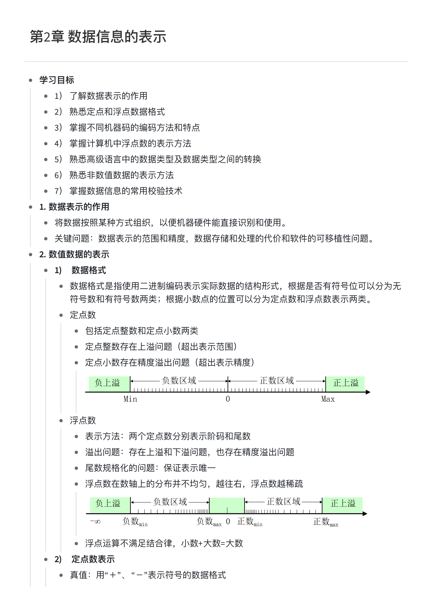

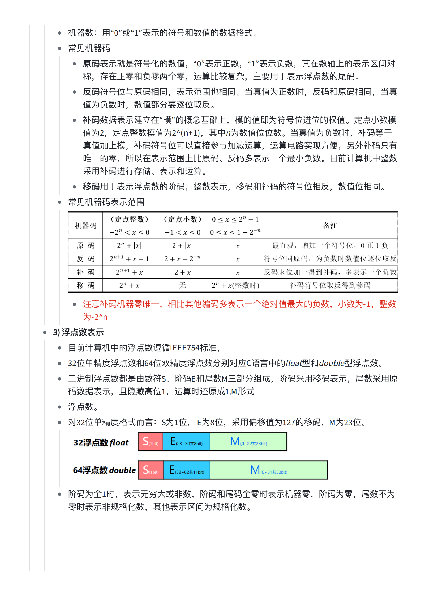

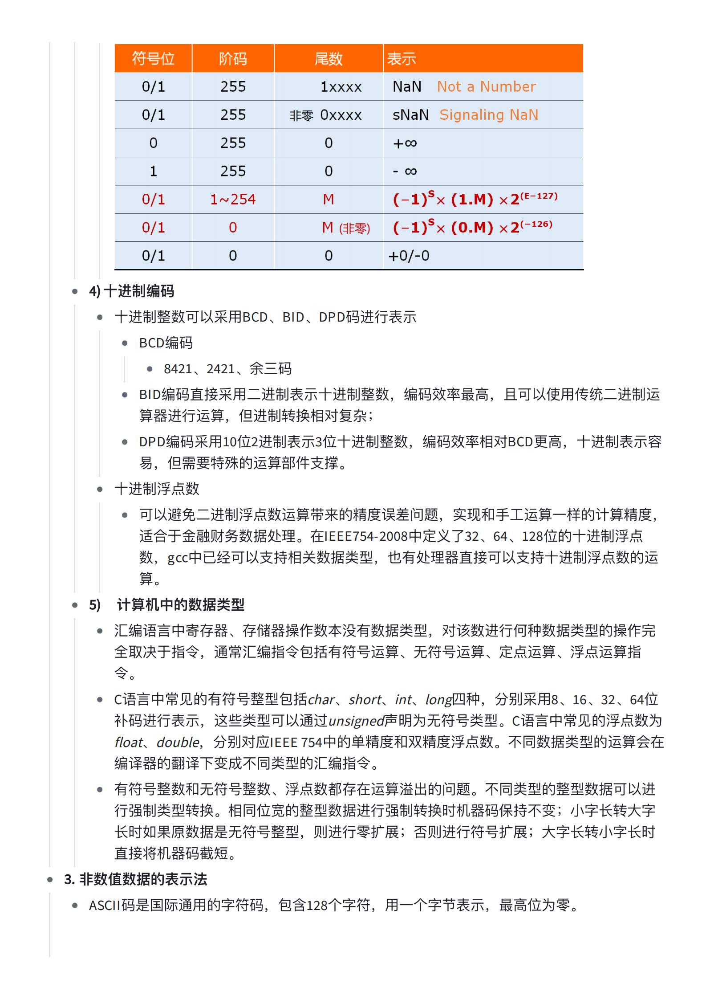

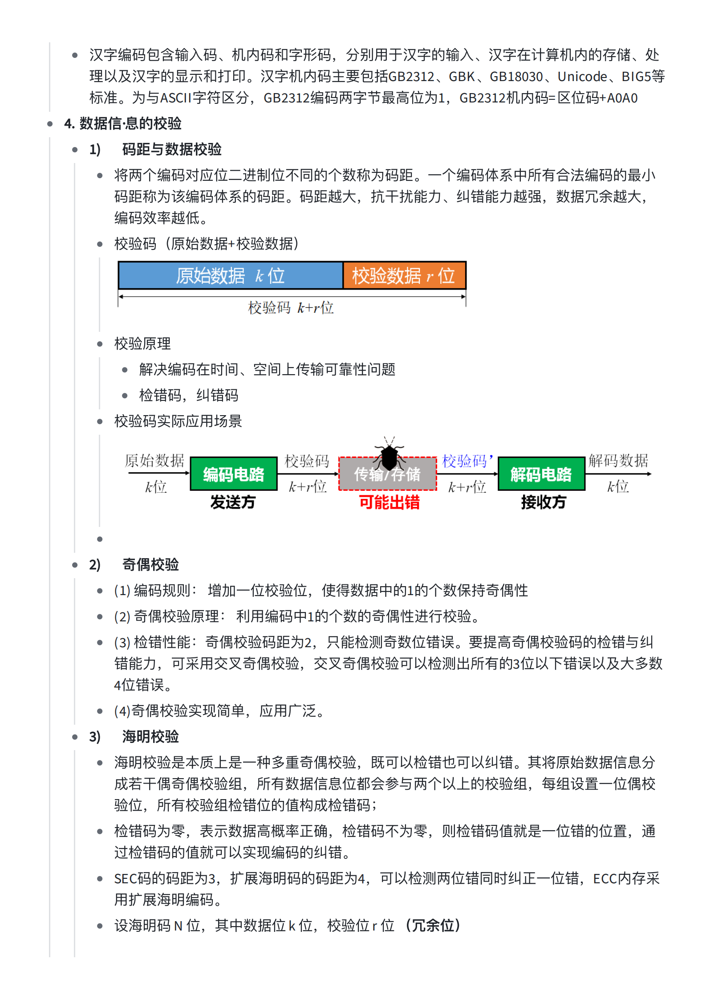

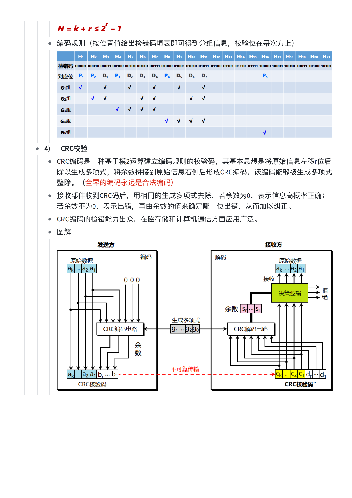

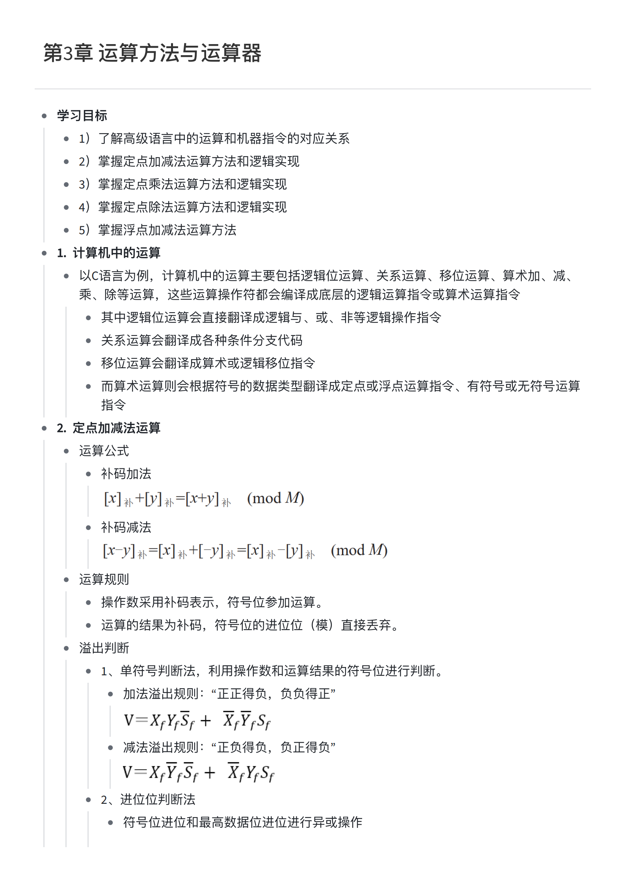

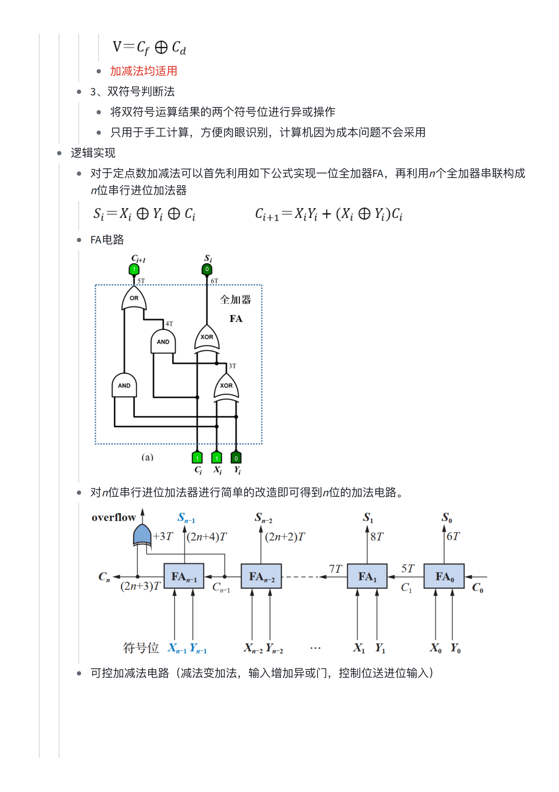

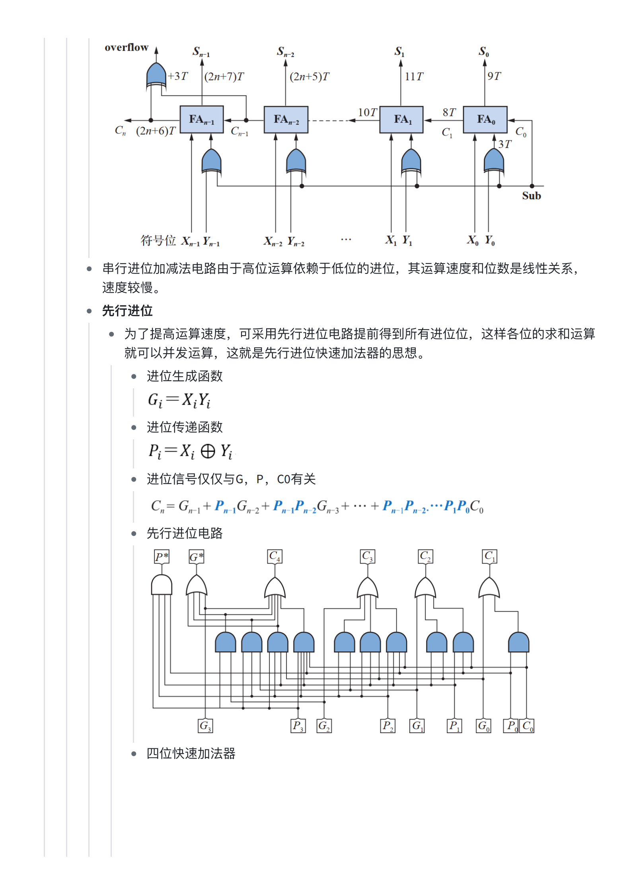

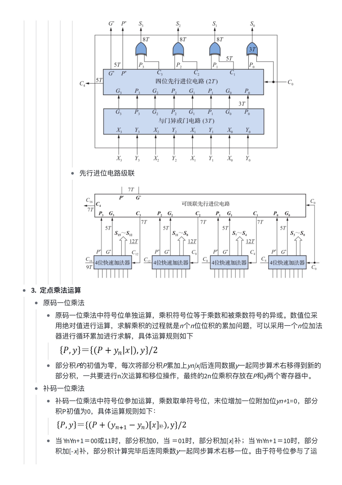

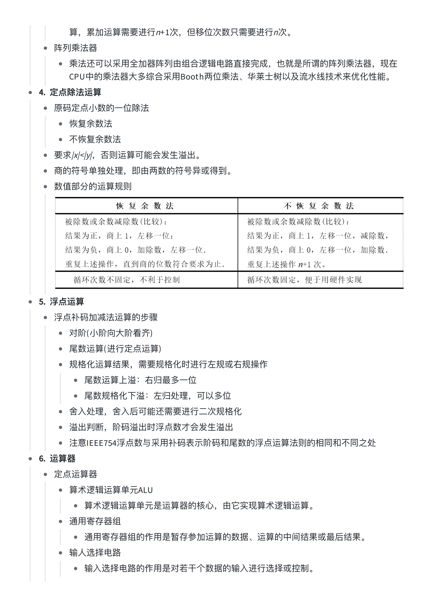

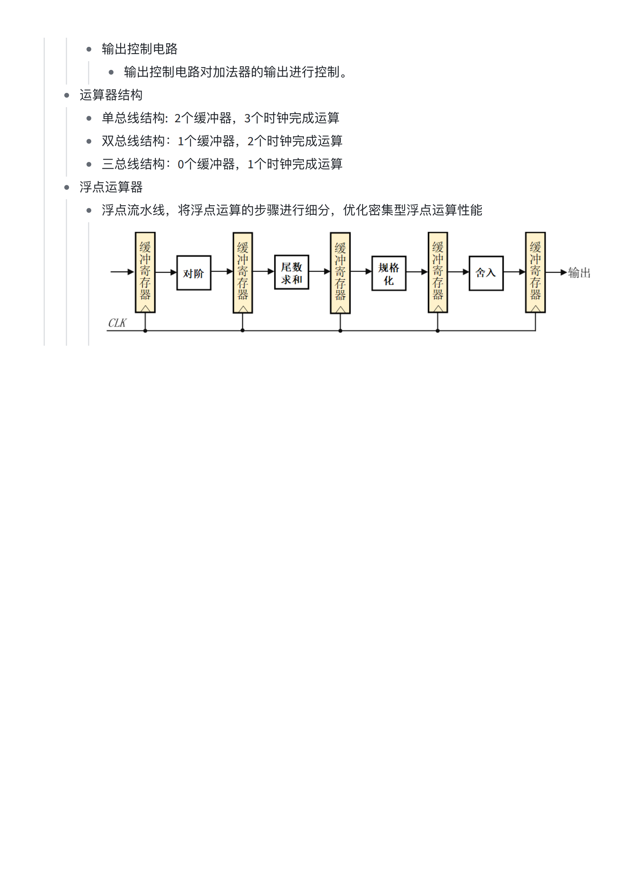

## 数制与编码

### 进位计数制

- 真值：符合人类习惯的数字。
- 机器数：数字实际存到机器里的形式，正负号需要被“数字化”。

#### 十进制

- 符号反映权重。
- 符号所在位置也反映权重。

$$
K_nK_{n-1}\cdots K_2K_1K_0K_{-1}K_{-2}\cdots K_{-m}=\\K_n\times10^n+K_{n-1}\times10^{n-1}\cdots K_2\times10^2+K_1\times10^1+K_0\times10^0+K_{-1}\times10^{-1}+K_{-2}\times10^{-2}\cdots K_{-m}\times10^{-m}
$$

#### R进制

- 基数：每个数码位所用到的不同符号的个数，$r$进制的基数$r$。
- 二进制：$0$、$1$。
- 使用二进制的原因：
    1. 可使用两个稳定状态的物理器件表示。
    2. $0$，$1$正好对应逻辑值假、真。方便实现逻辑运算。
    3. 可很方便地使用逻辑门电路实现算术运算。（物理部件性质决定）
- 八进制：$0\sim7$。可以用下标方式表明，也可以用结束的$O$或开头的$0$表示。如$(1643)_8$、$01643$、$1643O$。
- 十进制：$0\sim9$。可以用下标方式表明，也可以用结束的$D$表示，如$(1643)_{10}$、$1643D$。
- 十六进制：$0\sim9$、$A$、$B$、$C$、$D$、$E$、$F$。可以用下标方式表明，也可以用结束的$H$或开头的$0x$表示。如$(1643)_{16}$、$0x1643$、$1643H$。

#### 二进制与八进制或十六进制转换

- 二进制转换八进制：三位一组，每组转换成对应的八进制符号，整数部分不全则最高位用$0$填充，小数部分不全则最低位用$0$填充。
- 二进制转换十六进制：四位一组，每组转换成对应的十六进制符号，整数部分不全则最高位用$0$填充，小数部分不全则最低位用$0$填充。
- 八进制转换二进制：每位八进制对应的三位二进制。
- 十六进制转换二进制：每位十六进制对应的四位二进制。

| 十进制 | 二进制 | 八进制 | 十六进制 |
| :----: | :----: | :----: | :------: |
|   0    |  0000  |   0    |    0     |
|   1    |  0001  |   1    |    1     |
|   2    |  0010  |   2    |    2     |
|   3    |  0011  |   3    |    3     |
|   4    |  0100  |   4    |    4     |
|   5    |  0101  |   5    |    5     |
|   6    |  0110  |   6    |    6     |
|   7    |  0111  |   7    |    7     |
|   8    |  1000  |   10   |    8     |
|   9    |  1001  |   11   |    9     |
|   10   |  1010  |   12   |    A     |
|   11   |  1011  |   13   |    B     |
|   12   |  1100  |   14   |    C     |
|   13   |  1101  |   15   |    D     |
|   14   |  1110  |   16   |    E     |
|   15   |  1111  |   17   |    F     |

#### 十进制转换为R进制

- 整数部分需要使用除基取余法，小数部分需要使用乘基取整法。
- 对于十进制数，需要把它分为整数部分和小数部分两个部分进行处理。
- 已知$R$​进制转换为十进制的方法：
    $$
    K=K_nK_{n-1}\cdots K_2K_1K_0K_{-1}K_{-2}\cdots K_{-m}\\=K_n\times r^n+K_{n-1}\times r^{n-1}\cdots K_2\times r^2+K_1\times r^1+K_0\times r^0+K_{-1}\times r^{-1}+K_{-2}\times r^{-2}\cdots K_{-m}\times r^{-m}
    $$

    - 分为整数部分和小数部分：$K=N+F$。
        - 首先把整数拿出来得到$N=K_n\times r^n+K_{n-1}\times r^{n-1}\cdots K_2\times r^2+K_1\times r^1+K_0\times r^0$。
        - 对这个数除以基数$r$，得到$X=K_n\times r^{n-1}+K_{n-1}\times r^{n-2}\cdots K_2\times r^1+K_1\times r^0$，这时候就会得到一个余数$K_0$。所以$N=rX+K_0$，这时候就能算出$K_0$这个位数了。
        - 同理再将得到的商$X$同样除以$r$，就能得到$K_1$，所以不断递归就会得到整数部分所有的$K_i$。商为$0$时结束。
        - 得到的$K_i$是从低位排到高位。

    - 对于小数部分$F=K_{-1}\times r^{-1}+K_{-2}\times r^{-2}\cdots K_{-m}\times r^{-m}$。
        - 对这个数乘基数$r$，得到$K_{-1}\times r^0+K_{-2}\times r^{-1}\cdots K_{-m}\times r^{-m+1}$，取这个常数$K_{-1}$就是想要的答案。将乘积减去这个整数部分得到后面处理的数据
        - 同理再将得到的数据不断乘基数，就能得到小数部分所有的$K_i$。积为$1.0$时结束。
        - 得到的$K_i$是从高位排到低位。

    - 将整数和小数合在一起就是最后的结果。
    - 有时候小数会出现无法彻底转换的情况，需要考虑保留多少位。

基本上都是十进制转为二进制，然后由二进制转为十六进制或八进制，具体转换过程见例题。

同理也可以使用拼凑法将数字相减拼凑成对应的数值。这种方法对于只有整数的数值比较好用。

| $2^{12}$ | $2^{11}$ | $2^{10}$ | $2^{9}$ | $2^{8}$ | $2^{7}$ | $2^{6}$ | $2^{5}$ | $2^{4}$ | $2^{3}$ | $2^{2}$ | $2^{1}$ | $2^{0}$ | $2^{-1}$ | $2^{-2}$ | $2^{-3}$ |
| :------: | :------: | :------: | :-----: | :-----: | :-----: | :-----: | :-----: | :-----: | :-----: | :-----: | :-----: | :-----: | :------: | :------: | :------: |
|   4096   |   2048   |   1024   |   512   |   256   |   128   |   64    |   32    |   16    |    8    |    4    |    2    |    1    |   0.5    |   0.25   |  0.125   |

### 真值与机器数

使用正负号表示正负数的就是真值。

将数的符号和数值一起来编码的，如原码、反码、补码就是机器数。

> [!NOTE]
> **BCD 码 (Binary-Coded Decimal)**：
> 1. **8421 码**：有权码，权值为 8, 4, 2, 1。若加法结果 $>9$ (即落在 1010-1111)，需**加 6** (0110) 修正并进位。
> 2. **余三码**：无权码，在 8421 码基础上加 3。
> 3. **2421 码**：有权码，权值为 2, 4, 2, 1。特点是大于等于 5 的数字最高位必为 1，具有自补性。

### 字符与字符串

#### 英文字符表示

ASCII码，数字英文符号一共$128$个字符，使用$7$位就可以表示$128$个字符，但是通常会高位补$0$凑足$1B$：

- 其中$32$到$126$是可印刷字符，其他都是控制或通信字符。
- 数字：$48$（$0011\;0000$）到$57$（$0011\;1001$），后面$4$位就是数字的$8421$码。
- 大写字母：$65$（$0100\;0001$）到$90$（$0101\;1010$），前面三位是$010$，后面五位代表$1$到$26$。
- 小写字母：$97$（$0110\;0001$）到$122$（$0111\;1010$），前面三位是$011$，后面五位代表$1$到$26$。

#### 中文字符表示

- GB 2312-80：$1980$年推出汉字加符号共$7445$个表示的字符。**中文有两个字节。**
- 汉字编码包括汉字的输入编码、汉字内码、汉字字形码，用于输入、内部处理、输出。
    - 输入编码：如拼音、五笔等供人类输入，输入编码输入后转换为国标码再转成汉字内码存储。
        - 区位码：两个字节表示一个汉字，每字节用七位码，将汉字和符号排成$94$个区，每个区$94$位。
            - 四位十进制数，前两位是区码，后两位为位码。
        - 国标码：将十进制的区位码转换为十六进制。
            - 为了中文字符表示与英文字符表示共存，防止GB编码被认为是ASCII码的$0$到$32$位的控制或通信字符
            - 在$94$区$94$位的基础上还要各自加上$32$，即$20H$，防止信息交换时冲突。
            - 国标码两字节最高位都是$0$。
    - 汉字内码：国标码只能用于信息传输，而如果是存储在计算机上，由于前$128$位已经被ASCII码占用了，所以在国标码的基础上再各自加$80H$（$128$），从而计算机识别字符时，看到$0$到$128$之间的就能辨认出是ASCII码，大于$128$的就是GB码。因为ASCII码高位是$0$，而GB码是两个字节且高位都是$1$。
        - 国标码=区位码$H$+$2020H$。
        - 汉字内码=国标码$H$+$8080H$。
    - 汉字字形码：把汉字输出成汉字的样子。

#### 字符串

- 若一个计算机按字节编址，则每个地址对应$1B$。
- 很多语言中将`\0`即$00H$作为字符串结束标志。
- 大端模式：将数据的最高有效字节存放在低地址单元中。
- 小端模式：将数据的最高有效字节存放在高地址单元中。
- 计算机默认是小端模式，人类常用书写方式是大端模式。

### 数据校验

现在计算机组成原理不考数据校验，但是只是内容移动到计算机网络里。具体可以看计算机网络。

- 校验原理就是将更多字节映射到有限个合法状态，从而有多个冗余的非法状态，更容易判断是否非法。
- 码字：由若干位代码组成的一个字。
- 两个码字间的距离：将两个码字逐位进行对比，具有不同的位的个数。
- 码距：一种编码方案可能有若干个合法码字，即为各任意合法码字间最少变化的二进制最小位数。（如$1000$与$1001$码距为$1$，$1111$码距为$3$）

#### 纠错理论

当码距$=1$时，无检错能力；当码距$=2$时，有检错能力；当码距$\geqslant3$时，若设计合理，可能具有检错、纠错能力。

$L-1=D+C$且$D\geqslant C$。即编码最小码距$L$越大，其检测错误的位数$D$越大，纠正错误的位数$C$也越大，且纠错能力恒小于等于检错能力。

> [!NOTE]
> **奇偶校验码**：
> 1. **原理**：添加一位校验位，使码字中 "1" 的个数为奇数（奇校验）或偶数（偶校验）。
> 2. **能力**：码距为 2。只能检错（检测奇数位错误），不能纠错。

> [!IMPORTANT]
> **海明校验码 (Hamming Code)**：
> 1. **不等式限制**：$2^k \geqslant n + k + 1$ ($n$ 为信息位，$k$ 为校验位)。
> 2. **位置规定**：校验位 $P_i$ 置于海明码的第 $2^{i-1}$ 位。
> 3. **能力**：码距为 3。可纠正 1 位错，检测 2 位错。

> [!NOTE]
> **循环冗余校验码 (CRC)**：
> 1. **生成多项式**：G(x) 对应二进制码。
> 2. **计算核心**：**模 2 除法**（异或运算）。
> 3. **能力**：广泛用于网络传输检错。

## 定点数

### 数据表示的作用

数据表示的作用是将**数据按照某种方式组织起来，以便计算机硬件能直接识别和使用。**

在设计和选择计算机内的数据表示方式时，一般需要综合考虑以下几方面的因素。

1. 数据的类型: 满足应用对数据类型的要求，一般要支持数值数据和非数值数据，前者如小数、整数、实数等，后者如 ASCII 码和汉字等。
2. 表示的范围和精度: 满足应用对数据范围和精确度的要求，这要通过选择适当的数据类型与字长来实现。
3. 存储和处理的代价: 应尽量使设计出的数据格式易于表示、存储和处理; 易于设计处理数据的硬件，如运算器设计等赶要综合考虑性能需求和硬件开销。

4. 软件的可移植性: 从保护用户软件投资的角度看，应使设计的数据格式在满足应用需求的前提下，符合相应的规范，方便软件在不同计算机之间的移植。

二进制由于数码最少、容易与简单的物理状态对应、算术逻辑运算电路更容易实现等优势成为现代计算机中数据表示的不二之选，采用二进制可以表示任何数据信息。

### 定点数表示

**书写时用“+”和“-”来表示数据的书写格式称为真值。**

由符号和数值一起编码表示的二进制数称为机器数或机器码。

常用的定点数机器码有原码、反码、补码和移码等，不同的机器码具有不同的特点。

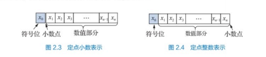

#### 原码

- **对于数据`0`，原码有`+0`和`-0`两个编码。**

- 若机器字长$n+1$位，则原码整数的表示范围是$[-(2^n-1)，2^n-1]$，原码小数的表示范围是$[-(1-2^{-n})，-2^{-n}]\cup[2^{-n}，1-2^{-n}]$。

定点小数的原码公式

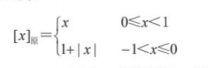

定点整数的原码公式

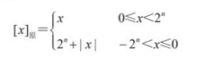

原码的加减法运算复杂，**符号位不能直接参与运算**。加法运算需要“同号求和，异号求差”， 减法运算需要“异号求和，同号求差”，求差时还需要先比较大小，然后用大数减去小数，最后结果的符号选择也相对复杂。

显然，利用原码作为机器数在实现加减法运算方面是不方便的，**原码在计算机中目前仅仅用于表示浮点数的尾码。**

#### 反码*

反码又称 1 的补码，其符号位和原码相同，**真值为正数时，反码和原码相同；真值为负数时，反码数值位为真值数值位取反。**

- **同样反码也存在`+0`和`-0`两个 `0`。**

- 若机器字长$n+1$位，则反码整数的表示范围是$[-(2^n-1)，2^n-1]$，则反码小数的表示范围是$[-(1-2^{-n})，-2^{-n}]\cup[2^{-n}，1-2^{-n}]$。
    - 范围表示没有变化与原码一致

定点小数的反码公式

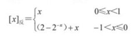

定点整数的反码公式

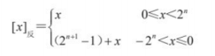

反码的加减运算较原码略简单，其符号位可以直接参与运算，加法运算直接将反码相加即可，但最高位进位要从运算结果最低位相加 ( 循环进位 ) 。减法运算只需要将被减数的反码加上被减数负数的反码即可，同样也要采用循环进位的运算方法。

但尽管如此，**现代计算机中并没有采用反码进行数据表示和运算**，这是因为人们找到了更好的编码一一补码。

#### 补码

- 补码：若符号位为$0$，则反码与原码相同，若符号位为$1$，则数值位全部取反再加一，即反码加一。
- 补码表示时真值$0$只有一种形式`0000 0000`。
- 多出来的一种形式`1000 0000`表示整数的$-2^7$和小数的$-1$。
- 若机器字长$n+1$位
    - 则补码整数的表示范围是$[-2^n，2^n-1]$。
        - 比原码多个$-2^n$

    - 补码小数的表示范围是$[-1，1-2^{-n}]$。
        - 比原码多个`-1`

> [!TIP]
> **补码转换快捷技巧**：
> 1. **原码 $\to$ 补码 (负数)**：符号位不变，数值位取反，末位加一。
> 2. **快捷法**：从右往左数，找到第一个 1，该 1 及其右边的 0 保持不变，该 1 左边的所有数值位取反。
> 3. **补码 $\to$ 原码**：同样适用上述规则。
- 补码算术移位：将补码的符号位与数值位一起右移一位并保持原符号位的值不变，表示除二。

定点小数的补码公式

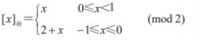

定点整数的补码公式

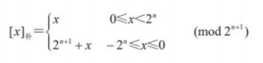

##### 变形补码

变形补码，又称**模 $4 $补码** 或 **双符号补码**，采用两个二进制位来表示数据的符号，其余与补码相同。

**符号位为 `00` 时表示正数，符号位为`11`时表示负数。**对定点小数而言，采用变形补码后，其模为 4。

**符号位`01`表示正溢出，`10`表示负溢出，**最高位表示正确符号位****

因此，变形补码也称为“模 $4 $补码”。对定点整数而言，采用变形补码后，其模为$2^{n+2}$ (为数值位的位数 ) 。

将$[X]_{\text{补}}$的符号位与数值位一起右移并保持原符号位的值不变，可实现除法功能

用于完成算术运算的ALU部件中。

定点小数变形补码

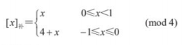

定点整数变形补码

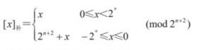

##### 补码作用

- 原码在计算时由于首位表示的是符号，所以需要考虑将加减运算转换的问题，而减法实现起来比较困难，就考虑是否可以将减法通过加法来实现。
- **补码可以让减法操作转换为加法操作，减少硬件成本**。
    - 由于计算机码操作若最高位进一就被舍弃，则天然是进行模运算，所以可以通过数学模运算来实现机器码的运算。
    - 带余除法：设$x，m\in Z$，$m>0$则存在唯一决定的整数$q$和$r$，使得$x=q\cdot m+r\;，0\leqslant r<m$。
    - 若两个数绝对值之和为模，则互为补数。即模-数的绝对值=数的补数（正数）。从而数加上数的补数就得到了模。
    - 补码就是正数不变，负数取模的结果。如$-66=-0100\;0010$，而$(1000\;0000-0100\;0010)\mod(1111\;1111)=1011\;1110$，也就是其补码。
    - 可以用补数的加法（**被减数转为其负数的补码**）替代原码转换的加减法。

- $50$**年代开始成为整数标准**

#### 移码

- 一般是在补码的基础上只将符号位取反，即在真值上加上一个常数偏移量$2^n$。也可能加上不同的偏移量。
- **移码只能用于表示整数，而不能表示定点小数**。
- 若机器字长$n+1$位，则移码整数的表示范围是$[-2^n，2^n-1]$
- **只有一个零的表示$10\cdots0$。**
- 移码全 $0$ 时，对应真值的最小值$-2^{n}$，移码全 $1$ 时，对应真值的最大值 $2^{n}-1$
- 移码保持了数据原有的大小顺序，移码大真值就大，移码小真值就小。
- **通常用于浮点数阶码**

> [!IMPORTANT]
> **定点数表示范围总结**（机器字长 $n+1$ 位，含 1 位符号位）：
> | 码制 | 定点整数范围 | 定点小数范围 | 真值 0 的表示 |
> | :--- | :--- | :--- | :--- |
> | **原码** | $[-(2^n-1), 2^n-1]$ | $[-(1-2^{-n}), 1-2^{-n}]$ | 两种 ($\pm 0$) |
> | **补码** | $[-2^n, 2^n-1]$ | $[-1, 1-2^{-n}]$ | 唯一 |
> | **反码** | $[-(2^n-1), 2^n-1]$ | $[-(1-2^{-n}), 1-2^{-n}]$ | 两种 ($\pm 0$) |
> | **移码** | $[-2^n, 2^n-1]$ | 无 | 唯一 ($10\dots0$) |

#### 相互转换

- 真值转原码
    - 最高位是符号位;**$0$正$1$负**
    - 数值位取二进制即可

四种机器码的相互转换(**正数三码合一**，下面只总结负数的情况)：

- 原码转反码and反码转原码

    - 符号位不变
    - 数值位取反
    - 反码的反码是原码

- 反码转补码

    - 末位+1即可

        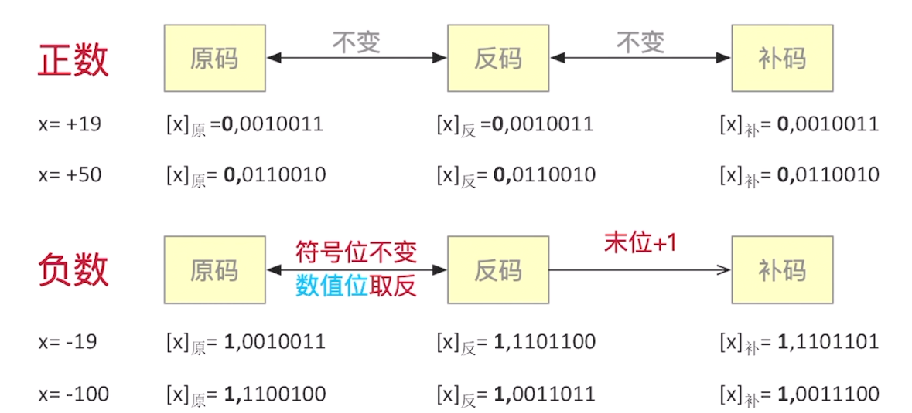

- 原码转补码 补码转原码

    1. 从右往左找到第一个1，这个1左边的所有“**数值位**”按位取反

    2. 补码的补码是原码

        - 符号位为0表示正数，原码就是补码本身

        - 符号位为1表示负数，对其再求一次补码就是其原码

    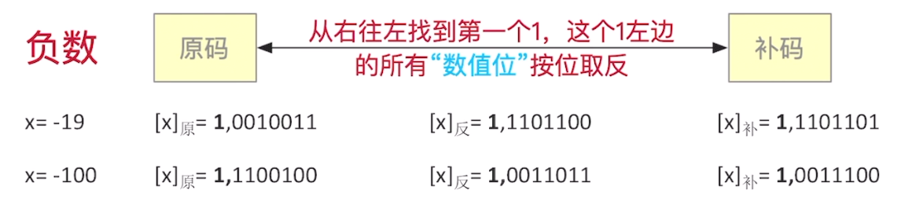

- 补码转反码

    - 先转成原码再转成反码

- 补码转移码

    - 只将符号位取反即可
    
- 三码转移码

    - 先转成补码然后将符号位取反即可
    - 注意如果是正数则三码合一不用转

-   $[x]_补\to[-x]_补$：从右往左找到第一个1，这个1左边的所有位（包括符号位）按位取反

#### 总结

1. 原码、补码、反码的符号位相同，正数的机器码相同。

2. 原码、反码的表示在数轴上对称，二者都存在$+0$ 和$-0$ 两个零。

3. 补码、移码的表示在数轴上不对称，零的表示唯一，它们比原码、反码多表示一个数。

4. 整数的补码、移码的符号位相反，数值位相同。

5. 负数的反码、补码末位相差 $1$。

6. 原码很容易判断大小。而**负数的反码、补码**很难直接判断大小，可采用如下规则**快速判断**：**对于负数，数值部分越大，绝对值越小，真值越大（更靠近 $0$）。**

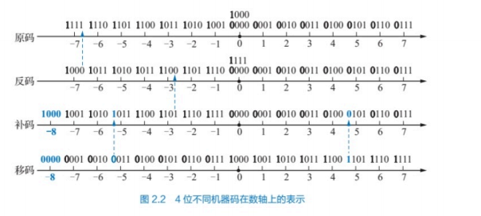

### 计算机中的运算

#### C语言中的位运算

C 语言中的位运算操作符主要包括“&”，“|”，“~“，”^” 4种，分别对应逻辑与、或、非、异或操作。这些位运算操作符会在编译器的作用下被翻译成与之对应的汇编指令，如 x86 中的逻辑与指令 and 、逻辑或指令 or、逻辑非指令 not、逻辑异或指令 xor.

| A    | B    | A AND B与 | A OR B或 | NOT A非 | A XOR B异或 |
| :--- | :--- | :-------- | :------- | :------ | :---------- |
| 0    | 0    | 0         | 0        | 1       | 0           |
| 0    | 1    | 0         | 1        | 1       | 1           |
| 1    | 0    | 0         | 1        | 0       | 1           |
| 1    | 1    | 1         | 1        | 0       | 0           |

-   与：所有输入为真时，才会有输出真。

-   或：所有输入为假时，才会有输出假。

-   非：逆转输入的真假。

-   异或：输入相同时输出为假，否则为真。
    -   可以类比正负数乘法
    -   正数（符号位）为`0`，负数（符号位）为`1`
    -   同号相乘得正
        -   $1\oplus 1=0，0\oplus0=0 $

    -   异号相乘得负
        -   $1\oplus 0=1，0\oplus1=1 $

#### $C$语言中的逻辑运算

$C $语言中的逻辑运算操作符主要包括`&&`，`||`，`!`三种，逻辑运算和位运算的区别在它属于非数值运算，操作数只能是`0`和`1`两个值，所有非`0`值都被当作`1`处理。

所以逻辑运算翻译成汇编程序时不会对应具体的运算指令，而会演变成相应的程序分支结构。

#### $C$语言中的移位运算

-   $C $语言中的移位运算操作符主要包括`<<`，`>>`两种，分别代表左移和右移。
    -   左移运算操作符对应汇编指令中的逻辑左移
        -   逻辑左移将高位移出，低位补零;
    -   而右移运算操作符则根据操作数是无符号还是有符号类型分别对应汇编指令中的逻辑右移和算术右移指令。
        -   逻辑右移则是将低位移出，高位补零
        -   算术右移的高位不是直接补零，而是填充原数据的符号位。

-   **每左移一位，数据就扩大一倍; 每右移一位，数据就缩小一半。**
    -   所以高级语言中 $2x$ 、$4x$、x/8、x/16 这样的运算在编译时都会转换成对应的汇编移位指令实现，而不是转换成运算时间较长的乘除法指令。
    -   考试中也要反应过来使用左右移实现乘除法

-   **需要注意的是，左移运算可能会因为超出表示范围而发生溢出。**

### 运算方法和运算电路

#### 基本运算部件

在计算机中，运算器由算术逻辑单元ALU(Arithmetic Logic Unit)、移位器、状态寄存器和通用寄存器组等组成。运算器的基本功能包括加、减、乘、除四则运算，与、或、非、异或等逻辑运算，以及移位、求补等操作。ALU 的核心部件是加法器。

##### 一位全加法器

注：参考资料[【硬件科普】带你认识CPU第02期——CPU是怎么计算加法的（上）_哔哩哔哩_bilibili](https://www.bilibili.com/video/BV1aQ4y1v7QP/?spm_id_from=333.337.search-card.all.click&vd_source=58d3a366b06c1c094d0731d6732f7441)

###### 基本概念 本位和数和进位

本位和数 Sum 简写为S

进位 Carry 简写为C

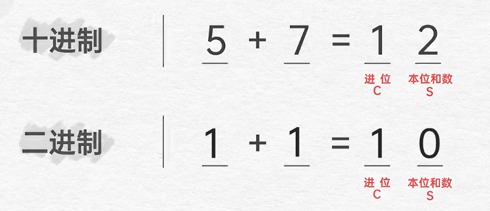

###### 运算思路

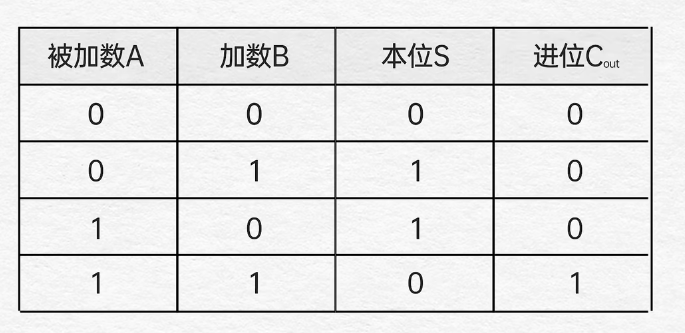

对于本位可以发现，**只要不一样就输出1一样就输出0**，符合异或运算的思想

对于进位C可以发现，当且仅当AB均为1时才输出1，符合与运算或相乘的思想

即
$$
S=A\oplus B,C_{out}=A\times B
$$

###### 一位半加法器

半加法器没有进位输入，只能计算一位二进制加法

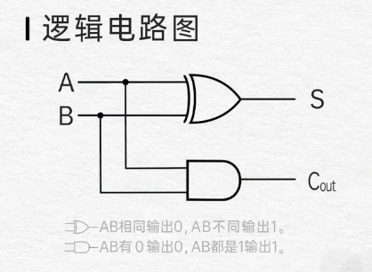

###### 一位全加法器

计算多位加法可需要将进位$C_{out}$作为下一个加法器的$C_{in}$参与运算

由加法表可知

对于本位S来说易得
$$
S=A\oplus B\oplus C_{in}
$$
对于进位$C_{out}$来说，$A，B，C_{in}$中至少要有两个1

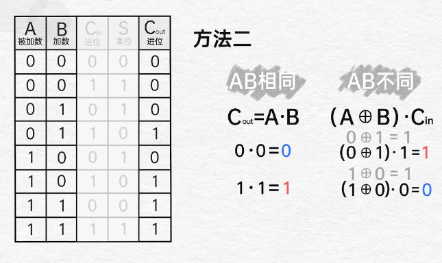

计算时考虑AB相同和AB不同的情况

AB相同时相乘(进行与运算)，均为0则输出为0($A，B，C_{in}$中已经有两个0了，进位$C_{out}$一定是0)，均为1则输出为1($A，B，C_{in}$中已经有两个1了，进位$C_{out}$一定是1)

AB不同时，进行异或运算结果一定是1(此时AB中只要有一个1，只需要判断$C_{in}$即可)，此时与$C_{in}$相乘判断$C_{in}$是0还是1

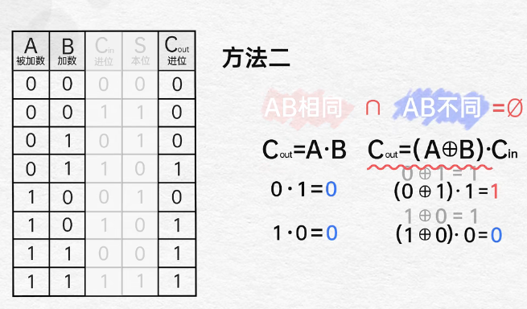

而AB相同与AB不同两种情况互斥可以相加(进行与运算)，得到最终逻辑表达式

$$
C_{out}=A\times B+(A\oplus B)\times C_{in}
$$
即全加法器逻辑表达式为:
$$
S=A\oplus B\oplus C_{in}\\
C_{out}=A\times B+(A\oplus B)\times C_{in}
$$

#### 串行进位全加法器

将上一位全加法器的$C_{in}，C_{out}$首尾相连即可得到

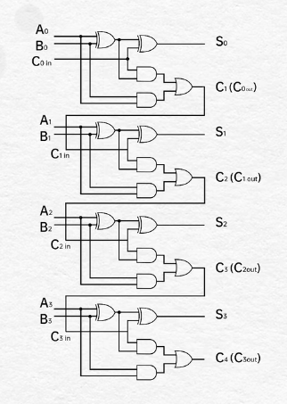

在串行进位全加法器中，每个位的进位是依次计算的，需要等待前一位的进位计算完成后才能进行下一位的计算。

这种计算方式需要串行操作，即逐位地进行计算，因此速度较慢，且一位的错误输出可能会导致全部输出错误。

#### 并行进位加法器

-   考虑进位$C_{out}$逻辑表达式$C_{out}=A\times B+(A\oplus B)\times C_{in}$

即
$$
C_{i}=A_{i}\times B_{i}+(A_{i}\oplus B_{i})\times (A_{i-1}\times B_{i-1}+(A_{i-1}\oplus B_{i-1})\times C_{i-2})
$$
-   继续对$C_{i-2}$展开可以一直展开到$C_0$
    -   则**第$i$位向更高位的进位$C_{i}$可根据被加数、加数的第1~i位，再结和$C_{0}$即可确定**
    -   记$G_{i}=A_{i}\times B_{i} \quad P_{i}=A_{i} \oplus B_{i}$

则上式可以化为

$$
C_{i}=A_{i}\times B_{i}+\left(A_{i} \oplus B_{i}\right) C_{i-1}=G_{i}+P_{i} C_{i-1}
$$
展开有
$$
\begin{aligned}
&C_{1}= G_{1}+P_{1}C_{0}  \\
&C_{2}= G_{2}+P_{2}C_{1}=G_{2}+P_{2}G_{1}+P_{2}P_{1}C_{0}  \\
&C_{3}= G_{3}+P_{3}C_{2}=G_{3}+P_{3}G_{2}+P_{3}P_{2}C_{1}+P_{3}P_{2}P_{1}C_{1}\\
&C_{4}= G_{4}+P_{4}C_{3}=G_{4}+P_{4}G_{3}+P_{4}P_{3}G_{2}+P_{4}P_{3}P_{2}G_{1}+P_{4}P_{3}P_{2}P_{2}P_{2}P_{1}  \\

\end{aligned}
$$
其中每一位的$A_{i}， B_{i}$都预先知道，则$G_{i}，P_{i}$可以通过简单的运算得知

则**每一位的运算结果几乎可以同时产生**

-   **并行进位的并行加法器：各级进位信号同时形成，又称为先行进位、同时进位**

-   这种进位方式是快速的，与位数无关。

-   但随着加法器位数的增加，$C_{i}$的逻辑表达式会变得越来越长，这会使电路结构变得很复杂。**因此，当位数较多时采用全先行进位是不现实的。**

-   更多位数的加法器可通过将CLA部件或全先行进位加法器串接起来实现。 
    -   例如，对于 16 位加法器，可以分成4组，组内为 4 位先行进位，组间串行进位。
    -   为了进一步提高运算速度，也可以采用组内和组间都并行的进位方式。
    -   因为两级先行进位加法器组内和组间都采用先行进位方式，其延迟和加法器的位数没有关系。
    -   所以，通常采用两级或多级先行进位加法器。

#### 带标志加法器

##### 补码计算器

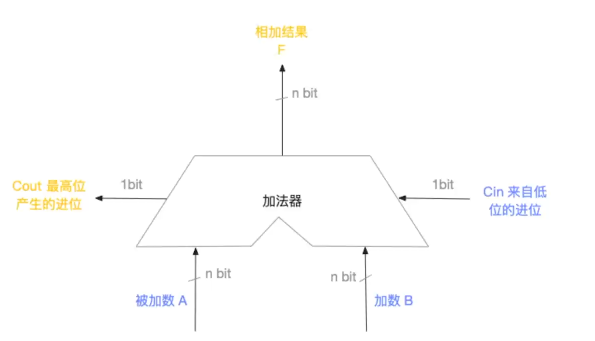

计算减法$(A-B)$时，先将减数全部按位取反并末位加1，得到$[-B]_{\text{补}}$即$B$的相反数的补码，此时计算$A+[-B]_{\text{补}}$即可 

加法时不必改变，按位相加即可

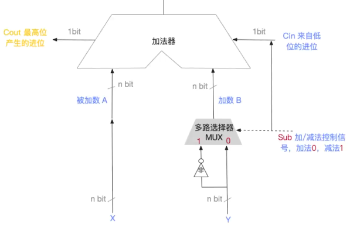

- 当Sub信号为$0$时识别为加法，直接输出加数$B$，$C_{in}$此时为0

- 当Sub信号为$1$时识别为减法，先在非门中按位取反再输出加数$B$，且此时$C_{in}$此时为1

**但此时无法检测溢出，检测溢出可以使用标志位**

本电路也可以实现无符号数的运算(逻辑表达式相同)，且无需考虑溢出

##### 带标志加法器

> [!IMPORTANT]
> **ALU 核心标志位 (Flags)**：
> 1. **ZF (Zero Flag)**：零标志。结果为 0 时 $ZF=1$。
> 2. **OF (Overflow Flag)**：溢出标志。仅对**有符号数**有意义。$OF = C_{n} \oplus C_{n-1}$ (符号位进位 ⊕ 最高数值位进位)。
> 3. **SF (Symbol Flag)**：符号标志。结果为负时 $SF=1$。即结果的最高位。
> 4. **CF (Carry Flag)**：进/借位标志。仅对**无符号数**有意义。加法时看进位，减法时看借位。公式：$CF = C_{out} \oplus Sub$。

### 定点数运算

#### 定点数移位运算

首先明确一件事情

在不产生溢出的情况下，左移相当于原数乘二

在不考虑因移出而舍弃的末位尾数的情况下，右移相当于原数除以二

- 算术移位：针对**有符号数**，**符号位保持不变**，通过改变各个数码位和小数点的相对位置，从而改变各数码位的位权。可用移位运算实现乘法、除法。
  
    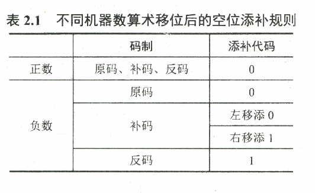
    
    - 原码的算数移位：仅对数值位进行移位：
        - 若****右移**高位补$0$，低位舍弃**，右移代表除$2$
            - 若移出的是$0$则刚好整除
            - 若移出的是$1$则会整除余$1$丢失精度。
        - 若****左移**低位补$0$，高位舍弃**，左移代表乘$2$
            - 若移出的是$0$则刚好乘$2$
            - 若移出的是$1$则会溢出产生严重误差。
    - 反码的算术移位：正数的反码与原码相同，所以正数的处理跟原码一样。而对于负数而言，反码的$1$等于原码的$0$，反码的$0$等于原码的$1$，故：
        - 若右移低位补$1$，高位舍弃。
        - 若左移高位补$1$，低位舍弃。
    - 补码的算术移位：正数的补码与原码相同，所以正数的处理跟原码一样。由于负数补码=反码末位加一，导致反码最右边几个连续的$1$都因进位而变为$0$，直到进位碰到第一个$0$为止。所以得到规律：
        - 负数补码中，最右边的$1$及其右边同原码一样。最右边的$1$的左边同反码一样。
        - 右移同反码，高位补$1$，低位舍弃。
        - 左移同原码，低位补$0$，高位舍弃。
    - 算术移位的影响
        - 对于正数
            - 左移时，高位丢1，结果出错
            - 右移时，最低位丢1，影响精度。
        - 对于负数
            - 负数的原码左移时，高位丢1，结果出错
                - 右移时，低位丢1，影响精度。
            - 负数的补码左移时，高位丢0，结果出错
                - 右移时，低位丢1，影响精度。
            - 负数的反码左移时，高位丢0，结果出错
                - 右移时，低位丢0，影响精度
    
- 逻辑移位，逻辑的移位可以视为对无符号数的算术移位：
    - 逻辑右移：高位补$0$，低位舍弃。
    - 逻辑左移：低位补$0$，高位舍弃。

- 循环移位，将移出的一位放到另一端的端点，类似队列：
    - 进位位CF：保存计算是否进位。$1$代表产生进位，$0$代表未产生进位。

    - 带CF就是大循环，不带CF的就是小循环。**不论带不带CF进行循环移位，最高位的值都必定与CF的值相等。**

        1.   循环右移：将最低位的一位移出放到最高位，其余右移一位。
        2.   循环左移：将最高位的一位移出放到最低位，其余左移一位。
        3.   带进位位的循环左移：需要加上进位位数值的循环左移。
        4.   带进位位的循环右移：需要加上进位位数值的循环右移。

    - 适合将数据的低字节数据和高字节数据互换。

        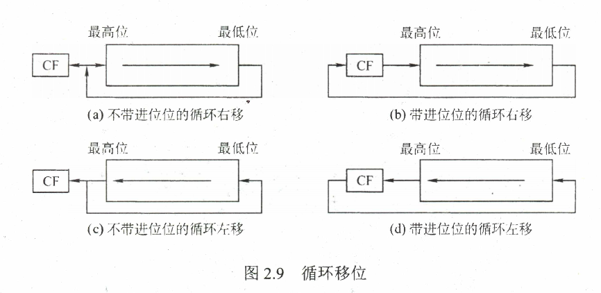

#### 定点数加减运算

- 注意机器字长，若溢出则将溢出位丢弃。

- 原码的加减，由加法器和减法器两个硬件来实现，因为最高位为符号位，所以不能直接进行加减，符号位要单独处理：

    - 原码的加法：
        - 正数+正数：绝对值做加法，结果为正数。
        - 负数+负数：绝对值做加法，结果为负数。
        - 正数+负数：绝对值大的减绝对值小的，符号同绝对值大的数。
    - 原码的减法，减数符号取反，转变为加法：
        - 正-负→正+正。
        - 负-正→负+负。
        - 正-正→正+负。
        - 负-负→负+正。

- 补码的加减，由于减法器的硬件实现比较困难，所以原码的减法操作可以由补码来更简单实现，不用考虑符号位的问题，直接全部参与运算：

    - 参与运算的两个操作数均用补码表示。
    - 按二进制运算规则运算，逢二进一（与模二加减法不同需要进位）。
    - 符号位与数值位按同样规则一起参与运算，符号位运算产生的进位要丢掉，结果的符号位由运算得出。
    - 补码加减运算依据下面的公式进行。当参加运算的数是定点小数时，模$M=2$；当参加运算的数是定点整数时，模$M=2^{n+1}$。$[A+B]_\text{补}=[A]_\text{补}+[B]_\text{补}$（$\mod M$）；$[A-B]_\text{补}=[A]_\text{补}+[-B]_\text{补}$（$\mod M$）。
        - 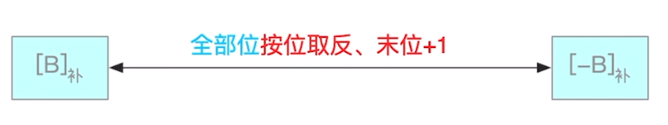
        - 此处是包括符号位的**全部位**都按位取反末位加一，**相当于取相反数(符号位取反)后，求补码(符号位不变数值位按位取反后加一)，与原码补码互换没有太大关系**
    - $\mod M$运算是为了将溢出位丢掉。也就是说，若做加法，则两数的补码直接相加；若做减法，则将被减数与减数的机器负数相加。
    - 补码运算的结果亦为补码。

- 溢出判断，**由于使用补码进行加减操作都会变成加法，所以只用考虑加法溢出的处理。**

    - 小于最小值就是下溢。只有负数+负数才会下溢得到正数。如
        $$
        -24-124=1110\,1000+1000\,0100=0110\,1100=108
        $$

    - 大于最大值就是上溢。只有正数+正数才会上溢得到负数。如
        $$
        15+124=0000\,1111+0111\,1100=1000\,1011=-117
        $$

    - 对于小数，其绝对值小于等于$1$。

    - 方法一，采用一位符号位（模二补码），根据符号位判断：

        - 设$A$的符号为$A_s$，$B$的符号为$B_s$，运算结果的符号为$S_s$。

        - 则溢出逻辑表达式为
            $$
            V=A_sB_s\overline{S_s}+ \overline{A_s}\overline{B_s}S_s
            $$
            即
            $$
            V=A_s\&\&B_s\&\&!(S_s)\mid\mid!(A_s)\&\&!(B_s)\&\&S_s
            $$
            前面判断下溢，后面判断上溢。

        - 逻辑表达式的含义：

            >   符号位为0表示是正数，符号位为1表示是负数

            - 第一项 $A_sB_s\overline{S_s}$：表示当两个操作数 $A$ 和 $B$ 的符号位相同（都为正或都为负），而运算结果的符号位与操作数的符号位不同（异号），即产生了溢出。
            - 第二项 $\overline{A_s}\overline{B_s}S_s$：表示当两个操作数 $A$ 和 $B$ 的符号位不同（一个正一个负），而运算结果的符号位与操作数的符号位相同（同号），即产生了溢出。

        - 若$V=0$，表示无溢出，若$V=1$，表示有溢出。

        - 由于只有操作数同号才能溢出，即判断标准为，两个操作数是否同号，结果符号是否与原操作数相同，这两个条件必须同时满足。

        - 如$-24-124=108$产生了溢出，$A_s=1$、$B_s=1$、$S_s=0$
            $$
            V=A_sB_s\overline{S_s}+ \overline{A_s}\overline{B_s}S_s=1\,1\,1+0\,0\,0=1+0=1
            $$
            所以产生了溢出。

    - 方法二，采用一位符号位（模二补码），根据数据位进位$1$情况判断：

        - 符号位的进位$C_s=0$，最高数值位的进位$C_1=1$时产生了上溢。
        - 符号位的进位$C_s=1$，最高数值位的进位$C_1=0$时产生了下溢。
        - 原理同方法一类似，如果进位产生并符号与期待符号不同则发生溢出。
        - 如$-24-124=1110\;1000+1000\;0100=0110\;1100$中符号位都为$1$相加结果为$0$，所以符号位进位，$C_s=1$，而最高数值位为$1+0=1$，没有进位，所以$C_1=0$，所以就产生了下溢。

    - 方法三，采用双符号位（模四补码），正数符号为$00$，负数符号为$11$。

        - 若两个符号位不同，则表示溢出，第一个符号位表示应该得到的符号位，第二个符号位代表实际得到的符号位。
        - **符号位$01$表示正溢出，$10$表示负溢出，最高位表示正确符号位**
        - 如$-24-124=11，110\;1000+11，000\;0100=10，110\;1100=108$。下溢。
        - 如$15+124=00，000\;1111+00，111\;1100=01，000\;1011=-117$。上溢。
        - 实际存储时只存储一个符号位，运算时会复制一个符号位。

> [!NOTE]
> **符号扩展 (Symbolic Extension)**：
> 1. **正数**：所有位补 0。
> 2. **负数**：
>    - **原码**：扩展位补 0。
>    - **反码**：扩展位补 1。
>    - **补码**：整数左边补 1，小数右边补 0。

#### 定点数乘法运算

二进制乘法基本流程：将乘法变为加法和移位运算，将乘数一位位的向前移动并与被乘数相乘，由于是二进制所以只有$0$和$1$，遇到乘数当前位值为$1$就在原来的和上加上被乘数，并向前移动一位，如果是$0$就加上$0$继续移动一位，当乘数位数访问完成则乘法完成，所有的和相加成为最后的积。

##### 原码一位乘法

- 一般使用原码一位乘法，即每次只乘一位的数据。

- 在原码乘法时，可以先符号位单独处理，将两个符号进行异或操作，得到的结果就是最后的结果的符号。然后对数据的绝对值（去除符号位）进行一位位的乘法（位积）然后相加。

    - **凡是原码运算，不论加减乘除，符号位都单独进行异或操作**

- 由于**运算时可能存在绝对值大于$1$但是不是溢出的情况，所以部分积和被乘数使用双符号位。**

- **原码乘法移位和加法运算最多均为$n$次**

- ACC保存乘积高位，MQ保存乘数与乘积低位，$X$保存被乘数。

- 原码一位乘法机器实现时就是按照这种方式计算：
    1. 字长若为$n+1$位，则ACC、MQ、$X$全部初始化为$n$位

        -   将被乘数的绝对值放入$X$中
        -   MQ放入乘数的绝对值
        -   ACC初始化为全$0$。

    2. 将MQ的最右边的一位当做当前乘运算位，让其进行乘运算，运算规则是

        -   若当前位是$1$，则ACC加上被乘数，即$ACC+=X$

        -   若当前位是$0$，则ACC加上$0$（保持不变，跳过）。

    3. 将ACC和MQ的数据连接在一起，全部逻辑右移一位，ACC数据高位补$0$，ACC最后一个低位移到MQ的最高位。将MQ的最后一位抛弃。若是第i轮逻辑右移，则MQ的前$i$位是结果的后$i$个低位值。

    4. 从步骤二开始重复，字长若为$n+1$位，则重复$n$次，直到MQ的最后一位是符号位，则停止计算

        -   此时ACC的全部和MQ的前$n$位都是结果。

    5. 定点小数的小数位隐藏在符号位后面第一位，定点正数的小数位隐藏在MQ符号位的前一位。

    6. 将两个符号位的异或结果赋值给积最高位。

- 原码一位乘法逻辑运算：
    1. 初始化，左边为部分积，即计算的部分结果，最开始为全$0$，右边为乘数的绝对值，最后边全部为丢失位。
    2. 根据丢失位前一位的值来判断加上什么
        -   若是$1$则加上被乘数的绝对值
        -   若是$0$则加上被乘数等长的全$0$。
    3. 右移部分积一位，高位补$0$，丢失位多一位。
    4. 继续计算，直到乘数全部被移出。
        -   字长为$n+1$位则需要移位计算$n$次
        -   丢失位前的就是全部部分积。
    5. 将两个符号位的异或结果赋值给积最高位。

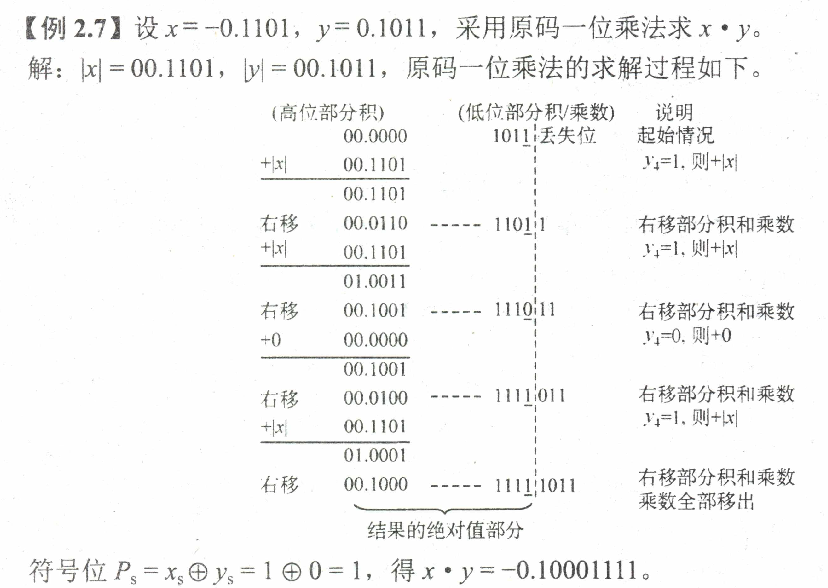

> [!IMPORTANT]
> **Booth 算法 (补码一位乘)**：
> 1. **符号位**：参与运算，不单独处理。
> 2. **判断规则**：依据 MQ 最低位 $y_n$ 和辅助位 $y_{n+1}$ 的差值 $y_{n+1}-y_n$：
>    - $01$：部分积加 $[X]_补$。
>    - $10$：部分积加 $[-X]_补$。
>    - $00/11$：部分积加 0。
> 3. **移位**：**算术右移**。
> 4. **次数**：$n$ 次移位，$n+1$ 次加法（最后一次不移位）。

#### 定点数除法运算

- 进行除法操作时，都是为了找到一位能让商乘除数能最大即余数最小但大于等于$0$的值。
    - 若除数被除数都是小数，可以同时乘一个数变成整数再运算。

- 所以可以忽略小数点，每确定一位商进行一次减法
- 若机器字长为$n$位，则得到n-1位余数，在余数末尾补$0$，再确定下一位商$0$或$1$，直到确定$n$位商即可停止。
- 在进行除运算时，ACC保存被除数和余数，MQ保存商，$X$保存除数。

所以同理可以推出恢复余数法，与源码一位法类似，都是计算绝对值最后判断符号。余数加$0$扩大余数就相当于左移一位。

##### 符号扩展

-   正数的符号扩展非常简单，即符号位不变，新表示形式的所有扩展位都用`0`进行填充。
-   负数的符号扩展方法则根据机器数的不同而不同。
    -   原码表示负数的符号扩展方法与正数相同，只不过此时符号位为`1`
    -   补码表示负数的符号扩展方法：原有形式的符号位移动到新形式的符号位上，新表示形式的所有附加位都用`1` （对于整数）或`0 `（对于小数）进行填充。

##### 原码除法

原码不恢复余数法也称**原码加减交替除法**

默认会商$1$，如果发现结果有问题就恢复余数（变成商$0$）。若字长为$n+1$，则只用左移$n$次，上商$n+1$次，最后一次上商余数不左移。

原码除法运算：

- 因为恢复余数很麻烦，所以会考虑是否不用恢复余数，直接进行运算得到后面的结果。
- 假如令原始值为$x$，原始值加上$-y$绝对值的补码结果为$a$，$y$绝对值的补码为$b$，按恢复余数法，$a$这个余数是一个负值，所以要加上$b$即$a+b$变成原始值$a+b=x$，这时候商$0$，然后计算下一个商，余数$a+b$左移一位，即$(a+b)\times2=2a+2b$，这时候商$1$看看结果是否正确，即$2a+2b$要减去y绝对值的补码（等价于加上$-y$绝对值的补码）$2a+2b-b=2a+b$。
- 所以如果得到了一个负的余数$a$，可以直接转换到$2a+b$这个结果，即直接左移一位余数再加上除数的补码就可以得到结果。
- 这就是加减交通法或不恢复余数法。
- 从而恢复余数法就是当余数为负时商$0$，并+|除数|，再左移，再-|除数|，而加减交替法是当余数为负时商$0$，并左移一位，再+[除数|，若余数为正时商$1$，并左移一位，再-|除数|。
- 值得注意的是，若在最后一步余数为负，需要商$0$，并加上除数的补码得到正确余数。

逻辑上：

1. 被除数减去除数的绝对值，得到新的余数。
2. 余数为负，则商$0$，左移，加上除数绝对值。
3. 余数为正，则商$1$，左移，减去除数绝对值。
4. 在最后一步余数为负，需要商$0$，并加上除数的补码得到正确余数。

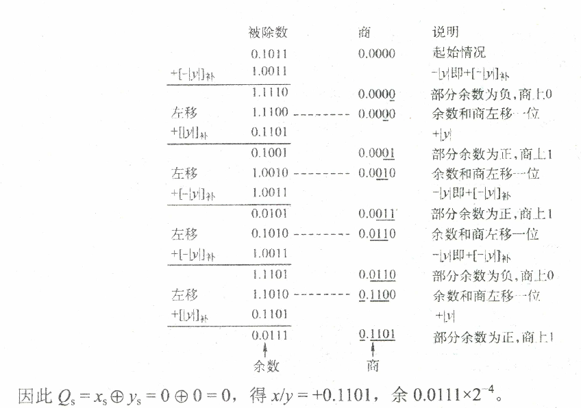

注意：在定点小数运算时，商只能是小数而不能是整数，所以被除数一定要小于除数，机器判断标准是看第一步计算的商，若第一步计算的商是$1$则代表结果大于$1$，机器就会报错。

机器实现：

1. 字长若为$n+1$位，则ACC、MQ、$X$全部初始化为$n$位，将被除数的绝对值放入ACC中，$X$放入除数的绝对值，MQ初始化为全$0$。
2. 将MQ的最右边的一位当做当前除运算位，让其进行除运算，运算规则是，默认商$1$，$ACC-=X$，即$X$的补码要加上除数的绝对值的负值的补码（减法都由补码的加法实现），判断是否有误。若结果高位为$0$则无误，高位为$1$则有误，错误则商改为$0$，并恢复余数，ACC加上$X$中除数的补码。
3. 将ACC和MQ的数据连接在一起，全部逻辑左移一位，MQ数据低位补$0$，MQ最高位的$0$移到ACC的最低位。将ACC的最高一位抛弃。若是第$i$轮逻辑左移，则MQ的后$i$位是当前计算的商的结果。
4. 从步骤二开始重复，字长若为$n+1$位，则左移$n$次，上商$n+1$次，直到MQ中全部是计算结果，则停止计算。此时MQ中保存商，ACC中保存左移$n$位的余数值，真正的余数应该是结果再乘上$2$的$-n$次方。
5. 定点小数的小数位隐藏在符号位后面第一位，定点正数的小数位隐藏在最后一位后。
6. 将两个符号位的异或结果赋值给商最高位。

> [!IMPORTANT]
> **定点数除法总结 (加减交替法)**：
> | 特性 | 原码加减交替法 | 补码加减交替法 |
> | :--- | :--- | :--- |
> | **符号位** | 单独异或处理 | 参与运算 |
> | **上商原则** | 余数同号商 1，异号商 0 | 余数与除数同号商 1，异号商 0 |
> | **最后一步** | 余数为负需恢复余数 | 商末位恒置 1 |
> | **移位次数** | $n$ 次左移 | $n$ 次左移 |

#### 定点数强制类型转换

- 无符号数与有符号数：不改变数据内容，只改变解释方式。
    - 若最高位为`1`，则转换前后会出现一个正数和一个负数
    - 此时正负数的绝对值相加等于当前类型的占用位数的理论最大值
        - `short`类型占用`2B=16bit`，$2^{16}=65536$

- 长整数转短整数：高位截断，保留低位。
- 短整数转长整数：符号扩展。

---

1. 有符号数和无符号数之间的转换。例如，由signed型转换为等长unsigned型数据时，符号位成为数据的一部分，即负数转换为无符号数时，数值将发生变化。同理，由unsigned转换为signed时最高位作为符号位，也可能发生数值变化。
2. 数据的截取与保留。当一个浮点数转换为整数时，浮点数的小数部分全部舍去，并按整数形式存储。但浮点数的整数部分不能超过整型数允许的最大范围，否则溢出。
3. 数据转换中的精度丢失。四舍五入会丢失一些精度，截去小数也会丢失一些精度。此外，数据由long型转换为float型或double型时，有可能在存储时不能准确地表示该长整数的有效数字，精度也会受到影响。
4. 数据转换结果的不确定性。当较长的整数转换为较短的整数时，要将高位截去。例如，long型转换为short型，只将低$16$位送过去，这样就会产生很大的误差。浮点数降格时，如double型转换为float型，当数值超过float型的表示范围时，所得到的结果将是不确定的。

>   PS.C语言的`int`类型占用`4B=32bit`，`short`类型占用`2B=16bit`，`float`类型占用`4B=32bit`，`double`类型占用`8B=64bit`，`char`类型占用`1B=8bit`

#### 定点数数据存储与排列

- 数据最左边的高位就是最高有效字节MSB。
- 数据最右边的低位就是最低有效字节LSB。
- 大端模式：将MSB存到最低地址，LSB存在最高地址。便于人类阅读。
- 小端模式：将MSB存到最高地址，LSB存在最低地址。便于机器读取。
- 边界对齐：
    - 现代计算机通常是按字节编址即每个字节对应一个地址。也支持按字、按半字、按字节寻址。
    - 假设存储字长为$32$位，则$1$个字=$32bit$，半字$=16bit$。每次访存只能读/写$1$个字。
    - 字地址转换为字节地址，只用逻辑左移两位就可以了，即乘以$4$，因为字长为$32$，而字节长$8$。
    - 使用边界对齐方式会让每个数据都能一次性读完而不用跨行读取，多余的空间用$0$填充。

## 浮点数

### 浮点数表示

#### 阶码与尾数

- 指小数点的位置不固定，如使用科学计数法，如$9.694E2$。

- 类似科学计数法，分为两个部分，阶码(一般记为$E$)和尾数(一般记为$M$)。

    - 其中阶码分为阶符和阶码数值，阶符和阶码数值反映数值大小、表示范围、小数点实际位置

    - 尾数分为数符和尾数数值，数符代表浮点数的符号，尾数数值反映精度。

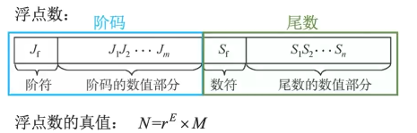

- 对于二进制的浮点数，阶码是常用补码或移码表示的定点整数，而尾数是常用原码或补码表示的定点小数。

- $r$为阶码的底，即基数，一般为$2$，不过也可以使用$2^{n}$
    - 基数越大，在运算中尾数右移的可能性越小，运算的精度损失越小。

    - 由于基数大时发生因对阶或尾数溢出需右移及规格化需左移的次数显著减少，因此运算速度可以提高。 

    - 基数越大，可表示的数的范围越大

- 阶码$E$反映浮点数的**表示范围**及小数点的实际位置。

    - 阶码符号（exponent sign）：
        - 阶码符号表示阶码的正负号。它决定了浮点数的大小范围和取值方向。
        - 如果阶码符号为正，表示浮点数的阶码是正数；如果阶码符号为负，表示浮点数的阶码是负数。
    - 阶码数值（exponent value）：
        - 阶码数值是一个无符号整数，表示浮点数的阶码大小。
        - 阶码数值决定了浮点数在科学计数法中的指数部分的值，控制了浮点数的数量级。

- 尾数$M$的数值部分的位数n反映浮点数的**精度**。

    - 数符（sign）：
        - 数符表示浮点数的正负号。它决定了浮点数的数值是正数还是负数。
        - 如果数符为正，表示浮点数是正数；如果数符为负，表示浮点数是负数。
    - 尾数数值（significand/mantissa）：
        - 尾数数值是一个带有符号位的小数或定点数，表示浮点数的小数部分或尾数部分。
        - 尾数数值决定了浮点数的精度和小数部分的值。

- 其实$E\&M$就是分别的两个数，符号只是其本身的符号位

#### 尾数规格化

> [!IMPORTANT]
> **浮点数规格化 (Normalization)**：
> 1. **左规**：尾数左移，$E$ 减 1。用于消除高位无效 0。
> 2. **右规**：尾数右移，$E$ 加 1。用于尾数溢出（双符号位 01 或 10）时的调整。
> 3. **规格化标准**：
>    - **原码**：最高数值位必为 1。正数 0.1...，负数 1.1...。
>    - **补码**：符号位与最高数值位互异。正数 0.1...，负数 1.0...。

#### 定点浮点区别

假设定点数和浮点数的字长相同。

- 浮点数表示范围更大。
- 浮点数精度降低。（由于只取出一部分数据，还有部分长度表示阶码等，所以用于表示尾数的字长减少）
- 浮点数运算更复杂。（需要规格化，需要做尾数运算和阶码运算）
- 浮点数只有规格化后才能判断是否溢出。

### IEEE 754标准

IEEE 754标准就是浮点数标准，为了解决计算机中阶码、尾数使用什么码来表示，各取多少位的问题。

#### 移码定义

- 移码的定义其实=真值+偏置值，一般取$2^{n-1}$，这时候移码才等于补码符号位取反，若移码采取其他方案则没有这个特点。
- 在IEEE 754标准中，规定移码的偏置值不再是$128$而是$127$，即$2^{n-1}-1$。所以这个标准下的移码与一般的移码不同。
- 从而真值$-128$的移码为$-1000\;0000+0111\;1111=1111\;1111$，$-127$的移码为$0000\;0000$，$0$的移码为$0111\;1111$，$127$的移码为$1111\;1110$。

> [!IMPORTANT]
> **IEEE 754 浮点数标准**：
> | 类型 | 总位数 | 符号位 | 阶码 (E) | 偏置值 (Bias) | 尾数 (M) |
> | :--- | :--- | :--- | :--- | :--- | :--- |
> | **float** | 32 | 1 | 8 | 127 | 23 |
> | **double** | 64 | 1 | 11 | 1023 | 52 |
> - **真值公式**：$(-1)^S \times (1.M) \times 2^{E-Bias}$
> - **隐含位**：尾数 $M$ 默认最高位隐含一个 1，不占位。

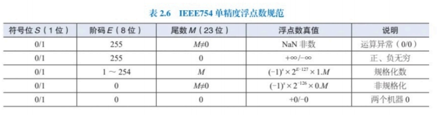

#### IEEE 754取值范围

|  格式  |            规格化的最小绝对值            |                      规格化的最大绝对值                      |
| :----: | :--------------------------------------: | :----------------------------------------------------------: |
| 单精度 |  $E=1$，$M=0$：$1.0×2^{1-127}=2^{-126}$  | $E=254$，$M=.11...1$：$1.11...1×2^{254-127}=2^{127}×(2-2^{23})$ |
| 双精度 | $E=1$，$M=0$：$1.0×2^{1-1023}=2^{-1022}$ | $E=2046$，$M=.11...1$：$1.11...1×2^{2046-1023}=2^{1023}×(2-2^{-52})$ |

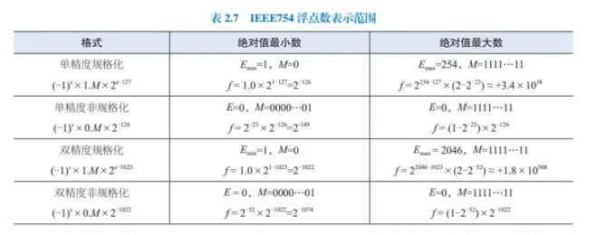

- 对于规格化短浮点数，只有$1\leqslant E\leqslant 254$正常区间时，$(-1)^S\times 1.M\times2^{E-127}$。
- 阶码全0全1时的特殊用途
    - 当阶码$E$为全$0$，即应该为$-127D$，而尾数$M$不全为$0$时，表示**非规格化小数**$\pm(0.\textrm{M})_2\times2^{-126}$。（此时最高位就不默认为$1$了，阶码固定设置为$-126$）。
    - 当阶码$E$为全$0$，即应该为$-127D$，而尾数$M$全为$0$时，表示真值$\pm0$，正负由数符决定。
    - 当阶码$E$为全$1$，即应该为$-128D$，而尾数$M$全为$0$时，表示无穷大$\pm\infty$，正负由数符决定。
    - 当阶码$E$为全$1$，即应该为$-128D$，而尾数$M$不全为$0$时，表示非数值NaN（Not a Number）。如果非法操作如$\frac{0}{0}$等就会使用到。

#### 单精度浮点数与真值之间的转换

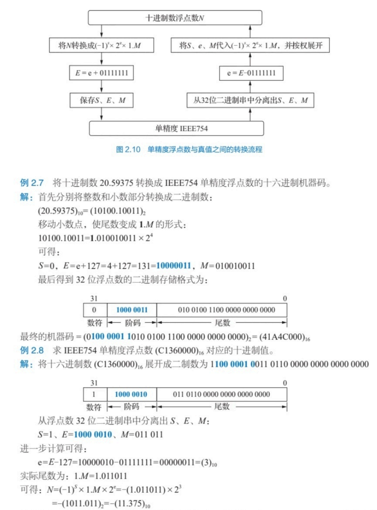

#### 尾数运算

由于阶码由原码转换为移码，尾数加减都需要进行原码运算，所以需要两种实现方式。

- 转换为补码进行加减，再转回原码。
- 直接用原码加减，符号和数值分开。

> [!IMPORTANT]
> **浮点数加减运算步骤**：
> 1. **对阶**：小阶向大阶看齐。尾数右移，$E$ 增加。可能会导致精度损失（舍入）。
> 2. **尾数加减**：按照定点数补码加减法运算。
> 3. **规格化**：
>    - **左规**：结果为 00.0... 或 11.1... 时左移。
>    - **右规**：尾数溢出（符号位 01 或 10）时右移 1 位。
> 4. **舍入**：对阶或右规时进行。常用方法：0 舍 1 入、恒置 1。
> 5. **溢出判断**：阶码上溢（阶码 $> \text{Max}$）才真正溢出。

>   **例题** 计算$9.85211\times10^{12}+9.96007\times10^{10}$的值并保留四舍五入六位有效尾数。
>
>   第一步进行对阶，变成$9.85211\times10^{12}+0.0996007\times10^{12}$。
>
>   第二步进行相加得到$9.9517107\times10^{12}$。
>
>   第三步由于整数部分为9，所以不需要规格化。
>
>   第四步因为只能保留六位有效尾数，所以保留9.95171，因为后一位是0，所以不进位为最后答案。
>
>   第五步因为阶码无论是10或12都是两位，所以肯定没有溢出。

#### 浮点数的加减运算

一般步骤

1. (转换格式化为浮点数)
    -   一般格式为$2^{E}\times M$，$M$最高位可能是1可能是0，卷子上一般会给出浮点数格式，可能是双符号位格式(11表示负数，00表示正数)
    
    -   **此处阶码尾数均用补码表示**
2. 对阶
    -   使两个数的阶码相等，小阶向大阶看齐，尾数每右移一位，阶码加1
3. 尾数加减
4. 规格化
5. 舍入
6. 判溢出

**【例题】:**

例：已知十进制数$X=-\frac{5}{256}$、$Y=+\frac{59}{1024}$，按机器补码浮点运算规则计算X-Y，结果用二进制表示，浮点数格式如下：阶符取2位，阶码取3位，数符取2位，尾数取9位。

**【解】:**

1. 转换格式化为浮点数

   $(5)_{10}=(101)_{2}，\frac{1}{256}=2^{-8}$此处先不慌把-8转换

    $X=(-101)_{2}\times 2^{(-8)_{10}}=(-0.101)_{2}\times 2^{(-5)_{10}}$此处有进制混用，建议分开写

    对于阶码$E$，$(-5)_{10}=(1101)_{\text{原码}}=(11011)_{\text{双符号位补}}，$

    对于尾数$M$，$(-0.101)_{2}=(1 101)_{\text{原码}}=(11.0110\;0000\;0)_{\text{双符号位补}}$

    则化为题目所给格式为$X:11.0110\;0000\;0;11 011，Y=00.1110\;1100\;0;11100$.

2. 对阶

    1. 使两个数的阶码相等，小阶向大阶看齐，尾数每右移一位，阶码加1

    2. 求阶差:$[\Delta E]_{\text{补}}=11011+00100=11111$，可知$[\Delta E]=-1$

        **此处是求XY两数阶数之差X-Y，由于计算机中计算减法是利用补码，所以此处是先将Y转换成对应负补码计算$X+Y$得到$[11111]_{补}$即为-1**

    3. 对阶:X:11.0110 0000 0;11 011转换为X:11.1011 0000 0;11100

    尾数加减：X-Y:10.1100 0100 0;11100

4. 规格化：X-Y:10.1100 0100 0;11101

5. 舍入：此处无舍入

6. 判溢出：常阶码，无溢出

结果即为$(-0.1001\;111)_{2}\times 2^{(-011)_{2}}$

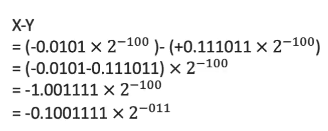

#### 强制类型转换

|   类型    | 16位机器 | 32位机器 | 64位机器 |
| :-------: | :------: | :------: | :------: |
|   char    |    8     |    8     |    8     |
|   short   |    16    |    16    |    16    |
|    int    |    16    |    32    |    32    |
|   long    |    32    |    32    |    64    |
| long long |    64    |    64    |    64    |
|   float   |    16    |    32    |    32    |
|  double   |    64    |    64    |    64    |

无损转换：

- char→int→long→double。
- float→double。

此处默认long型为$32$位，64位long型向double转换会有精度损失

由于定点数和浮点数不同，浮点数使用阶码+尾数的存储方式存储，所以定点数数值精度看位长就可以了，而浮点数数值精度看尾数长度，按IEEE 754标准有一个隐含的高位$1$，所以double尾数长度为$53$位。对于$32$位机器long是$32$位，所以转换到double的$53$位没有损失，而对于$64$位机器long是$64$位，double还是$53$位，这时候转换就会产生损失了。

int与float转换

- $float\to int$：可能会溢出（float表示范围更大）及损失精度，float的小数部分会丢失，但是float是整数就是无损转换。
- $int\to float$：可能会损失精度，产生的尾数若多于$23$位，多余的部分会丢失，但是不多于$23$位就是无损转换。

>   + int：表示整数，范围$[-2^{31}，2^{31}-1]$，有效数字$32$位。
>   + float：表示整数及小数，范围$\pm[2^{-126}，2^{127}×(2-2^{-23})]$，有效数字$23+1=24$位。

## 算术逻辑单元

即运算器中的ALU。

### 原理

#### ALU结构

- 输入信号有一个操作数的输入口，输出信号有一个运算结果输出口，旁边还有一个控制单元CU发出的控制信号接口，会输入指令译码。
- 机器字长就是指ALU可以同时处理多长的数据。为了保存结果，寄存器的字长与机器字长相等。
- 核心为带标志加法器。
- 整体ALU：$A$、$B$两个操作数输入；$C_{in}$、$C_{out}$进位输入和进位输出；$ALU_{op}$操作控制端（决定执行哪种操作）；ZF、OF、SF、CF四个标志位；$F$输出。
- 整体ALU的每一位ALU：$A$、$B$两个操作数输入；Cin、Cout进位输入和进位输出；由多路选择开关（多路选择器）MUX实现的ALUop操作控制端；一位全加器；$F$输出。

#### 逻辑运算

- 与可以用\*表示，如$A*B$。
- 或可以用+表示，如$A+B$。
- 优先级上类比乘法加法，与优先于或。
- 具有类似的分配律结合律。
- 与非：先与后非。
- 或非：先或后非。
- 异或：相异为$1$，相同为$0$。
- 同或：相同为$1$，相异为$0$。

### 加法器实现

#### 加减法逻辑电路

- 加法器实际上能实现加法和减法两种运算。
- 加法即是$X$的补码加上$Y$的补码，而减法即使$X$的补码减去$Y$的补码。
- 而减去的操作能通过加法来实现，不管是补码减法，还是无符号数减法，都是用被减数$X$加上减数$Y$的负数的补码来实现的。所以加减法被统一为加法。
- 根据公式，减数$Y$的负数的补码为$\overline{Y}+1$（即全部取反加一），因此，在加法器的$Y$输入端用一个反向器实现，并用控制端Sub控制多路选择器MUX判断是否将$Y$的各位取反后，输入$Y$端进行加操作。
- 所以在输入$X$和$Y$时，同时将Sub作为低位进位送到加法器。当Sub为$1$时，做减法，当Sub为$0$时，做加法。

#### 一位全加器

- 一位全加器FA中，令被加数为$A$，被加数从低到高的位数为$A_i$，令加数为$B$，被加数从低到高的位数为$B_i$，令来自低位i-1的进位为$C_{i-1}$，本位的和为$S_i$。$S_i=A_i+B_i+C_{i-1}$。
- 输入$A_i$、$B_i$、$C_{i-1}$，输出$S_i$、$C_i$。
- 输入中有奇数个$1$时为$1$（异或）：$S_i=A_i\oplus B_i\oplus C_{i-1}$。
- 输入中至少两个$1$才会高位进$1$，一种情况是两个本位都是$1$，另一种情况是只有一个是$1$且来自低位的进位是$1$：$C_i=A_iB_i+(A_i\oplus B_i)C_{i-1}$。

#### 串行加法器

- 基于一个一位全加器，一位一位串行进入加法器运算。对比一位全加器，需要保存一个进位触发器用来保存进位位，进位触发器初始化值为$0$。
- 如果操作数长$n$位加法就要分$n$次进行，每次产生一位和，并且串行逐位地送回寄存器。

#### 串行进位并行加法器

> [!IMPORTANT]
> **加法器进位方式**：
> 1. **串行进位 (Ripple Carry)**：低位进位依次传递到高位。速度受限于进位链长度。
> 2. **并行进位 (Carry Look-ahead)**：每一位的进位信号同时产生，不依赖前位结果。速度快但电路复杂。

#### 单级先行进位加法器

- 称为组内并行、组间串行进位方式。
- 由于逻辑表达式越长就代表电路实现越复杂，所以一般会最多用$4$个FA和一些新的线路、运算逻辑组成一个运算单元进行串联进位计算。
- 组内的信息可以并行同时得到，但是组件信息需要串行进位。这时虽然实现简单，但是效率对比并行进位并行加法器还是下降了。

#### 多级先行进位加法器

- 多级先行进位方式，又称为组内并行、组间并行进位方式。
- 为了解决这个问题按照并行进位并行加法器的思路继续对每一组的数据进行计算。
- 令$G_1^*=G_4+P_4G_3+P_4P_3G_2+P_4P_3P_2G_1$为组进位产生函数，$P_1^*=P_4P_3P_2P_1$为组进位传递函数。一开始输入就能确定，所以这些都是一开始就能确定的。
- 所以$C_4=G_1^*+P_1^*C_0$，$C_8=G_2^*+P_2^*C_4=G_2^*+P_2^*G_1^*+P_2^*P_1^*C_0$，$C_{12}=G_3^*+P_3^*C_8=G_3^*+P_3^*G_2^*+P_3^*P_2^*G_1^*+P_3^*P_2^*P_1^*C_0\cdots$
- 所以$4$位BCLA（成组先行进位电路）只要输出$G_i$和$P_i$就可以在计算机中计算得到$C_{4i}$了。

### 带标志加法器

上面都是无符号数加法器，要实现有符号数运算还需要添加相应逻辑电路。

#### 零标志位

即ZF（zero flag）。判断当前数字是否为全0值。

- $ZF=1$表示结果为$0$。
- 无论是有符号数还是无符号数，ZF都有意义。
- 通过加法电路和最后的取反操作实现。

#### 符号标志位

即SF（$$symbol\;flag$）。判断当前结果符号。

- $SF=1$表示结果为负值。
- 当产生溢出时，符号标志位置出错。

#### 进/借位标志位

即CF（carry flag）。表示无符号整数数加/减运算时的进位/借位（溢出）。

- $CF=1$表示无符号数加法溢出/减法借位。
- 对于有符号数的整数运算，CF没有意义。

#### 溢出标志位

即OF（overflow flag）。表示带符号整数运算时结果发生溢出。

- $OF=1$表示溢出。
- 对于无符号整数运算，OF没有意义。

对于有符号数的溢出判断方式有：

1. 采用一位符号位：思想为：正正得负或负负得正则为溢出，其他情况无溢出。
    - 设$A$符号为$A_S$、$B$符号为$B_S$、运算结果符号为$S_S$。
    - 溢出逻辑表达式为$V=A_SB_S\overline{S_S}+\overline{A_SB_S}S_S$。
2. 采用双符号位：s1、s2表示运算结果的两个符号位：
    - $s1s2=00$：表示正数，无溢出。
    - $s1s2=01$：表示结果正溢出 ，即正正得负，且s2表示当前运算符号为负，s1表示原本正确的符号应该为正。
    - $s1s2=10$：表示结果负溢出 ，即负负得正，且s2表示当前运算符号为正，s1表示原本正确的符号应该为负。
    - $s1s2=11$：表示结果为负数，无溢出
3. 采用一位符号位，根据数据位和符号位的进位情况判断溢出：
    - C0：表示运算时符号位是否产生进位，若符号位产生进位则为$1$，否则为$0$。
    - C1：表示运算时最高数值位是否产生进位，若最高数值位产生进位则为$1$，否则为$0$。
    - $V=C0\oplus C1$：若$V=0$表示无溢出；$V=1$表示有溢出。
