# 计算机组成原理·4 指令系统

## 考纲内容

1. 指令格式的基本概念
2. 指令格式
3. 寻址方式
4. 数据的对齐和大/小端存放方式
5. CISC 和 RISC 的基本概念
6. 高级语言程序与机器级代码之间的对应
    - 编译器、汇编器与链接器的基本概念
    - 选择结构语句的机器级表示
    - 循环结构语名的机器级表示
    - 过程(函数)调用对应的机器级表示

### 知识导图

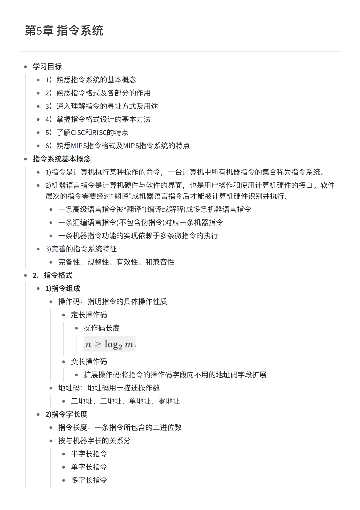

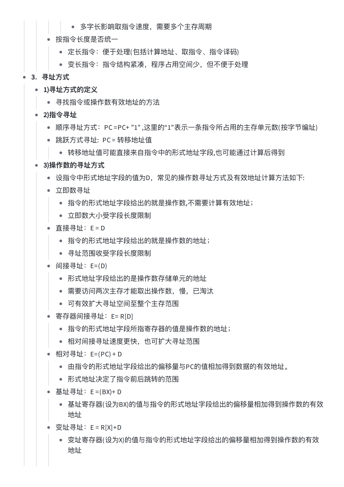

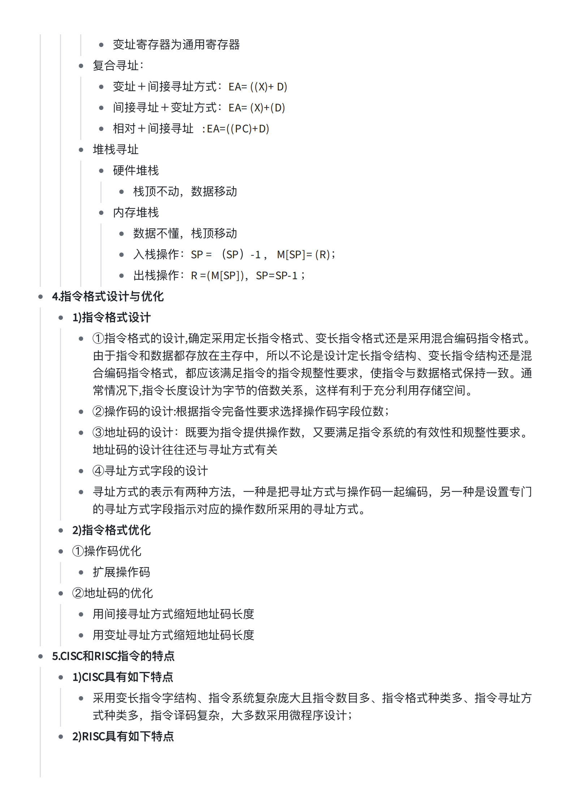

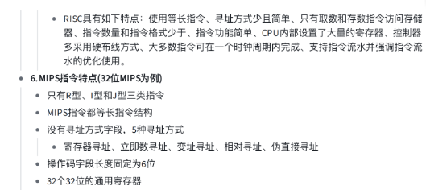

## 指令格式

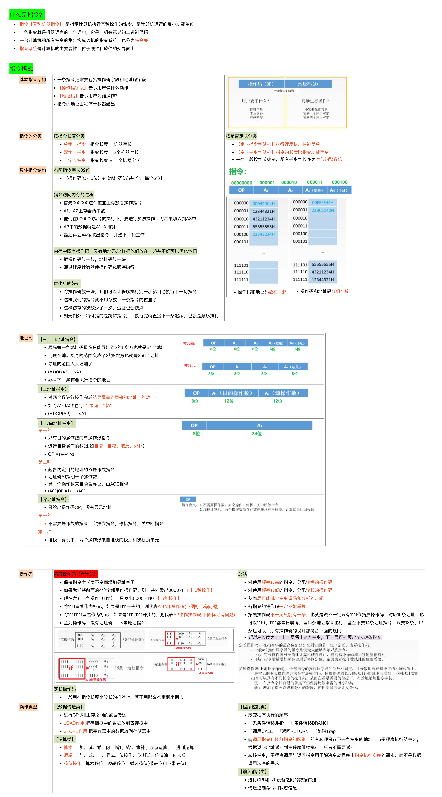

指如何使用二进制代码表示指令。

操作码+寻址特征码（有多少种寻址方式）+地址码。

> [!IMPORTANT]
> **指令系统 (ISA)**：
> 1. **定义**：计算机软硬件的界面，由机器指令集合构成。
> 2. **核心内容**：指令格式、数据类型、寻址方式、寄存器组织等。
> 3. **层次**：处于软硬件交界面。


    - **一台计算机只能执行自己指令系统中的指令，不能执行其他系统的指令**。

- 一条指令就是机器语言的一个语句，它是一组有意义的二进制代码，一条指令通常要包括操作码字段（OP）和地址码字段（$A$）两部分。

    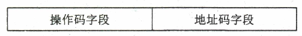

    - 其中，操作码指出指令中该指令应该执行什么性质的操作以及具有何种功能。
        - 操作码是识别指令、 了解指令功能及区分操作数地址内容的组成和使用方法等的关键信息。
        - 例如，指出是算术加运算还是算术减运算，是程序转移还是返回操作。

    - 地址码给出被操作的信息（指令或数据）的地址
        - 包括参加运算的一个或多个操作数所在的地址、运算结果的保存地址、程序的转移地址、被调用的子程序的入口地址等。 
        - **指令地址由程序计数器PC给出**。


- **操作码指出该指令要执行什么操作，地址码指出指令要操作的数据的地址。**
- 指令的长度是指一条指令中所包含的二进制代码的位数
    - **指令字长取决于操作码的长度、操作数地址码的长度和操作数地址的个数。**
    - **指令长度与机器字长没有固定的关系，它可以等于机器字长，也可以大于或小于机器字长**。
    - 通常，**把指令长度等于机器字长的指令称为单字长指令，指令长度等于半个机器字长的指令称为半字长指令，指令长度等于两个机器字长的指令称为双字长指令**
- 定长指令字结构：在一个指令系统中，若所有指令的长度都是相等的，则称为定长指令字结构
    - 定字长指令执行速度块，控制简单。
    - **因为主存一般是按字节编址的，所以指令字长多为字节的整数倍**
    - ==指令字长=存储字长==
- 变长指令字结构：指令长度随指令功能而异。
    - 按字节的倍数变化

>   机器字长：CPU进行一次整数运算所能处理的二进制数据的位数（通常和ALU直接相关）
>
>   存储字长：一个存储单元中的二进制代码位数（通常和MDR位数相同）

### 地址码

- 一条指令的执行分为三步，如果是两个操作数则四次访存：
    1. 取指令。
    2. 取两个操作数。
    3. 放回结果。
- 访存是指访问内存，ACC在运算器中，访问ACC不是访问内存。如果数据在Cache中则不用访存。

> [!IMPORTANT]
> **指令地址码结构**：
> 1. **零地址**：OP。用于堆栈运算或停机等。
> 2. **一地址**：OP A1。$(ACC) \text{ OP } (A_1) \to ACC$。
> 3. **二地址**：OP A1 A2。$(A_1) \text{ OP } (A_2) \to A_1$。
> 4. **三地址**：OP A1 A2 A3。$(A_1) \text{ OP } (A_2) \to A_3$。

    
- 用硬件资源减少地址码字段的优势：
    - 扩大指令寻址范围。
    - 缩短指令字长。
    - 减少访存次数。

### 操作码

#### 定长操作码

- 指令字的最高位部分分配固定的若干位表示操作码。
- 若有$n$位操作码，则有$2^n$条指令。
- 优点：能简化计算机硬件设计，提高指令译码和识别速度。
    - **一般这种操作码用于指令字长较长的情况**。
    - 当计算机字长为32位或更长时，这是常规用法

- 缺点：指令数量增加时会占用更多固定位，留给表示操作数地址的位数有限。
- 控制器的译码电路设计简单，但灵活性较低

#### 可变长操作码

- 为了在指令字长有限的前提下仍保持比较丰富的指令种类，可采取可变长度操作码，即全部指令的操作码字段的位数不固定，且分散地放在指令字的不同位置上
- 控制器的译码电路设计复杂，但灵活性较高

> [!IMPORTANT]
> **扩展操作码**：
> 1. **核心思想**：操作码长度随地址码减少而增加。
> 2. **原则**：短码不能是长码的前缀（前缀编码）。


### 操作类型

1. 数据传输：
    1. MOV：寄存器之间的传送。
    2. LOAD：把存储器的数据放到CPU寄存器中。
    3. STORE：把CPU寄存器的数据放到存储器中。
2. 算术和逻辑运算：
    1. 算术：加ADD、减SUB、比较CMP、乘MUL、除DIV、自加一INC、自减一DEC、求补、浮点运算、十进制运算。
    2. 逻辑：与AND、或OR、非NOT、异或XOR、位操作、位测试、位清除、位求反。
3. 移位操作：
    1. 算术移位。
    2. 逻辑移位。
    3. 循环移位（带进位和不带进位）。
4. 转移操作：调用指令必须保存下一条指令的地址，当子程序结束时要返回主程序继续执行，而转移指令不用返回执行。
    1. 无条件转移：JMP，将地址码送入PC。
    2. 条件转移：BRANCH，如
        -   JZ：结果为$0$
        -   JO：结果溢出
        -   JC：结果进位。
    3. 调用CALL和返回RET。
    4. 陷阱TRAP和陷阱指令。（意外事故的中断）
5. 输入输出操作。

## 指令寻址方式

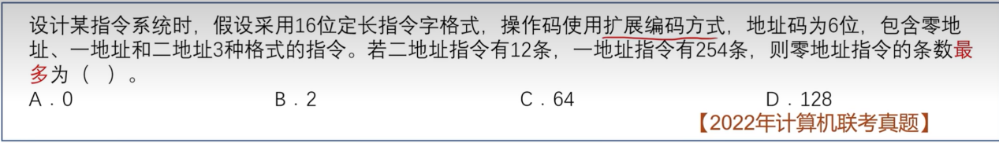

$(A)$表示地址为$A$的数值，$A$既可以是寄存器编号，也可以是内存地址。对应的$(A)$就是寄存器中的数值，或相应内存单元的数值。例如，$EA=(A)$意思是有效地址是地址A中的数值。

目的是：缩短指令字长、扩大寻址空间、提高编程灵活性。

寻址方式是指寻找指令或操作数有效地址的方式，即确定本条指令的数据地址及下一条待执行指令的地址的方法，寻址方式包括指令寻址和数据寻址。

### 操作数类型与存放方式

#### 操作数类型

- 地址：无符号整数。
- 数字：定点数、浮点数、十进制数。
- 字符：ASCII。
- 逻辑数：逻辑运算。

#### 存放方式

- 大小端：若一个操作数有多个内存地址对应，则存放地址为：
    - 大端方式：指令中给出的地址是操作数**最高有效字节MSB**所在的地址。
        - 字地址为高字节地址，如$012345$。
    - 小端方式：指令中给出的地址是操作数**最低有效字节LSB**所在的地址。
        - 字地址为低字节地址，如$452301$。
- 寻址方式
    - 按字节地址寻址：给出个字节地址，可以取出长度为一个字节的数据。
    - 按字地址寻址：给出个字地址，可以取出长度为一个字的数据。

- 编址方式
    - 按字节编址：每个字节存储单元都有一个地址编号。
        - 每个字中最小的字节地址就是字地址。

    - 按字编址：每个字存储单元都有一个地址编号。
        - 但是按字编址就无法直接取出字节地址，所以一般只按字节编址。

- 三个字长：
    1. 机器字长：CPU一次能处理的二进制数据的位数，一般等于内部寄存器的位数。
        -   机器字长通常与主存单元的位数一致
    2. 指令字长：一个指令字中包含二进制代码的位数。
        -   若是单字长指令则指令字长等于机器字长，若是半字长指令之类的则不相等。
            -   指令字长等于机器字长的指令，称为**单字长指令**；
            -   指令字长等于半个机器字长的指令，称为**半字长指令**；
            -   指令字长等于两个机器字长的指令，称为**双字长指令**。
        -   **指令字长取决于从操作码的长度、操作码地址的长度和操作码地址的个数**
    3. 存储字长：一个存储单元存储二进制代码的长度。
- 存储位置
    - 从任意位置开始存储：
        - 优点：不浪费存储资源。
        - 缺点：除了访问一个字节之外，访阿其它任何类型的数据，都可能花费两个存储周期的时间。读写控制比较复杂。

    - 从一个存储字的起始位置开始访问，其余位置置空或填充：
        - 优点：无论访问何种类型的数据，在一个周期内均可完成，读写控制简单。
        - 缺点：浪费了宝贵的存储资源。

    - 边界对准方式，从地址的整数倍位置开始访问：
        - 由于不同的机器数据字长不同，每台机器处理的数据字长也不统一，为了便于硬件实现，通常要求多字节的数据在存储器的存放方式能满足“边界对准”的要求。
        - 数据存放的起始地址是数据长度（按照编址单位进行计算）的整数倍。
        - 本方案是前两个方案的折衷，在一个周期内可以完成存储访问，空间浪费也不太严重。

### 指令寻址

> [!IMPORTANT]
> **常见数据寻址方式总结**：
> | 寻址方式 | 有效地址 (EA) | 访存次数 (指令执行阶段) | 特点 |
> | :--- | :--- | :---: | :--- |
> | **立即寻址** | 无 (操作数在指令中) | 0 | 速度最快，范围受限 |
> | **直接寻址** | $EA = A$ | 1 | 简单，范围受限 |
> | **间接寻址** | $EA = (A)$ | 2 或更多 | 扩大寻址范围，速度慢 |
> | **寄存器寻址** | $EA = R_i$ | 0 | 速度快，字长短 |
> | **寄存器间接** | $EA = (R_i)$ | 1 | 扩大寻址范围 |
> | **相对寻址** | $EA = (PC) + A$ | 1 | 便于程序浮动，多用于转移 |
> | **基址寻址** | $EA = (BR) + A$ | 1 | 面向操作系统，解决多道程序驻留 |
> | **变址寻址** | $EA = (IX) + A$ | 1 | 面向用户，适合循环/数组处理 |


**当计算机开始执行一段程序时，PC会指向该程序的第一条指令的地址，随着程序的执行，PC会自动加一，指向下一条要执行的指令的地址。**

用于确定要执行的下一条指令的地址。始终由程序计数器PC给出。

- 顺序寻址，即`(PC)+"1"→PC`：由PC自动加上某个数寻址下一个要操作的指令
    - <span style="color:orange">注意：</span>不是单纯加一，加上的是当前取出的指令字长。
    - **加上的$1$实际上表示的是**每个指令占用的存储单元数**。**

- 跳跃寻址：由转移指令指出。
    - 如执行到操作码为JMP，则跳跃到保存的地址码所指向的指令地址进行执行。
    - 跳跃地址分为绝对地址（标记符直接得到）和相对地址（相对当前地址的偏移量）。
    - 跳跃的结构是当前指令修改PC值，所以下一条指令仍通过PC给出。
    - 可实现程序的条件或无条件转移。
    - <span style="color:orange">注意：</span>程序跳跃后，按新的指令地址开始顺序执行。
        - 因此，程序计数器的内容也必须相应改变，以便及时跟踪新的指令地址。

> [!IMPORTANT]
> **常见数据寻址方式**：
> 1. **立即寻址**：操作数在指令中。
> 2. **直接寻址**：$EA = A$。
> 3. **间接寻址**：$EA = (A)$。
> 4. **寄存器寻址**：$EA = R_i$。
> 5. **偏移寻址**：
>    - **基址**：$EA = (BR) + A$。
>    - **变址**：$EA = (IX) + A$。
>    - **相对**：$EA = (PC) + A$。
    
    
    
    
    
- 此时指令就需要由：操作码OP+寻址特征（寻址方式）+形式地址$A$组成。

    - 形式地址不再是实际的地址，而是指令字中的地址。

- 有效地址/真实地址EA(Effctive Address)就是通过寻址特征和形式地址$A$进行运算得到的。

- 无论是有多少个地址，都必须给出成对的寻址特征和形式地址$A$。

- 主存地址不能为负。

- 基址寻址和变址寻址的区别：
    - 两种方式有效地址的形成都是寄存器内容＋偏移地址。
    - 在基址寻址中，程序员操作的是偏移地址，基址寄存器的内容由操作系统控制，在执行过程中是动态调整的，偏移量较短。
    - 在变址寻址中，程序员操作的是变址寄存器，偏移地址是固定不变的，偏移量较大。

-   由于访存慢于访问寄存器，所以寄存器访问快于直接访问。

-   速度快慢
    
    - **间接寻址**方式的执行速度最慢
        - 需要读内存两次，第一次由操作数的间接地址读到操作数的地址，第二次再由操作数的地址读到操作数
    
    - 采用**变长指令码**格式的时候，**寄存器寻址**方式的执行速度更快
        - 通用寄存器位于CPU内部，无须到内存读取操作数
    
    - 如果采用**定长指令码**格式，那就是**立即数寻址**更快
        - 采用**变长指令码**格式时，虽然无须取操作数，但因指令码长度最长，取指令访存花费的时间较多
        - 若指令系统采用定长指令码格式，所有指令（包括采用立即寻址方式的指令）所包含的二进制位数均相同，由于读到指令的同时，便立即取得操作数，所以立即寻址方式执行速度最快
    
-   指令码长度长短

    - **寄存器寻址**方式和**寄存器间接寻址**方式的指令码长度最短
    - **立即寻址**方式、**直接寻址**方式和**间接寻址**方式的指令码长度最长
        - 若指令码长度太短，则无法表示范围较大的立即数和寻址到较大的内存地址空间。


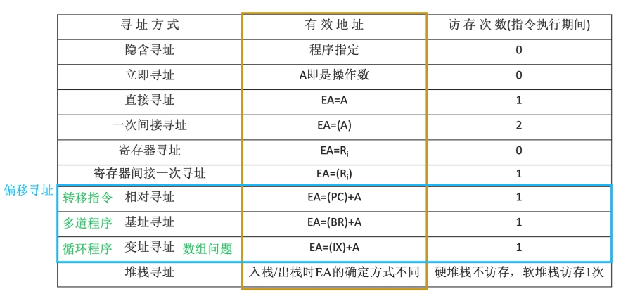

#### 直接寻址

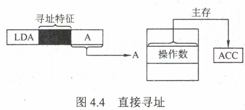

- 指令字中的形式地址$A$就是操作数的真实地址EA。
    $$
    EA=A
    $$

- 直接寻址的指令执行：
    1. 取指令，访存$1$次。

    2. 取操作数，访存$1$次。

        -   暂不考虑如何存结果。

        共访存$2$次。

- 优点：简单，指令执行阶段仅访问一次主存，不需专门计算操作数的地址。

- 缺点：
    - 形式地址$A$的位数决定了该指令操作数的寻址范围。
    - 操作数的地址不易修改。

#### 间接寻址

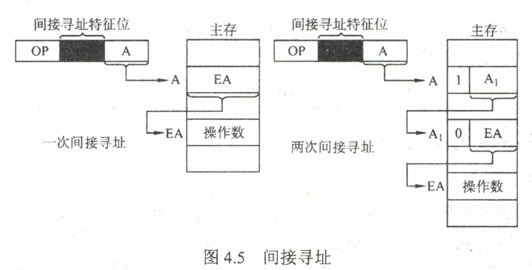

- 指令的地址字段给出的形式地址不是操作数的真正地址，而是操作数有效地址所在的存储单元的地址，也就是操作数地址的地址
    $$
    EA=(A)
    $$

- 间接寻址可以是一次间接寻址，还可以是多次间接寻址。

    - 在图4.5中，主存字第一位为1时，表示取出的仍不是操作数的地址，即多次间址
    - 主存字第一位为0时，表示取得的是操作数的地址。 

- 间接寻址的指令执行：

    1. 取指令，访存$1$次。
    2. 取操作数地址，取操作数，访存$2$次。
    3. 暂不考虑如何存结果。
    4. 共访存$3$次。

- **若间址次数为$n$，则访问时间为$n+2$**。

- 优点：
    - 可扩大寻址范围
        - 有效地址EA的位数大于形式地址$A$的位数。
    - 便于编制程序
        - 用间接寻址可以方便地完成子程序返回。

- 缺点：

    - 指令在执行阶段要多次访存
        - 一次间址需两次访存，多次寻址需根据存储字的最高位确定几次访存。
        - **由于访问速度过慢，所以一般都不使用**。


#### 隐含寻址

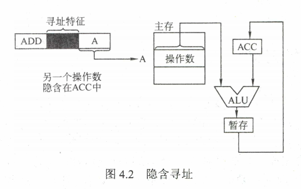

- 不是明显地给出操作数的地址，而是在指令中隐含着操作数的地址。
    - 单地址的指令格式就不明显地在地址字段中指出第二操作数的地址，而规定累加器ACC作为第二操作数地址，指令格式明显指出的仅是第一操作数的地址。
    - 因此，累加器ACC对单地址指令格式来说是隐含寻址

- 优点：有利于缩短指令字长。
- 缺点：需增加存储操作数或隐含地址的硬件。

#### 立即寻址

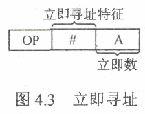

- 形式地址指出的不是数据地址，而是数据本身，称为立即数，**采用补码形式存储**。
- 地址形式为：操作码`OP+#+`立即数$A$。**`#`即表示立即寻址特征**。
- 立即寻址的指令执行：
    1. 取指令，访存$1$次。
    2. 执行指令，直接取指令操作数，访存$0$次。
    3. 暂不考虑如何存结果。
    4. 共访存$1$次。
- 优点：指令执行阶段不访问主存，**指令执行时间最短**。
- 缺点：
    - 形式地址$A$的位数限制了立即数的范围。
        - 如$A$的位数为$n$，且立即数采用补码时，可表示的数据范围为$[-2^{n-1}，2^{n-1}-1]$。

#### 寄存器寻址

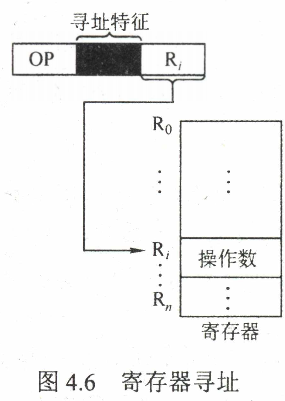

- 在指令字中直接给出操作数所在的寄存器编号
    $$
    EA=R_i
    $$
    其操作数在由$R_i$所指的寄存器内。
- 类似于直接寻址，只是数据在主存中变为在寄存器中，寄存器编号就是形式地址。
- 寄存器寻址的指令执行：
    1. 取指令，访存$1$次。
    2. 执行指令，由于操作数在寄存器中，寄存器集成在CPU中，所以不需要访问主存，访存$0$次。
    3. 暂不考虑如何存结果。
    4. 共访存$1$次。
- 优点：
    - 指令在执行阶段不访问主存，只访问寄存器，**指令字短且执行速度快**。
    - **支持向量/矩阵运算**。
- 缺点：
    - 寄存器价格昂贵。
    - 计算机中寄存器个数有限。

#### 寄存器间接寻址

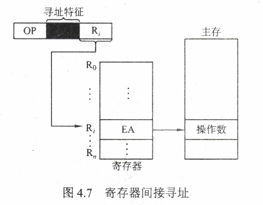

- 寄存器$R_i$​中给出的不是一个操作数，而是操作数所在主存单元的地址。
    $$
    EA=(R_i)
    $$
- 寄存器间接寻址的指令执行：
    1. 取指令，访存$1$次。
    2. 执行指令，先访问寄存器获得地址，再根据地址在主存中访问，访存$1$次。
    3. 暂不考虑如何存结果。
    4. 共访存$2$次。
- 优点：与一般间接寻址相比速度更快。
- 缺点：指令的执行阶段需要访问主存（因为操作数在主存中）。

#### 基址寻址

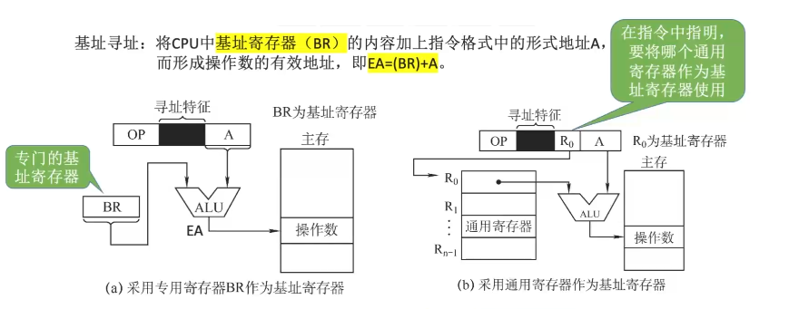

- 以程序的起始存放地址作为“起点”
- 将CPU中基址寄存器BR(Base-address Register)的内容加上指令格式中的形式地址$A$​，而形成操作数的有效地址。
    $$
    EA=(BR)+A
    $$

    - 分为隐式基址寄存器（专用寄存器BR）和显式基址寄存器（需要指定某通用寄存器为基址寄存器）。
    - 基址寄存器是面向操作系统的，其内容由操作系统或管理程序确定，用户不可改变。
    - 基址寄存器主要用于解决程序逻辑空间与存储器物理空间的无关性
    - 在程序执行过程中，基址寄存器的内容不变（作为基地址），形式地址$A$可变（作为偏移量，**使用补码表示**）。

- 当采用通用寄存器作为基址寄存器时，可**由用户决定哪个寄存器作为基址寄存器，但其内容仍由操作系统确定**。
- 优点：
    - 可扩大寻址范围（基址寄存器的位数大于形式地址$A$的位数）。
    - 便于程序“浮动”，用户不必考虑自己的程序存于主存的哪一空间区域，故有利于多道程序并发运行，以及可用于编制浮动程序。
        - 操作数的地址不是固定的，它随PC值的变化而变化，且与指令地址之间总是相差一个固定值

#### 变址寻址

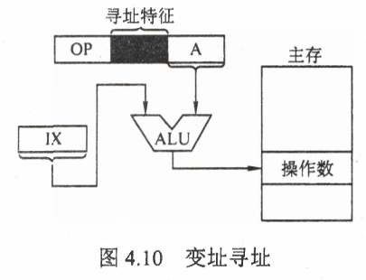

- 程序员自己决定从哪里作为“起点”
- 有效地址EA等于指令字中的形式地址$A$与变址寄存器IX​的内容相加之和。
    $$
    EA=(IX)+A
    $$
- 其中IX为变址寄存器$(Index\;Register)$（专用），也可用通用寄存器作为变址寄存器。
- **与基址寄存器不同的是，变址寄存器是面向用户的**

    - 在程序执行过程中，变址寄存器的内容可由用户改变（作为偏移量），形式地址$A$不变（作为基地址）。

- 优点：
    - 可扩大寻址范围（变址寄存器的位数大于形式地址$A$的位数）。
    - 在**数组处理**过程中，可设定$A$为数组的首地址，不断改变变址寄存器IX的内容，便可很容易形成数组中任一数据的地址，**特别适合编制循环程序**。
- 变址寻址与基址寻址配合使用：
    $$
    EA=A+(BR)+(IX)
    $$
- 变址寻址与间接寻址配合使用：
    - 先变址后间址，
        $$
        EA=(A+(IX))
        $$
    - 先间址后变址：
        $$
        EA=(A)+(IX)
        $$

>   基址寻址和变址寻址的区别：
>
>   + 两种方式有效地址的形成都是寄存器内容＋偏移地址。
>   + 在基址寻址中，程序员操作的是偏移地址，基址寄存器的内容由操作系统控制，在执行过程中是动态调整的，偏移量较短。
>   + 在变址寻址中，程序员操作的是变址寄存器，偏移地址是固定不变的，偏移量较大。

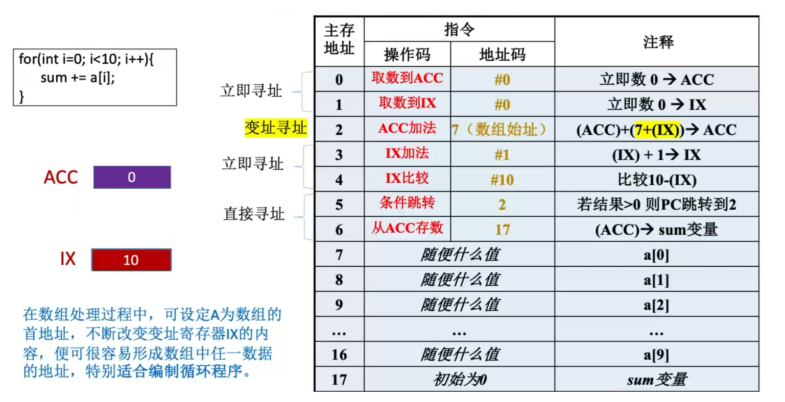

#### 相对寻址

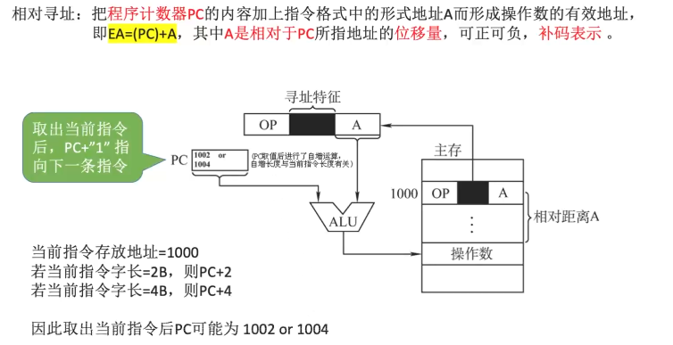

- 以程序计数器PC所指地址作为“起点”

- 把程序计数器PC的内容加上指令格式中的形式地址$A$而形成操作数的有效地址
    $$
    EA=(PC)+A
    $$
    其中$A$是相对于PC所指地址即下一条指令的地址的位移量，可正可负，**补码表示**。

- 由于取指时PC会默认加上一个指令字长（$(PC)+1\rightarrow PC$），所以相对寻址所提供的相对地址是以下条指令在内存中首地址为基准位置的偏移量。

- 优点：
    - 操作数的地址不是固定的，它随着PC值的变化而变化，并且与指令地址之间总是相差一个固定值，因此便于程序浮动(一段代码在整个程序内部的浮动)。
    - 相对寻址广泛应用于转移指令。
    
- **转移指令基本上使用相对寻址方式**

    - 无条件转移指令会在指令周期中对PC进行两次修改操作，一起是取指周期后自动`+'1'`，一个是执行周期后转移修改。
    - 有条件指令如果条件满足则修改两次，条件不满足则只用修改一次。


#### 堆栈寻址

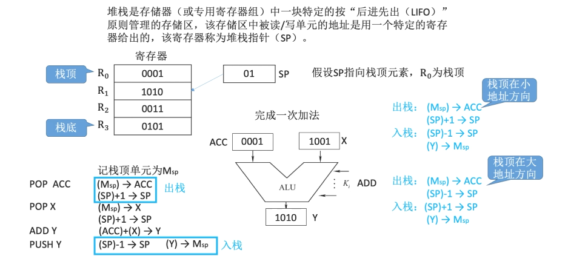

- 操作数存放在堆栈中，隐含使用堆栈指针SP(Stack Pointer)作为操作数地址。
- 堆栈是存储器（或专用寄存器组）中一块特定的按**后进先出LIFO**原则管理的存储区，该存储区中被读/写单元的地址是用一个特定的寄存器给出的，该寄存器称为堆栈指针SP。
- **寄存器做堆栈就是**硬堆栈**，成本高，主存做堆栈就是**软堆栈****
    - 寄存器堆栈又称**硬堆栈**，寄存器堆栈的成本较高，不适合做大容量的堆栈
    - 而从主存中划出一段区域来做堆栈是最合算且最常用的方法，这种堆栈称为**软堆栈**。
    
-   在采用堆栈结构的计算机系统中，大部分指令表面上都表现为无操作数指令的形式，因为操作数地址都隐含使用了SP
    -   通常情况下，在读/写堆栈中的一个单元的前后都伴有自动完成对SP内容的增量或减量操作

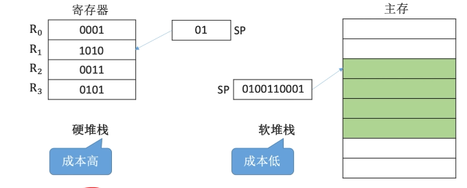

## 程序的机器级代码表示

### 考试要求

2022新增考点

- 只需关注x86汇编语言：若考察其他汇编语言题目会详细注释
- 题目给出某段简单程序的C语言、汇编语言、机器语言表示。
    - 能结合C语言看懂汇编语言的关键语句（看懂常见指令、选择结构、循环结构、函数调用)
- 汇编语言、机器语言一一对应，要能结合汇编语言分析机器语言指令的格式、寻址方式
- 不会考：将C语言人工翻译为汇编语言或机器语言

### x86汇编语言指令基础

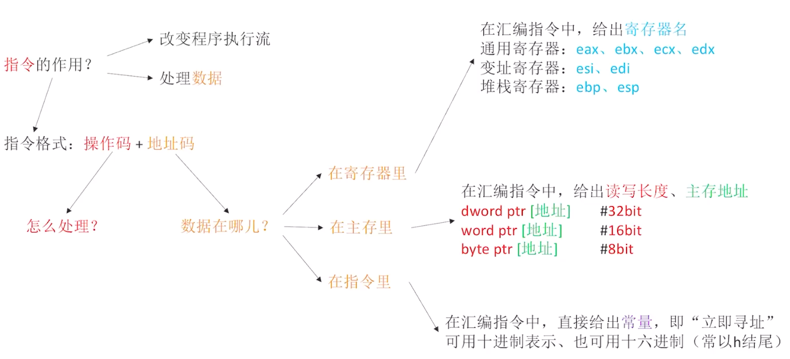

#### 相关寄存器

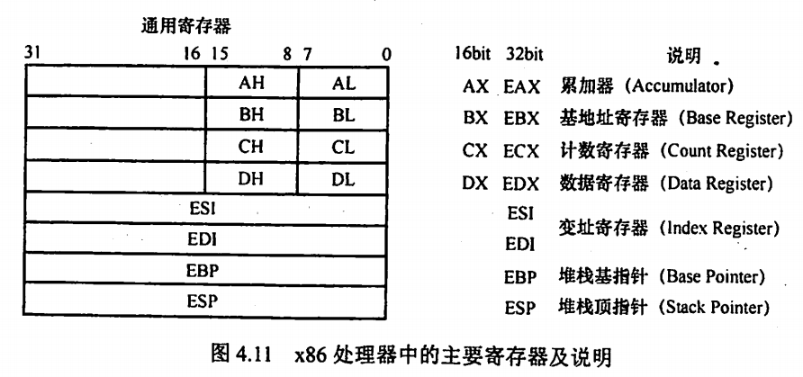

* 上四个寄存器$(EAX\;EBX\;ECX\;EDX)$称为通用寄存器，其中X=未知
    * $EAX，EBX，ECX，EDX$有$32bit$(有$E$)
        * $E=Extended=32bit$，看到$E$表示是32位
    * $AX，BX$等有$16bit$
    * $AH，AL，BH，BL$等有$8bit$
* 中间两个寄存器$(ESI\;EDI)$是变址寄存器，用于线性表和字符串的处理
    * $S =Source，D=Destination$
* 最后两个寄存器是堆栈寄存器，用于实现函数调用

### 汇编指令格式`AT&T`V.S.`Intel`

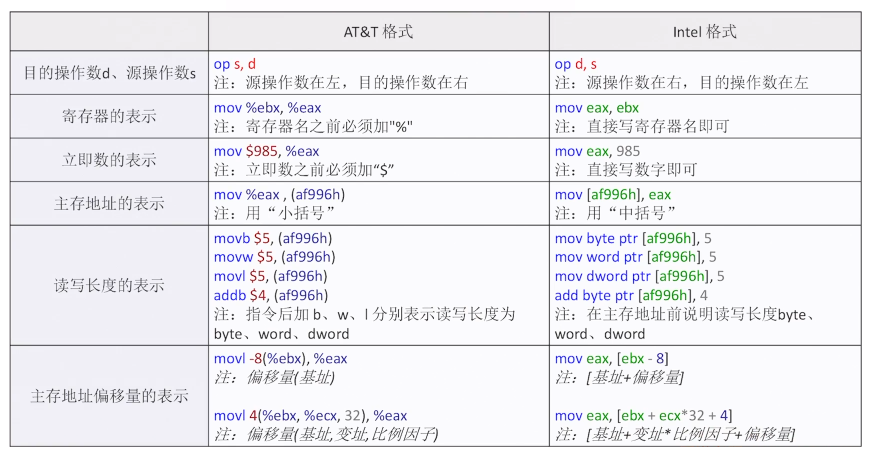

1.   AT&T格式的指令**只能用小写字母**

     -   而Intel格式的指令对大小写不敏感。 

2.   在AT&T格式中，第一个为源操作数，第二个为目的操作数，方向从左到右，合乎自然

     -   在Intel格式中，第一个为目的操作数，第二个为源操作数，方向从右向左。 

3.   在AT&T格式中，寄存器需要加前缀`%`，立即数需要加前缀`$`

     -   在Intel格式中，寄存器和立即数都不需要加前缀。 

4.   在内存寻址方面，AT&T格式使用`(`和`)`

     -   而Intel格式使用`[`和`]`

5.   在处理复杂寻址方式时

     -   例如AT&T格式的内存操作数`disp(base, index, scale)`分别表示偏移量、基址寄存器、变址寄存器和比例因子
         -   如`8(%edx,%eax,2)`表示操作数为`M[R[edx] + R[eax]*2 + 8]`
     -   其对应的 Intel 格式的操作数为 `[edx + eax*2 + 8]`

6.   在指定数据长度方面

     -   AT&T格式指令操作码的后面紧跟一个字符，表明操作数大小
         -   **b**：表示字节（8位）。
         -   **w**：表示字（16位）。
         -   **l**：表示双字（32位）。
         -   **q**：表示四字（64位）。
     -   Intel格式也有类似的语法，它在操作码后面显式地注明`byte ptr`， `word ptr`或`dword ptr`
         -   dword ptr——双字，$32bit$
         -   word  ptr——单字，$16bit$
         -   byte  ptr——字节，$8bit$
         -   若未指明主存读写长度，默认$32bit$

7.   表4.2展示了两种格式的几条不同指令

     -   其中，`mov`指令用于在内存和寄存器之间或者寄存器之间移动数据

     -   `lea`指令用于将一个内存地址（而不是其所指的内容）加载到目的寄存器。

         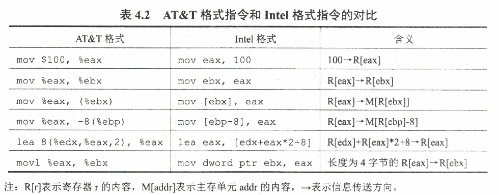

>   由于32或64位体系结构都是由16位扩展而来的，因此用word （字）表示16位。
>
>   ---
>
>   本笔记依照王道教材进行汇编语言表示，以下为王道教材原话
>
>   两种汇编指令的相互转换并不复杂。考虑到本书参考教材之一[袁春风所著《计算机系统基础（第二版）》]使用的是AT&T格式，但2017年和2019年统考综合题使用的是Intel格式，因此本书将混用两种格式，两种格式的汇编指令都需要理解。
>
>   在本节介绍常用指令时，使用Intel格式；在后面介绍具体结构的机器级表示时，使用AT&T格式。读者在学习时可以尝试转换。

### 常用指令

汇编指令通常可以分为数据传送指令、逻辑计算指令和控制流指令

以下用于操作数的标记分别表示寄存器、内存和常数

-   ``<reg>``：表示任意寄存器，若其后带有数字，则指定其位数
    -   如``<reg32>``表示32位寄存器（eax、ebx、ecx、edx、esi、edi、esp 或 ebp ）;
    -   ``<regl6>``表示 16 位寄存器（ax、bx、ex 或 dx）;
    -   ``<reg8>``表示 8 位寄存器（ah、al、bh、bl、ch、cl、dh、dl ）。
-   ``<mem>``：表示内存地址
    -   如`[eax]`、`[var + 4]`或 `dword ptr [eax + ebx]`
-   ``<con>``：表示8位、16位或32位常数
    -   ``<vcon8>``表示8位常数
    -   ``<vconl6>``表示16位常数
    -   `<vcon32>`表示32位常数。

#### 数据转移`mov`指令

- 基本格式: 【`mov ` 目标操作数$d$ 源操作数$s$】
    - `mov`指令功能：将源操作数s复制到目的操作数d所指的位置
    - **但不能用于直接从内存复制到内存**
    
    
    
    - $d：destination$(n.目的地)
    
    - $s：source$(n.来源，来源地)
    
- 常见格式:
    - `mov eax,ebx`
        - 将寄存器ebx的值复制到寄存器eax
        - 寄存器寻址→寄存器寻址
    - `mov eax，5`
        - 将立即数$5$复制到寄存器eax
        - 立即数寻址→寄存器寻址
    - `mov eax,dword ptr [af996h]`
        - 将内存地址`af996h`所指的$32bit$值复制到寄存器eax
        - **`[] `表示里面是个地址，并且一般前面还会指明数据长度**
            - []里面如果没有写直接的地址就表示寄存器(EAX EBX ECX EDX等)，这表示寄存器间接寻址
                - 即先把寄存器中存放的主存地址取出在去主存中取数据
            - []里面还可以加减表示地址偏移
        - `af996h`中$h$表示16进制
        - dword ptr等表示内存读写长度，常见如下
            - dword ptr——双字，$32bit$
            - word  ptr——单字，$16bit$
            - byte  ptr——字节，$8bit$
            - 若未指明主存读写长度，默认$32bit$
        - 直接寻址(+基址寻址)→寄存器寻址(主存→寄存器)
        - 此处是`dword ptr [af996h]`→`eax`，不要搞混了
            - **`mov`指令都是后面移到前面**
    - `mov byte ptr [af996h],5`
        - 将立即数5复制到内存地址`af996h`所指的一字节中
        - 立即数寻址→直接寻址(+基址寻址)

>   **AT&T 格式解释：**
>
>   在 AT&T 格式中，`mov` 指令用于数据传送，通常使用以下语法：
>
>   ```
>   mov 目标操作数, 源操作数
>   ```
>
>   - `目标操作数`：表示数据传送的目标位置。
>   - `源操作数`：表示要传送的数据源。
>
>   数据传送的方向是从 `源操作数` 到 `目标操作数`。以下是一些示例：
>
>   ```asm
>   movl %eax, %ebx    ; 将 eax 寄存器的内容传送到 ebx 寄存器
>   movl $42, %ecx     ; 将立即数 42 传送到 ecx 寄存器
>   movl (%esi), %edx  ; 将 esi 寄存器指向的内存位置的内容传送到 edx 寄存器
>   ```
>

#### 函数调用

##### `push`指令

**AT&T 格式解释：**

```
push 源操作数
```

- `源操作数`：表示要推入栈的数据源。

`push` 指令的作用是将源操作数的值放入栈顶，并将栈指针减小，以便指向新的栈顶。以下是一些示例：

```asm
push %eax    ; 将 eax 寄存器的值推入栈中
push $42     ; 将立即数 42 推入栈中
push (%esi)  ; 将 esi 寄存器指向的内存位置的值推入栈中
```

**Intel 格式解释：**

```
push 源操作数
```

- `源操作数`：表示要推入栈的数据源。

`push` 指令的作用与 AT&T 格式相似，它将源操作数的值放入栈顶，并将栈指针减小，以便指向新的栈顶。以下是一些示例：

```asm
push eax    ; 将 eax 寄存器的值推入栈中
push 42     ; 将立即数 42 推入栈中
push [esi]  ; 将 esi 寄存器指向的内存位置的值推入栈中
```

##### pop指令

与push指令相反，pop指令执行的是出栈工作，出栈前先将ESP指示的地址中的内容出栈，然后将ESP值加4。

**AT&T 格式解释：**

```
pop 目标操作数
```

- `目标操作数`：表示弹出的值将要存储的位置。

`pop` 指令的作用是从栈顶弹出一个值，将其存储到目标操作数中，并将栈指针增加，以指向新的栈顶。以下是一些示例：

```asm
pop %eax    ; 从栈中弹出一个值，存储到 eax 寄存器中
pop %ebx    ; 从栈中弹出一个值，存储到 ebx 寄存器中
pop (%esi)  ; 从栈中弹出一个值，存储到 esi 寄存器指向的内存位置中
```

**Intel 格式解释：**


```
pop 目标操作数
```

- `目标操作数`：表示弹出的值将要存储的位置。

`pop` 指令的作用与 AT&T 格式相似，它从栈顶弹出一个值，将其存储到目标操作数中，并将栈指针增加，以指向新的栈顶。以下是一些示例：

```asm
pop eax    ; 从栈中弹出一个值，存储到 eax 寄存器中
pop ebx    ; 从栈中弹出一个值，存储到 ebx 寄存器中
pop [esi]  ; 从栈中弹出一个值，存储到 esi 寄存器指向的内存位置中
```

#### 常见算术运算指令

| 功能   | 英文全称   | 汇编指令   | 对应功能                                            |
| ------ | ---------- | ---------- | --------------------------------------------------- |
| 加     | add      | `add d,s`  | 计算$d+s$，结果存入$d$                              |
| 减     | subtract | `sub d,s`  | 计算d-s，结果存入$d$                              |
| 乘     | multiply | `mul d,s`  | 无符号数$d*s$，乘积存入$d$                          |
| 乘     | multiply | `imul d,s` | 有符号数$d*s$，乘积存入$d$                          |
| 除     | divide   | `div s`    | 无符号数除法edx:eax/s，商存入eax，余数存入edx |
| 除     | divide   | `idiv s`   | 有符号数除法edx:eax/s，商存入eax，余数存入edx |
| 取负数 | negative | `neg d`    | 将$d$取负数，结果存入$d$                            |
| 自增+  | increase | `inc d`    | 将$d++$，结果存入$d$                                |
| 自减-  | decrease | `dec d`    | 将$d–$，结果存入$d$                                 |

其中，目标操作数$d$不能为常量，只能来自于寄存器和主存

x86中不允许两个操作数同时来自于主存

edx:eax/s:进行除法操作前要对被除数32位进行位扩展为64位再进行除法操作，edx:eax表示高32位存放在edx中低32为存放在eax中

#####  `add`指令：加运算

**AT&T 格式：**

```
add 目标操作数, 源操作数
```

- `目标操作数`：表示相加后的结果将要存储的位置。
- `源操作数`：表示要相加的值。

以下是示例：

```asm
addl %eax, %ebx    ; 将 eax 寄存器的内容与 ebx 寄存器的内容相加，并将结果存储在 ebx 中
addl $42, %ecx     ; 将立即数 42 与 ecx 寄存器的内容相加，并将结果存储在 ecx 中
addl (%esi), %edx  ; 将 esi 寄存器指向的内存位置的内容与 edx 寄存器的内容相加，并将结果存储在 edx 中
```

**Intel 格式：**

```
add 目标操作数, 源操作数
```

- `目标操作数`：表示相加后的结果将要存储的位置。
- `源操作数`：表示要相加的值。

以下是示例：

```asm
add ebx, eax    ; 将 eax 寄存器的内容与 ebx 寄存器的内容相加，并将结果存储在 ebx 中
add ecx, 42     ; 将立即数 42 与 ecx 寄存器的内容相加，并将结果存储在 ecx 中
add edx, [esi]  ; 将 esi 寄存器指向的内存位置的内容与 edx 寄存器的内容相加，并将结果存储在 edx 中
```

##### `sub`指令：减运算

**AT&T 格式：**
在 AT&T 格式中，`sub` 指令用于将源操作数减去目标操作数，并将结果存储在目标操作数中。通常使用以下语法：

```
sub 目标操作数, 源操作数
```

- `目标操作数`：表示相减后的结果将要存储的位置。
- `源操作数`：表示要减去的值。

以下是示例：

```asm
subl %eax, %ebx    ; 将 ebx 寄存器的内容减去 eax 寄存器的内容，并将结果存储在 ebx 中
subl $10, %ecx     ; 将立即数 10 减去 ecx 寄存器的内容，并将结果存储在 ecx 中
subl (%esi), %edx  ; 将 edx 寄存器的内容减去 esi 寄存器指向的内存位置的内容，并将结果存储在 edx 中
```

**Intel 格式：**
在 Intel 格式中，`sub` 指令同样用于将源操作数减去目标操作数，并将结果存储在目标操作数中，通常使用以下语法：

```
sub 目标操作数, 源操作数
```

- `目标操作数`：表示相减后的结果将要存储的位置。
- `源操作数`：表示要减去的值。

以下是示例：

```asm
sub ebx, eax    ; 将 ebx 寄存器的内容减去 eax 寄存器的内容，并将结果存储在 ebx 中
sub ecx, 10     ; 将 ecx 寄存器的内容减去立即数 10，并将结果存储在 ecx 中
sub edx, [esi]  ; 将 edx 寄存器的内容减去 esi 寄存器指向的内存位置的内容，并将结果存储在 edx 中
```

##### **`inc` 指令**：自增

**AT&T 格式：**
在 AT&T 格式中，`inc` 指令用于将目标操作数的值增加1。通常使用以下语法：

```
inc 目标操作数
```

- `目标操作数`：表示要增加的值的位置。

以下是示例：

```asm
incl %eax    ; 将 eax 寄存器的内容增加1
incl (%esi)  ; 将 esi 寄存器指向的内存位置的内容增加1
```

**Intel 格式：**
在 Intel 格式中，`inc` 指令同样用于将目标操作数的值增加1，通常使用以下语法：

```
inc 目标操作数
```

- `目标操作数`：表示要增加的值的位置。

以下是示例：

```asm
inc eax    ; 将 eax 寄存器的内容增加1
inc dword ptr [esi]  ; 将 esi 寄存器指向的内存位置的内容增加1
```

##### **`dec` 指令：**自减

**AT&T 格式：**
在 AT&T 格式中，`dec` 指令用于将目标操作数的值减少1。通常使用以下语法：

```
dec 目标操作数
```

- `目标操作数`：表示要减少的值的位置。

以下是示例：

```asm
decl %ebx    ; 将 ebx 寄存器的内容减少1
decl (%esi)  ; 将 esi 寄存器指向的内存位置的内容减少1
```

**Intel 格式：**
在 Intel 格式中，`dec` 指令同样用于将目标操作数的值减少1，通常使用以下语法：

```
dec 目标操作数
```

- `目标操作数`：表示要减少的值的位置。

以下是示例：

```asm
dec ebx    ; 将 ebx 寄存器的内容减少1
dec dword ptr [esi]  ; 将 esi 寄存器指向的内存位置的内容减少1
```

##### **`imul` 指令：**带符号整数乘法指令

**AT&T 格式：**

```
imul 目标操作数, 原始操作数, 立即数或寄存器
```

- `目标操作数`：表示乘法结果将要存储的位置。
- `原始操作数`：表示要乘以的源操作数。
- `立即数或寄存器`：表示乘法的因子，可以是立即数或寄存器。

以下是示例：

```asm
imull %eax, %ebx, $5    ; 将 ebx 寄存器的内容与立即数 5 相乘，并将结果存储在 ebx 中
imull (%esi), %edx, %ecx  ; 将 esi 寄存器指向的内存位置的内容与 edx 寄存器的内容相乘，结果存储在 ecx 中
```

**Intel 格式：**

```
imul 目标操作数, 源操作数, 立即数或寄存器
```

- `目标操作数`：表示乘法结果将要存储的位置。
- `源操作数`：表示要乘以的源操作数。
- `立即数或寄存器`：表示乘法的因子，可以是立即数或寄存器。

以下是示例：

```asm
imul ebx, eax, 5    ; 将 ebx 寄存器的内容与立即数 5 相乘，并将结果存储在 ebx 中
imul ecx, [esi], edx  ; 将 esi 寄存器指向的内存位置的内容与 edx 寄存器的内容相乘，结果存储在 ecx 中
```

两种格式：

1.   两个操作数，将两个操作数相乘，将结果保存在第一个操作数中，**第一个操作数必须为寄存器**
2.   三个操作数，将第二个和第三个操作数相乘，将结果保存在第一个操作数中，第一个操作数必须为寄存器。 

当你输入 `idiv` 这个汇编指令时，我将为你提供这个指令在 AT&T 格式和 Intel 格式下的详细解释：

##### **`idiv` 指令：**带符号整数除法指令

**AT&T 格式：**

```
idiv 源操作数
```

- `源操作数`：表示要用于除法的除数。

`idiv` 指令将被除数从 EDX:EAX 寄存器对中的值除以除数，商存储在 EAX 中，余数存储在 EDX 中。

以下是示例：

```asm
idivl %ecx    ; 用 ecx 寄存器的值除以 EAX，商存储在 EAX，余数存储在 EDX
idivl (%esi)  ; 用 esi 寄存器指向的内存位置的值除以 EAX，商存储在 EAX，余数存储在 EDX
```

**Intel 格式：**

```
idiv 源操作数
```

- `源操作数`：表示要用于除法的除数。
    - 它只有一个操作数，即除数
    - 而被除数则为edx:eax中的内容（64位整数），操作结果有两部分：商和余数，商送到eax，余数则送到edx。 


`idiv` 指令将被除数从 AX 寄存器中的值除以除数，商存储在 AL 中，余数存储在 AH 中。

以下是示例：

```asm
idiv ecx    ; 用 ecx 寄存器的值除以 AX，商存储在 AL，余数存储在 AH
idiv dword ptr [esi]  ; 用 esi 寄存器指向的内存位置的值除以 AX，商存储在 AL，余数存储在 AH
```

#### 逻辑运算指令

| 功能 | 英文全称      | 汇编指令  | 对应功能                                       |
| ---- | ------------- | --------- | ---------------------------------------------- |
| 与   | and         | `and d,s` | 将$d、s$逐位相与，结果放回$d$                  |
| 或   | or          | `or d,s`  | 将$d、s$逐位相或，结果放回$d$                  |
| 非   | not         | `not d`   | 将$d$逐位取反，结果放回$d$                     |
| 异或 | exclusiveor | `xor d,s` | 将$d、s$逐位异或，结果放回$d$                  |
| 左移 | shiftleft   | `shl d,s` | 将$d$逻辑左移s位，结果放回$d$(通常$s$是常量)   |
| 右移 | shiftright  | `shr d,s` | 将$d$逻辑右移$s$位，结果放回$d$(通常$s$是常量) |

#### 循环指令

| 指令             | 描述                                                         | 示例                                                         |
| ---------------- | ------------------------------------------------------------ | ------------------------------------------------------------ |
| `loop`           | 根据 CX 寄存器的值，执行循环，然后减小 CX，直到 CX 变为零。  | ```asm loop label ; 循环至 CX 变为零，然后跳转到标签 label 处 ``` |
| `cmp` 和 `jcc`   | 使用 `cmp` 比较两个值，然后使用条件跳转指令 `jcc` 根据比较结果执行循环。 | ```asm cmp eax, ebx ; 比较 eax 和 ebx 寄存器的值 je loop_start ; 如果相等，跳转到循环开始处 ``` |
| `jmp` 和 `label` | 使用 `jmp` 无条件跳转到指定标签（label），通常在循环中用于控制跳转。 | ```asm jmp loop_start ; 无条件跳转到循环开始处 ```      |
| `dec` 和 `jnz`   | 使用 `dec` 减小寄存器值，然后使用 `jnz` 如果结果不为零则跳转，可用于实现循环。 | ```asm dec ecx ; 减小 ecx 寄存器的值 jnz loop_start ; 如果 ecx 不为零，则跳转到循环开始处 ``` |

>   `;`是汇编语言的注释符号，`;`后面的内容是注释

#### 函数调用

| 指令   | 描述                                                         | 示例                                                         |
| ------ | ------------------------------------------------------------ | ------------------------------------------------------------ |
| `push` | 用于将数据推入栈中，降低栈指针，通常用于保存寄存器或参数。   | ```asm push eax ; 将 eax 寄存器的值推入栈中 ```         |
| `pop`  | 用于从栈中弹出数据，增加栈指针，通常用于恢复寄存器或访问参数。 | ```asm pop ebx ; 从栈中弹出一个值，存储到 ebx 寄存器中 ``` |
| `call` | 用于调用子程序（函数），将当前执行位置的返回地址推入栈中，并跳转到子程序入口点。 | ```asm call my_function ; 调用名为 my_function 的子程序 ``` |
| `ret`  | 用于从子程序返回，弹出返回地址并跳转回调用点。               | ```asm ret ; 从子程序返回到调用点 ```                   |

###  选择语句

#### 标志位

-   零标志位ZF（Zero Flag）

    -   $ZF=1$表示结果为$0$。
    -   **无论是有符号数还是无符号数，ZF都有意义。**
    -   通过加法电路和最后的取反操作实现。

-   溢出标志位OF（Overflow Flag）

    -   $OF=1$表示溢出。
    -   **对于无符号整数运算，OF没有意义。**

-   符号标志位SF（Symbol Flag）

    -   $SF=1$表示结果为负值。

    - 当产生溢出时，符号标志位置出错。
        $$
        SF=F_{i=max}
        $$

        -   $F_{i=max}$即为运算结果的最高位

    - **对于无符号整数运算，SF没有意义**。

-   进/借位标志位CF（Carry Flag）

    -   $CF=1$表示无符号数加法溢出/减法借位。
        $$
        CF=C_{out}\oplus Sub
        $$

        -   Sub即为加减法控制信号，加法0减法1
        -   $C_{out}$即为最高位产生的进位

    - **对于有符号数的整数运算，CF没有意义。**

#### 条件转移指令和操作数比较指令

- 程序计数器PC(Program Counter)：每取出一条指令，PC都会自动+“1”，指向下一条即将执行的指令
    - Intel x86处理器中，PC也被称为IP(Instruction Pointer)

- 无条件转移指令–jmp指令

    - 格式: `jum <地址>`

        - `jmp 128`
          
            - <地址>可以用常数给出
            
        - `jmp eax`
          
            - <地址>可以来自于寄存器
            
        - `jmp[999]`
          
            - <地址>可以来自于主存
            
        - `jum NEXT`
          
            - <地址>可以用‘标号’锚定
            
                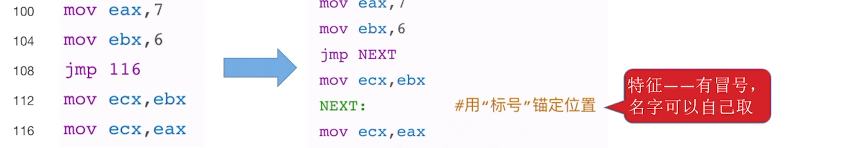

- 条件转移指令–`jxxx`指令
  
    - 一般与`cmp`指令一起使用
    - 格式: jxxx target
        - 其中，XXX表示特定的条件，target表示跳转的目标位置，可以是标签或相对/绝对的地址。
    - JXXX指令根据条件标志位的状态决定是否进行跳转，下面是几个常用的JXXX指令及其条件：
        1. je：jump  when  egual，若$a==b$则跳转。
        2. jne：jump  when not egual，若$a\ne b$则跳转。
        3. jg：jump when greater than，若$a>b$则跳转。
        4. jge：jump when greater than o requal to，若$a\ge b$则跳转。
        5. jl：jump when less than，若$a<b$则跳转。
        6. jle：jump when less than or equal to，若$a\le b$则跳转。

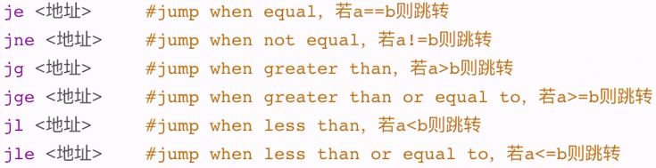

- 操作数比较指令–`cmp`指令
    - 格式：`cmp d s`
        - 其中，d表示比较的目标操作数，s表示比较的源操作数。
        - 两个操作数可以是寄存器、内存地址或立即数。
        - 不保存操作结果，仅根据运算结果设置CPU状态字中的条件码。 
    - `cmp`指令执行的过程如下：
        1. 将目标操作数和源操作数进行减法运算，但不保存结果。
            - CMP指令执行的是d- s的减法运算。
        2. 根据减法运算的结果设置标志位，包括零标志位（ZF）、进位标志位（CF）、符号标志位（SF）等。
    - 标志位的设置依赖于减法运算的结果：
        - 如果减法运算的结果为零，ZF被设置为1；否则，ZF被设置为0。
        - 如果减法运算中发生了进位（即结果无法用一个字节表示），CF被设置为1；否则，CF被设置为0。
        - 如果减法运算结果为负数（最高位为1），SF被设置为1；否则，SF被设置为0。
    - 通过CMP指令的结果，程序可以根据标志位进行条件判断，从而执行不同的操作。
        - 例如，可以使用JNE（Jump if not equal）指令来检查ZF标志位，如果ZF为0，则跳转到指定的目标位置。
    - 简单的示例，展示CMP指令的使用：
```asm
MOV AX， 42    ; 将值42移动到寄存器AX中
CMP AX， 30    ; 比较AX中的值与30
JL LessThan   ; 如果AX < 30，则跳转到标签LessThan
JG GreaterThan ; 如果AX > 30，则跳转到标签GreaterThan
JE Equal      ; 如果AX = 30，则跳转到标签Equal

LessThan:
    ; AX < 30 的情况下的处理

GreaterThan:
    ; AX > 30 的情况下的处理

Equal:
    ; AX = 30 的情况下的处理
```

### 循环语句

#### 条件转移指令

使用条件转移指令实现循环，一般有四个步骤

1. 循环前的初始化
2. 是否直接跳过循环
3. 循环主体
4. 是否继续循环

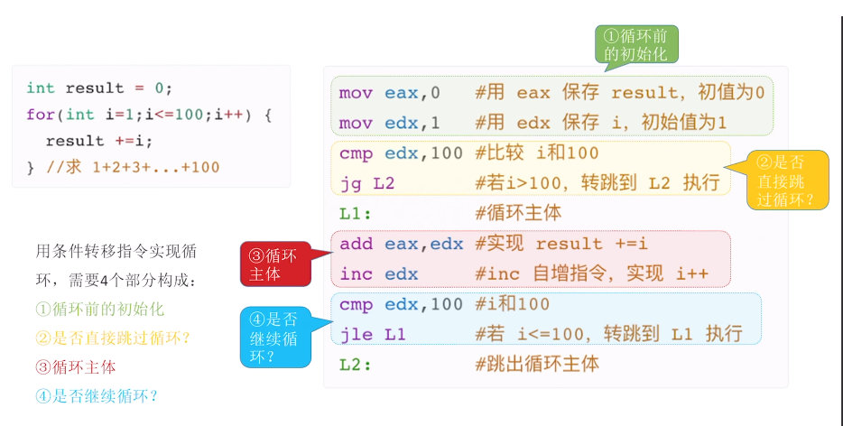

#### loop循环

在汇编语言中，`LOOP`指令用于实现循环控制结构，使程序可以重复执行一段代码块。LOOP指令会自动地根据CX（或ECX或RCX）寄存器中的计数值进行循环迭代。

LOOP指令的语法如下：

- `LOOP target`

其中，target表示循环的目标位置，可以是标签或相对/绝对的地址。

LOOP指令执行的过程如下：

1. 从CX寄存器中读取计数值（或ECX或RCX，具体取决于汇编指令集的位数）。
2. 将计数值减1。
3. 如果计数值不为零，则跳转到目标位置，继续执行循环内的指令。
4. 如果计数值为零，则循环结束，继续执行下一条指令。

LOOP指令通常与DEC（递减）指令结合使用，用于实现循环计数器的递减。在每次循环迭代中，DEC指令会递减CX寄存器中的计数值，然后根据计数值是否为零来决定是否跳转到目标位置。

以下是一个简单的示例，展示了LOOP指令的使用：


```markdown
MOV CX， 5       ; 初始化CX寄存器为5，作为循环计数器
LoopStart:
    ; 循环内的指令
    ; ...

    LOOP LoopStart   ; 循环迭代，跳转回LoopStart标签

    ; 循环结束后的指令
```
在上述示例中，循环从LoopStart标签开始，根据CX寄存器中的计数值来控制循环的执行次数。每次循环迭代，CX寄存器的计数值会递减，然后根据计数值是否为零决定是否跳转回LoopStart标签。当计数值为零时，循环结束，继续执行循环结束后的指令。

需要注意的是，LOOP指令是根据CX寄存器的计数值进行循环迭代的。因此，在使用LOOP指令前需要确保CX寄存器中已经正确初始化为循环的初始计数值。

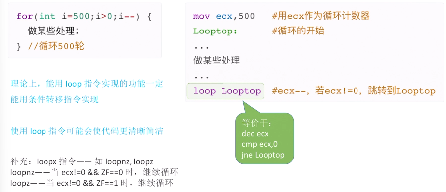

>   在汇编语言中，LOOPNZ（Loop if Not Zero）和LOOPZ（Loop if Zero）是两条特殊的循环指令，它们根据ZF（零标志位）的状态来控制循环的执行。
>
>   1. LOOPNZ（Loop if Not Zero）指令：
>       LOOPNZ指令用于执行循环迭代，只要ZF标志位为0（即结果不为零），就会重复执行循环内的代码块。
>       LOOPNZ指令的语法如下：
>
>
>   ```
>   LOOPNZ target
>   ```
>
>   其中，target表示循环的目标位置，可以是标签或相对/绝对的地址。
>
>   LOOPNZ指令执行的过程如下：
>
>
>       1. 从CX寄存器中读取计数值（或ECX或RCX，具体取决于汇编指令集的位数）。
>       2. 将计数值减1。
>       3. 如果计数值不为零且ZF标志位为0，则跳转到目标位置，继续执行循环内的指令。
>       4. 如果计数值为零或ZF标志位为1，则循环结束，继续执行下一条指令。
>
>   2. LOOPZ（Loop if Zero）指令：
>       LOOPZ指令用于执行循环迭代，只要ZF标志位为1（即结果为零），就会重复执行循环内的代码块。
>       LOOPZ指令的语法如下：
>
>
>   ```
>   LOOPZ target
>   ```
>
>   其中，target表示循环的目标位置，可以是标签或相对/绝对的地址。
>
>   LOOPZ指令执行的过程如下：
>
>
>       1. 从CX寄存器中读取计数值（或ECX或RCX，具体取决于汇编指令集的位数）。
>       2. 将计数值减1。
>       3. 如果计数值不为零且ZF标志位为1，则跳转到目标位置，继续执行循环内的指令。
>       4. 如果计数值为零或ZF标志位为0，则循环结束，继续执行下一条指令。
>
>   这两条指令通常与DEC（递减）指令结合使用，用于实现循环计数器的递减和根据ZF标志位进行循环判断。
>
>   以下是一个简单的示例，展示了LOOPNZ和LOOPZ指令的使用：
>
>
>   ```markdown
>   MOV CX， 5       ; 初始化CX寄存器为5，作为循环计数器
>   LoopStart:
>       ; 循环内的指令
>       ; ...
>   
>       LOOPNZ LoopStart   ; 循环迭代，只要ZF为0，则跳转回LoopStart标签
>   
>       ; 循环结束后的指令
>   ```

### 过程调用的机器级表示

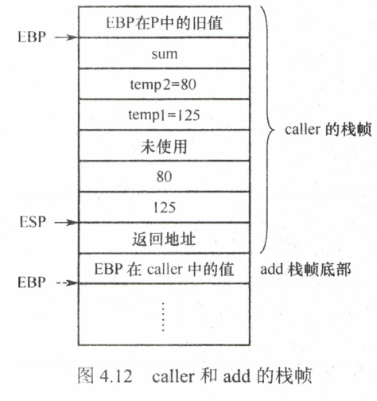

上面提到的`call/ret`指令主要用于过程调用，它们都属于一种无条件转移指令。 

假定过程P （调用者）调用过程Q （被调用者），过程调用的执行步骤如下：

1.   P将入口参数（实参）放在Q能访问到的地方。
2.   P将返回地址存到特定的地方，然后将控制转移到Q。
     -   由`call`指令实现
3.   Q保存P的现场（通用寄存器的内容），并为自己的非静态局部变量分配空间。
4.   执行过程Q。
5.   Q恢复P的现场，将返回结果放到P能访问到的地方，并释放局部变量所占空间。
6.   Q取出返回地址，将控制转移到P
     -   通过`ret`指令返回到过程P

---

-   在上述步骤中，需要为入口参数、返回地址、过程P的现场、过程Q的局部变量、返回结果找到存放空间。

    -   但用户可见寄存器数量有限，为此需要设置一个专门的存储区域来保存这些数据，这个存储区域就是栈。
    -   寄存器EAX、ECX和EDX是调用者保存寄存器，其保存和恢复的任务由过程P负责
    -   当P调用Q时，Q就可以直接使用这三个寄存器。
    -   寄存器EBX、ESL EDI是被调用者保存寄存器，Q必须先将它们的值保存在栈中才能使用它们，并在返回P之前先恢复它们的值

-   每个过程都有自己的栈区，称为**栈帧**

    -   因此，一个栈由若干栈帧组成。
    -   帧指针寄存器EBP指示栈帧的起始位置（栈底），栈指针寄存器ESP指示栈顶，栈从高地址向低地址增长
    -   因此，当前栈帧的范围在帧指针EBP和ESP指向的区域之间。 

-   下面用一个简单的C语言程序来说明过程调用的机器级实现

    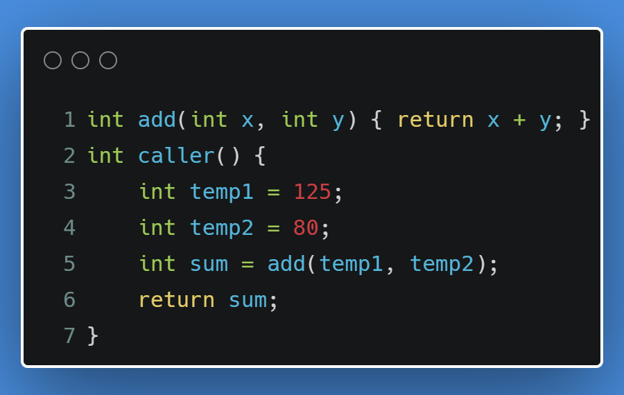

    -   经GCC编译后，caller过程对应的代码如下(#后面的文字是注释)：

        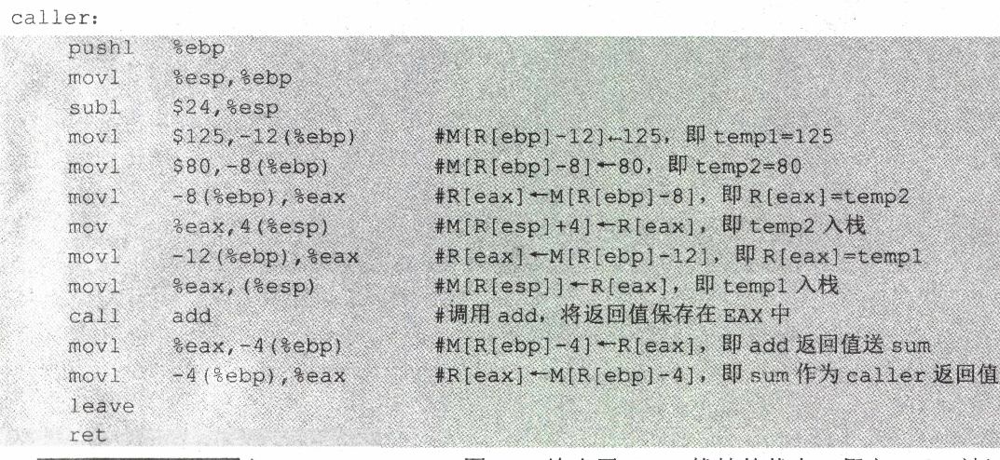

## 指令集计算机

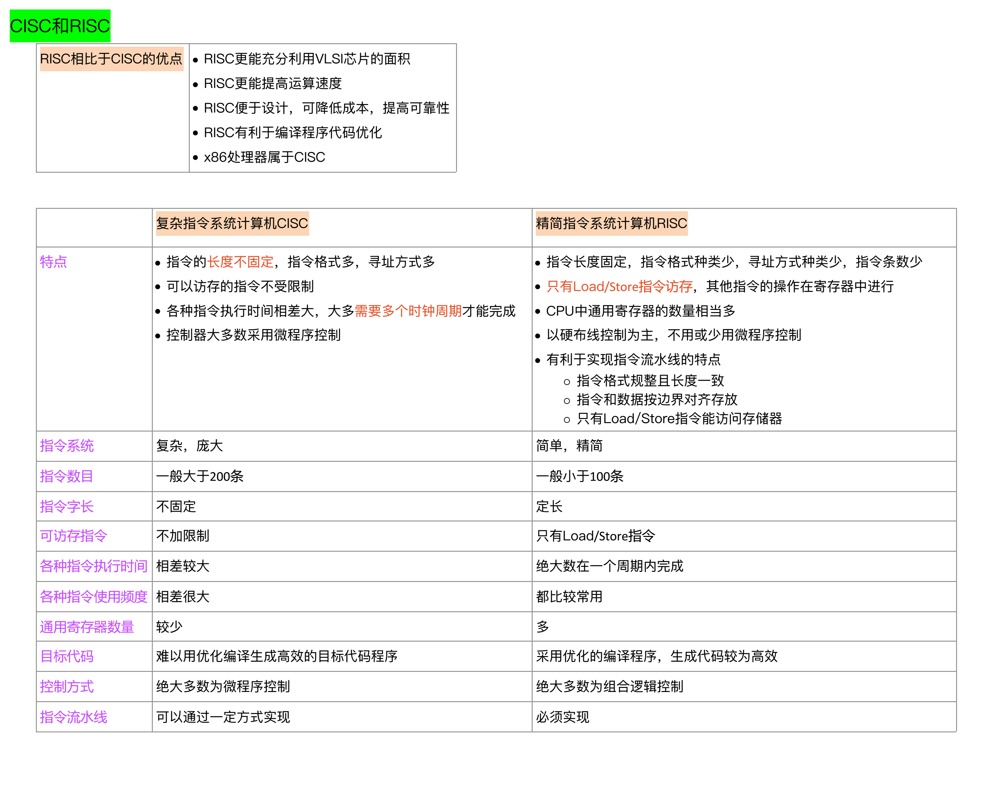

> [!IMPORTANT]
> **CISC vs RISC**：
> - **CISC** (Complex)：指令多且长，寻址复杂，微程序控制。代表：x86。
> - **RISC** (Reduced)：指令少且定长，只有 Load/Store 访存，硬布线控制，流水线效率高。代表：ARM。
