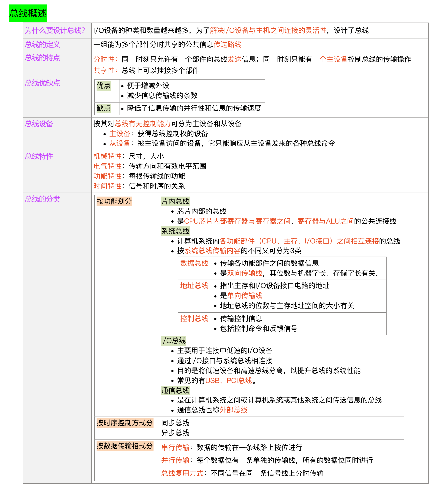
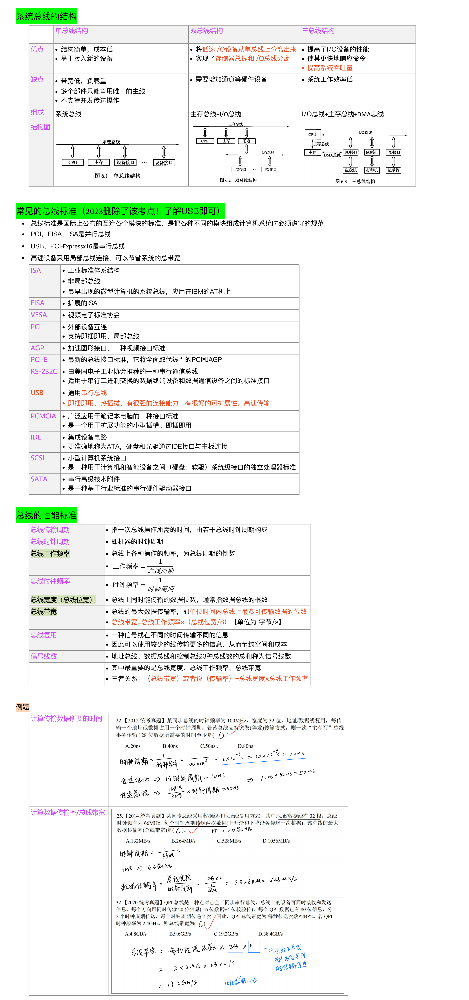
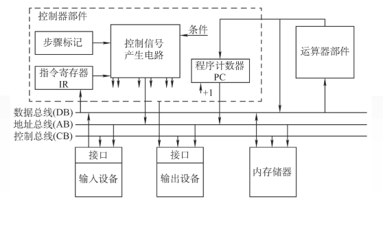
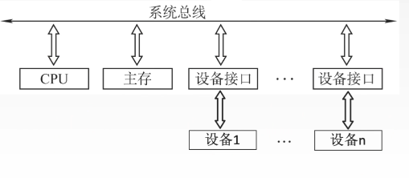
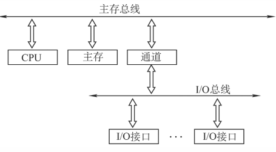
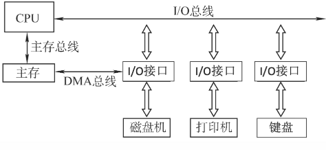
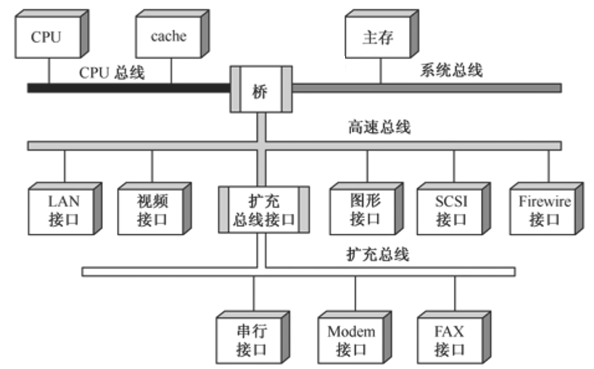
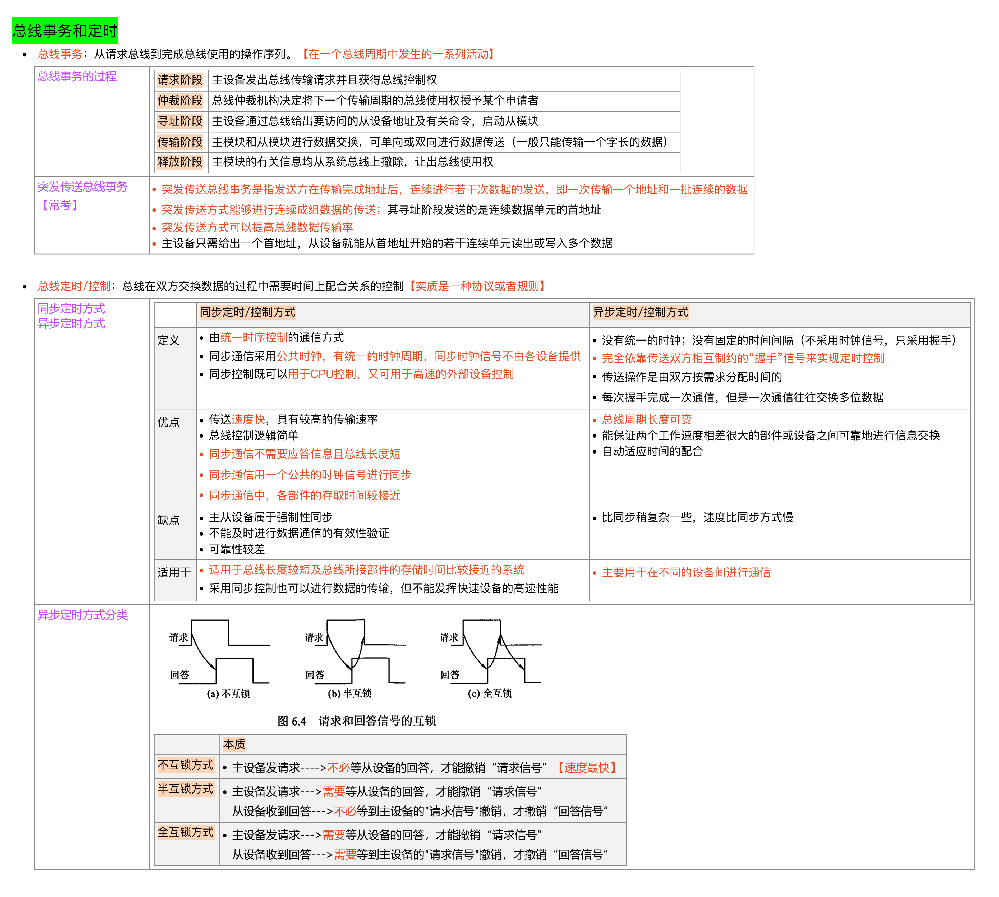
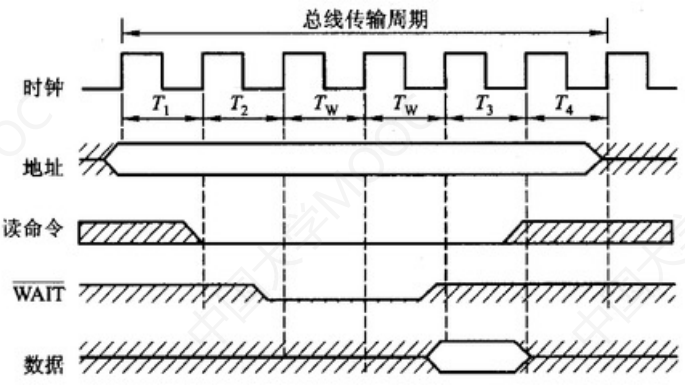

# 计算机组成原理·6 总线

## 考纲内容

1. 总线的基本概念
2. 总线的组成及性能指标
3. 总线事务和定时

## 总线概述

### 总线基本定义

> [!IMPORTANT] **总线两大特点**：
>
> 1. **分时**：同一时刻只允许一个部件向总线发送信息。
> 2. **共享**：总线上挂接的多个部件可以分时利用总线进行信息交换。

- 早期计算机外部设备少时大多采用分散连接方式，不易实现随时增减外部设备。
  - 为了更好地解决I/O设备和主机之间连接的灵活性问题，计算机的结构从分散连接发展为总线连接。

- 总线设备：总线上所连接的设备，按其对总线有无控制功能可分为主设备和从设备两种
  - 主设备：指获得总线控制权的设备。
  - 从设备：指被主设备访问的设备，它只能响应从主设备发来的各种总线命令

- 总线特性：
  1. 机械特性：尺寸、形状、管脚数、排列顺序。
  2. 电气特性：传输方向和有效的电平范围。
  3. 功能特性：每根传输线的功能（地址、数据、控制）。
  4. 时间特性：信号的时序关系

### 总线分类

计算机系统中的总线，按功能划分为以下4类：

- 数据传输格式：
  - **串行总线**：
    - 串行总线中，数据位依次串行发送和接收，通过一条物理线路传输。每个数据位都在时钟信号的控制下被逐位传输，形成连续的数据流。
    - 优点：只需要一条传输线，成本低廉，广泛应用于长距离传输；应用于计算机内部时，可以节省布线空间。
    - 缺点：在数据发送和接收的时候要进行拆卸和装配，要考虑串行并行转换的问题。
  - **并行总线**：
    - 在并行总线中，数据位按照字节或字的方式并行发送和接收，需要多个物理线路进行传输。每个数据位都有独立的线路进行传输，因此可以实现高带宽的数据传输。
    - 优点：总线的逻辑时序比较简单，电路实现起来比较容易。
    - 缺点：
      - 信号线数量多，占用更多的布线空间
      - 远距离传输成本高昂
      - 由于工作频率较高时，并行的信号线之间会产生严重电磁影响导致无法使用，对每条线等长的要求也越来越高，所以无法持续提升工作频率。
        - **由于并行总线可能产生电磁影响，串行总线则没有，并行总线不一定比串行总线快**
- 总线功能（连接部件）：-
  **片内总线**：片内总线是**芯片内部**的总线，是CPU芯片内部寄存器与寄存器之间、寄存器与ALU之间的公共连接线。
  > [!IMPORTANT] **系统总线分类**：
  >
  > 1. **数据总线 (DB)**：双向，传输指令和操作数，位数与机器字长/存储字长有关。
  > 2. **地址总线 (AB)**：单向，传输地址，位数与主存寻址范围有关。
  > 3. **控制总线 (CB)**：双向（一根线单向），传输控制信号和反馈信号。
      - **I/O总线**：I/O总线主要用于连接中**低速的I/O设备**，通过I/O接口与系统总线相连接
          - 目的是**将低速设备与高速总线分离**，以**提升总线的系统性能**，常见的有USB、PCI总线。
      - 通信总线：通信总线是用于计算机系统之间或计算机系统与其他系统（如远程通信设备、测试设备）之间信息传送的总线
          - 通信总线也称为**外部总线**。
- 时序控制方式：
  - 同步总线。
  - 异步总线。

### 总线结构

- 单总线结构：

  
  - 将CPU、主存、I/O设备（通过I/O接口）都连接在一组总线上，允许I/O设备之间、I/O设备和CPU之间或I/O设备与主存之间直接交换信息。
  - 单总线并不是指只有一根信号线，系统总线按传送信息的不同可**以细分为地址总线、数据总线和控制总线**。
  - 优点：结构简单，成本低，易于接入新的设备。
  - 缺点：带宽低、负载重，多个部件只能争用唯一的总线，且不支持并行传输操作。

- 双总线结构：

  
  - 双总线结构有两条总线：局部总线结构
    - 一条是主存总线，用于CPU、主存和通道之间进行数据传送
    - 另一条是I/O总线（因为I/O速度较慢），用于多个外部设备与通道之间进行数据传送。
      - 目的是**将低速设备与高速总线分离**，可以**节省系统的总带宽**，以**提升总线的系统性能**
  - 通道是具有特殊功能的处理器，能对I/O设备进行统一管理，**通道程序放在主存中**。
    - 双总线结构中的通道通常包括两个主要的通道：
      - **数据通道**（Data Channel）：数据通道用于传输数据信息。
        - 它是一个双向通道，用于在CPU和主存储器之间传输数据。
        - 当CPU需要从主存储器读取数据时，数据通道将数据从主存储器传输到CPU
        - 当CPU需要将数据写入主存储器时，数据通道将数据从CPU传输到主存储器
        - 数据通道通常是宽度与数据总线相匹配的并行通道，可以同时传输多个数据位。
      - **地址通道**（Address Channel）：地址通道用于传输内存地址信息。
        - 它是一个单向通道，用于将CPU发出的读写操作的目标地址传递给主存储器。
        - 当CPU需要读取或写入特定内存位置时，地址通道将相应的地址信息传输给主存储器。
        - 地址通道的宽度由**地址总线**决定，决定了CPU可以寻址的内存空间大小。
  - **支持突发（猝发）传送**：**第一次发地址，后面直接传数据**，减少了发地址的时间就增加了传输率
    - 例如，总线频率为100MHz，总线位宽与存储字长都是32位，传输128位数据一共需要的时间：
    - 由于总线频率为100MHz，因此时钟周期为10ns
    - 总线位宽与存储字长都是32位，因此每个时钟周期可传送一个32位存储字
    - 猝发式发送可以连续传送地址连续的数据，因此总传送时间为：传送地址10ns，传送128位数据40ns，共需50ns。
  - 优点：将较低速的I/O设备从单总线上分离出来，实现存储器总线和I/O总线分离。
  - 缺点：需要增加通道等硬件设备。

- 三总线结构：

  
  - 三总线结构是在计算机系统各部件之间采用三条各自独立的总线来构成信息通路，分别为：
    - 主存总线：CPU和主存之间的连接。
    - I/O总线：CPU和I/O接口之间连接。
    - 直接内存访问总线DMA：Direct Memory
      Access，连接外设与主存。能直接连接主存的就是高速外设，如磁盘机，而无法直接连接主存的就是低速外设，如打印机和显示器。
      - DMA总线允许外部设备（如硬盘、网络接口卡等）直接访问系统内存，而无需通过中央处理器（CPU）的干预。
      - 这种直接访问方式**可以显著提高数据传输的效率，减少CPU的负载**。
      - DMA总线通常是一个独立的**通道**，与CPU的数据总线和地址总线是分离的。
  - 优点：提高了I/O设备的性能，使其更快地响应命令，提高系统吞吐量。
  - 缺点：系统工作效率较低。

- 四总线结构(考试不考，但这才是现代常用的结构)：

  
  - 四总线结构一共四条总线：
    - CPU总线（局部总线）：CPU与Cache。
    - 系统总线：CPU和主存。
    - 高速总线：连接SCSI、图形、多媒体、局域网。
    - 扩充总线（扩展总线型）：连接传真机、扩展总线接口、调制解调器、串行接口。

  - 桥接器：桥接器（Bridge）是用于连接不同类型总线的关键组件。它的主要作用是在不同的总线之间进行数据缓冲和控制信号的转换和传递，以实现不同总线系统的互联互通。
    - 桥接器通常用于连接以下两种类型的总线：
      1. 前端总线（Front-Side
         Bus，FSB）：前端总线是与中央处理器（CPU）直接连接的总线，用于与CPU进行通信。它是高速的并行总线，负责传输数据、地址和控制信号。桥接器的一个端口与前端总线相连接，可以接收来自CPU的数据和指令，同时将数据和指令传递给后面的总线。
      2. 后端总线（Back-Side
         Bus，BSB）：后端总线是与主存储器（Memory）和其他外部设备连接的总线，用于与这些设备进行数据传输。后端总线的特点可能与前端总线不同，如宽度、速度或协议等方面的差异。桥接器的另一个端口与后端总线相连接，可以接收来自后端总线的数据和指令，同时将数据和指令传递给前面的总线。

    - 桥接器的功能包括：
      1. 地址转换：桥接器可以将来自前端总线的内存地址转换为适用于后端总线的地址格式。这涉及到地址映射和地址重定向等操作，确保正确地访问目标设备。
      2. 数据传输：桥接器负责在前端总线和后端总线之间进行数据传输。它接收来自前端总线的读取或写入请求，并将数据传递给后端总线相应的设备。反之，它也接收来自后端总线的数据，并将其传输到前端总线供CPU使用。
      3. 控制信号转发：桥接器将来自前端总线的控制信号转发到后端总线，以启动相应的操作。同时，它也将来自后端总线的控制信号转发到前端总线，以通知CPU或其他相关设备。

  - **越靠近CPU总线速度越快**，CPU总线>系统总线>高速总线>扩充总线。

  - 每级总线的设计遵循总线标准。

### 常见的总线标准\*

> 不考，了解USB即可

#### 总线标准概念

- 总线标准是国际上公布或推荐的互连各个模块的标准，它是把各种不同的模块组成计算机系统时必须遵守的规范。
- 按总线标准设计的接口可视为通用接口，在接口的两端，任何一方只需根据总线标准的要求完成自身方面的功能要求，而无须了解对方接口的要求。
- 系统总线标准：ISA、EISA、VESA、PCI、PCI-Express等。
- 设备总线标准：IDE、AGP、RS-232C、USB、SATA、SCSI、PCMCIA等。
- **局部总线**标准：在ISA总线和CPU总线之间增加的一级总线或管理层，如PCI、PCI-E、VESA、AGP等，可以节省系统的总带宽。
- 即插即用（Plug-and-Play）的作用是自动配置（低层）计算机中的板卡和其他设备，然后告诉对应的设备都做了什么。把物理设备和软件（设备驱动程序）相配合，并操作设备，在每个设备和它的驱动程序之间建立通信信道。
- 热插拔（hot-plugging或Hot
  Swap）即带电插拔，热插拔功能就是允许用户在不关闭系统，不切断电源的情况下取出和更换损坏的硬盘、电源或板卡等部件，从而提高了系统对灾难的及时恢复能力、扩展性和灵活性等，例如一些面向高端应用的磁盘镜像系统都可以提供磁盘的热插拔功能。

#### 标准总览

| 总线标准  |                          全称                           | 工作频率 | 数据线 |       最大速度        |        特点        |
| :-------: | :-----------------------------------------------------: | :------: | :----: | :-------------------: | :----------------: |
|    ISA    |             Industry Standard Architecture              |   8MHz   |  8/16  |         8MB/s         |      系统总线      |
|   EISA    |                      Extended ISA                       |   8MHz   |   32   |        32MB/s         |      系统总线      |
|    PCI    |            Peripheral Component Interconnect            | 33/66MHz | 32/64  |      133/528MB/s      |      局部总线      |
|    AGP    |                Accelerated Graphics Port                |          |        | X1:266MB/s X8:2.1GB/s |      局部总线      |
|   VESA    |         Video Electronics Standard Architecture         |  33MHz   |   32   |        132MB/s        |      局部总线      |
|   PCI-E   |                   PCI-Express (3GI0)                    |          |        |      10GB/s以上       |        串行        |
|    USB    |                  Universal Serial Bus                   |          |        |       1280MB/s        | **设备总线、串行** |
|  RS-232C  |                  Recommended Standard                   |          |        |        20Kbps         |    串行通信总线    |
| IDE（ATA) |              Integrated Drive Electronics               |          |        |        100MB/s        |    硬盘光驱接口    |
|   SATA    |          Serial Advanced Technology Attachment          |          |        |        600MB/s        |    串行硬盘接口    |
|  PCMCIA   | Personal Computer Memory Card International Association |          |        |        90Mbps         |    便携设备接口    |
|   SCSI    |             Small Computer System Interface             |          |        |        640MB/s        |    智能通用接口    |

#### 系统总线标准

| 总线标准 |              全称              | 工作频率 | 数据线 | 最大速度 |   特点   |
| :------: | :----------------------------: | :------: | :----: | :------: | :------: |
|   ISA    | Industry Standard Architecture |   8MHz   |  8/16  |  8MB/s   | 系统总线 |
|   EISA   |          Extended ISA          |   8MHz   |   32   |  32MB/s  | 系统总线 |

- ISA和EISA都是并行系统总线。
- ISA数据传送需要CPU或DMA接口来管理，传输速率过低、CPU占用率高、占用硬件中断资源，不支持总线仲裁。
- EISA从CPU中分离出了总线控制权，支持多个总线主控器和突发传送。
- 被PCI淘汰了。

#### 局部总线标准

##### PCI

| 总线标准 |               全称                | 工作频率 | 数据线 |  最大速度   |   特点   |
| :------: | :-------------------------------: | :------: | :----: | :---------: | :------: |
|   PCI    | Peripheral Component Interconnect | 33/66MHz | 32/64  | 133/528MB/s | 局部总线 |

PCI也是并行局部总线，可以将高速外部设备直接挂到CPU总线上。

特点：

1. 高性能:不依附于某个具体的处理器，支持突发传送。
2. 良好的兼容性。
3. 支持即插即用。
4. 支持多主设备。
5. 具有与处理器和存储器子系统完全并行操作的能力。
6. 提供数据和地址奇偶校验的能力。
7. 可扩充性好，可采用多层结构提高驱动能力。
8. 采用多路复用技术，减少了总线引脚个数。

##### AGP

| 总线标准 |           全称            | 工作频率 | 数据线 |       最大速度        |   特点   |
| :------: | :-----------------------: | :------: | :----: | :-------------------: | :------: |
|   AGP    | Accelerated Graphics Port |          |        | X1:266MB/s X8:2.1GB/s | 局部总线 |

AGP即加速图形接口，是并行局部总线，是显卡专用的局部总线。

##### PCI-E

| 总线标准 |        全称        | 工作频率 | 数据线 |  最大速度  | 特点 |
| :------: | :----------------: | :------: | :----: | :--------: | :--: |
|  PCI-E   | PCI-Express (3GI0) |          |        | 10GB/s以上 | 串行 |

- 点对点串行。
- 支持双向传输模式，可以运行全双工模式。
- 支持热插拔。

##### VESA

| 总线标准 |                  全称                   | 工作频率 | 数据线 | 最大速度 |   特点   |
| :------: | :-------------------------------------: | :------: | :----: | :------: | :------: |
|   VESA   | Video Electronics Standard Architecture |  33MHz   |   32   | 132MB/s  | 局部总线 |

即视频局部总线，为了传输活动图形。

#### 设备总线标准

##### USB

| 总线标准 |         全称         | 工作频率 | 数据线 | 最大速度 |      特点      |
| :------: | :------------------: | :------: | :----: | :------: | :------------: |
|   USB    | Universal Serial Bus |          |        | 1280MB/s | 设备总线、串行 |

USB属于设备总线，是设备和设备控制器之间的接口。

特点：

1. 可以热插拔、即插即用。
2. 具有很强的连接能力和很好的可扩充性。采用菊花链形式将众多外设连接起来，可使用USB集线器链式连接
   $127$ 个外设。
3. 标准统一。以前大家常见的是IDE接口的硬盘，串口的鼠标键盘，并口的打印机扫描仪，可是有了USB之后，这些应用外设统统可以用同样的标准与个人电脑连接，这时就有了USB硬盘、USB鼠标、USB打印机等等。
4. 高速传输，速率可达480Mb/s。
5. 有很好的可扩充性，一个USB控制器可扩充高达127个外部USB设备
6. 连接电缆轻巧，可为低压（$5V$）外设供电。

##### IS-232C

| 总线标准 |         全称         | 工作频率 | 数据线 | 最大速度 |     特点     |
| :------: | :------------------: | :------: | :----: | :------: | :----------: |
| RS-232C  | Recommended Standard |          |        |  20Kbps  | 串行通信总线 |

应用于串行二进制交换的数据终端设备（DTE）和数据通信设备（DCE）。

##### IDE（ATA）

| 总线标准  |             全称             | 工作频率 | 数据线 | 最大速度 |     特点     |
| :-------: | :--------------------------: | :------: | :----: | :------: | :----------: |
| IDE（ATA) | Integrated Drive Electronics |          |        | 100MB/s  | 硬盘光驱接口 |

硬盘、光驱都通过IDE接口与主板连接。

##### SATA

| 总线标准 |                 全称                  | 工作频率 | 数据线 | 最大速度 |     特点     |
| :------: | :-----------------------------------: | :------: | :----: | :------: | :----------: |
|   SATA   | Serial Advanced Technology Attachment |          |        | 600MB/s  | 串行硬盘接口 |

##### PCMCIA

| 总线标准 |                          全称                           | 工作频率 | 数据线 | 最大速度 |     特点     |
| :------: | :-----------------------------------------------------: | :------: | :----: | :------: | :----------: |
|  PCMCIA  | Personal Computer Memory Card International Association |          |        |  90Mbps  | 便携设备接口 |

##### SCSI

| 总线标准 |              全称               | 工作频率 | 数据线 | 最大速度 |     特点     |
| :------: | :-----------------------------: | :------: | :----: | :------: | :----------: |
|   SCSI   | Small Computer System Interface |          |        | 640MB/s  | 智能通用接口 |

1. IDE工作需要CPU参与，而SCSI通过独立高速SCSI卡控制读写，CPU就不需要等待。
2. SCSI扩充性高。

#### 视频线标准

##### VGA

即Video Graphics Array，也称为D-sub端口，传输模拟信号，所以要先将数字信号转换为模拟信号。

##### DIV

即Digital Visual Interface，传输数字信号，但是在分辨率 $1024\times768$ 以下时与VGA差别不大。

##### HDMI

即High Definition Multimedia Interface，可以传输音讯，源于DVI技术，分为三种类型：

- $A$型：高清电视，投影仪等。
- $C$型：平板电脑，MP4等。
- $D$型：智能手机，平板电脑等。

### 性能指标

#### 总线传输周期/总线周期

一次总线操作所需的时间（包括申请阶段、寻址阶段、传输阶段和结束阶段），总线传输周期通常由若干总线时钟周期构成。

申请阶段:总线的申请阶段是指在计算机系统中，设备或组件请求使用总线进行数据传输或访问共享资源的过程。在这个阶段，设备向总线控制器发送请求，请求获得对总线的控制权。

总线周期与总线时钟周期的关系:

- 大多数情况下，一个总线周期包含多个总线时钟周期
- 有的时候，一个总线周期就是一个总线时钟周期
- 有的时候，一个总线时钟周期可包多个总线周期
  - 例如总线分别在一个总线时钟周期的上升沿下降沿进行数据传输

#### 总线时钟周期

即机器的时钟周期。计算机有一个统一的时钟，以控制整个计算机的各个部件，总线也要受此时钟的控制。

现在的计算机中，总线时钟周期也有可能由桥接器提供

#### 总线工作频率

总线上各种操作的频率，为总线周期的倒数。

若总线周期=$N$个时钟周期，则总线的工作频率=时钟频率$\div N$。

#### 总线时钟频率

即机器的时钟频率，为时钟周期的倒数。若时钟周期为$T $，则时钟频率为$ 1/T$。

实际上指一秒内有多少个时钟周期。

#### 总线宽度

又称为总线位宽，它是总线上同时能够传输的数据位数，通常是**指数据总线的根数**，如 $32$ 根称为 $32$
位（bit）总线。

#### 总线带宽

> ==在描达**速率、频率**等时，$k、M、G、T $通常用$ 10 $的幂次表示，如$ 1kb/s=10^{3}b/s$。==
>
> ---
>
> 采用点对点**全双工总线**的情况下，**两个方向可同时传输信息，带宽记得乘2**

可理解为总线的数据传输率，即单位时间内总线上可传输数据的位数，通常用每秒钟传送信息的字节数来衡量，单位可用字节/秒（B/s）表示。

总线带宽=总线工作频率 $\times$ 总线宽度（bit/s）

- =总线工作频率$\times$(总线宽度$\div8$)（B/s）
- =总线宽度 $\div$ 总线周期（bit/s）
- =总线宽度 $\div8\div$ 总线周期（B/s）。

总线带宽是指总线本身所能达到的最高传输速率。

在计算实际的有效数据传输率时，要用实际传输的数据量除以耗时。

> 总线带宽和总统宽度应加以区别
>
> 1.  **总线带宽（Bus Bandwidth）：**
>     - 总线带宽指的是总线在一定时间内能够传输的数据量或信息的速度。
>     - 它通常以比特每秒（bps）或字节每秒（Bps）为单位来表示。
>     - 总线带宽描述了总线的性能，即它可以传输多少数据或信息。更高的总线带宽通常表示总线能够支持更高的数据传输速度，从而提高了系统性能。
>     - 总线带宽的提高通常需要采用更高速度的总线技术、增加总线的宽度、改进总线协议等方式来实现。
> 2.  **总线宽度（Bus Width）：**
>     - 总线宽度指的是总线物理上的数据传输通道的宽度，通常以比特（bits）为单位表示。
>     - 它表示在每个时钟周期内，总线可以传输多少个比特的数据。
>     - 总线宽度描述了总线的物理属性，即总线的数据通道有多宽。较宽的总线可以在每个时钟周期内传输更多的数据。
>     - 增加总线宽度可以增加总线带宽，从而提高数据传输速度。

#### 总线复用

总线复用是指一种信号线在不同的时间传输不同的信息。可以使用较少的线传输更多的信息，从而节省了空间和成本。

采用地址/数据线复用只是减少了线的数量，节省了成本，**并不能提高传输率**。

#### 信号线数

地址总线、数据总线和控制总线三种总线数的总和称为信号线数。

其中，总线的最主要性能指标为总线宽度、总线（工作）频率、总线带宽，总线带宽是指总线本身所能达到的最高传输速率，它是衡量总线性能的重要指标。 三者关系：总线带宽=总线宽度
$\times$ 总线频率

例如，总线工作频率为$22MHz $，总线宽度为16位，则总线带宽为$ 2 2 \times（16\div8） = 44MB/S$

## 总线仲裁\*

> 不考，了解主从设备即可

### 总线仲裁基本概念

- 解决多个设备争用总线的问题。
- 同一时刻只能有一个设备控制总线传输操作，可以有一个或多个设备从总线接收数据
- 将总线上所连接的各类设备按其对总线有无控制功能分为：
  - 主设备：获得总线控制权的设备。
  - 从设备：被主设备访问的设备，只能响应从主设备发来的各种总线命令。
- 总线仲裁原因：
  - 总线作为一种共享设备，不可避免地会出现同一时刻有多个主设备竞争总线控制权的问题。
- 总线仲裁的定义：多个主设备同时竞争总线控制权时，以某种方式**选择一个主设备优先获得总线控制权**称为总线仲裁。

### 总线控制流程

- 在总线控制中，申请使用总线的设备向总线控制器发出总线请求，由**总线控制器**进行裁决。
- 若经裁决允许该设备使用总线，就由总线控制器向该设备发出**总线允许信号**。
- 该设备收到信号后发出**总线忙信号**，通知其他设备总线已被占用。
- 该设备使用完总线时，将总线忙信号撤销，释放总线。

### 总线仲裁分类

- 集中仲裁方式：
  - “总线忙”信号的建立者是**获得总线控制权的设备**。
  - 工作流程：
    1. 主设备发出请求信号。
    2. 若多个主设备同时要使用总线，则由总线控制器的判优、仲裁逻辑按一定的优先等级顺序确定哪个主设备能使用总线。
    3. 获得总线使用权的主设备开始传送数据。
  - 链式查询方式。
    - 总线与控制线：
      - 数据线。
      - 地址线。
      - 控制线：
        - BG：总线允许（响应），$1$条。
        - BR：总线请求，$1$条。
        - BS：总线忙，$1$条。
    - 流程：
      - 总线上所有的部件共用一根总线请求线，当有部件请求使用总线时，需经此线发总线请求信号到总线控制器。
      - 由总线控制器检查总线是否忙，若总线不忙，则立即发总线响应信号，经总线响应线BG串行地从一个部件传送到下一个部件，依次查询。
      - 若响应信号到达的部件无总线请求，则该信号立即传送到下一个部件；若响应信号到达的部件有总线请求，则信号被截住，不再传下去。
    - 优先级：**离总线控制器越近的部件，其优先级越高，离总线控制器越远的部件，其优先级越低**。
    - 优点：链式查询方式优先级固定。只需很少几根控制线就能按一定优先次序实现总线控制，结构简单，扩充容易。
    - 缺点：
      - 对硬件电路的故障敏感。
      - 优先级不能改变。
      - **容易发生饥饿**，当优先级高的部件频繁请求使用总线时，会使优先级较低的部件长期不能使用总线。
  - 计数器定时查询方式。
    - 总线与控制线：
      - 数据线。
      - 地址线。
      - 设备地址线。
      - 控制线：
        - 设备地址线：传输设备地址，$\lceil\log_2n\rceil$条。
        - BR：总线请求，$1$条。
        - BS：总线忙，$1$条。
        - 若设备有 $n$ 个，则需要 $\lceil\log_2n\rceil+2$ 条控制线。（还有BS、BR）
    - 结构特点：用一个计数器控制总线使用权，相对链式查询方式多了一组设备地址线，少了一根总线响应线BG
      - 仍共用一根总线请求线。
      - 不需要总线允许信号。
    - 过程：
      - 当总线控制器收到总线请求信号，判断总线空闲时，计数器开始计数，计数值通过设备地址线发向各个部件。
      - 当地址线上的计数值与请求使用总线设备的地址一致时，该设备获得总线控制权。
      - 同时，中止计数器的计数及查询。
    - 优点：
      - 计数初始值可以改变优次序：
        - 计数每次从“$0$”开始，设各的优先级就按顺序排列，固定不变。
        - 计数从上一次的终点开始，此时设备使用总线的优先级相等。
        - 计数器的初值还可以由程序设置。
      - 对电路的故障没有链式敏感。
    - 缺点:
      - 增加了控制线数。
      - 控制相对比链式查询相对复杂。
  - 独立请求方式。
    - 总线与控制线：
      - 数据线。
      - 地址线。
      - 控制线：
        - BG：总线允许，$n$条。
        - BR：总线请求，$n$条。
        - BS：总线忙，$1$条。
        - 若设备有 $n$ 个，则需要 $2n+1$ 条控制线
          - 其中 $+1$ 为BS线，用于设备向总线控制部件反馈已经使用完毕总线。
    - 结构特点：每一个设备均有一对总线请求线 $BR_i$ 和总线允许线$BG_i$，由排队器控制优先级。
    - 过程：
      - 当总线上的部件需要使用总线时，经各自的总线请求线发送总线请求信号，在总线控制器中排队。
      - 当总线控制器按一定的优先次序决定批准某个部件的请求时，则给该部件发送总线响应信号。
    - 优点：
      - 响应速度快，总线允许信号BG直接从控制器发送到有关设备，不必在设备间传递或者查询。
      - 对优先次序的控制相当灵活。
    - 缺点：
      - 控制线数量多。
      - 总线的控制逻辑更加复杂。
- 分布仲裁方式
  - 特点：不需要中央仲裁器，每个潜在的主模块都有自己的仲裁器和仲裁号，多个仲裁器竞争使用总线。
  - 过程：
    - 当设备有总线请求时，它们就把各自唯一的仲裁号发送到共享的仲裁总线上。
    - 每个仲裁器将从仲裁总线上得到的仲裁号与自己的仲裁号进行比较。
    - 如果仲裁总线上的号优先级高，则它的总线请求不予响应，并撤销它的仲裁号。
    - 最后，获胜者的仲裁号保留在仲裁总线上。

  - 信息相符合的输入设备按命令进行一系列的内部操作，且必须在 $T_3$
    的上升沿来之前将CPU所需的数据送到数据总线上。- 执行：CPU在 $T_3$
    时钟周期内，将数据线上的信息传送到其内部寄存器电中。- 撤销：CPU在 $T_4$
    的上升沿撤销读命令，输入设备不再向数据总线上传送数据，撤销它对数据总线的驱动。
  - 优点：
    - 传送速度快，具有较高的传输速率。
    - 总线控制逻辑简单。
  - 缺点：
    - 主从设备属于强制性同步。
    - 不能及时进行数据通信的有效性检验，可靠性较差。
  - 同步通信适用于总线长度较短及总线所接部件的存取时间比较接近的系统。

## 总线操作与定时

总线是在两个或多个设备之间进行通信的传输介质

总线定时是指总线在双方交换数据的过程中需要时间上配合关系的控制，这种控制称为**总线定时**，其`实质`是一种协议或规则，主要有同步和异步两种基本定时方式。

### 总线事务

从请求总线到完成总线使用的操作序列称为**总线事务**，它是**在一个总线周期中发生的一系列活动**

1. 请求阶段：主设备（CPU或DMA）发出总线传输请求，并且获得总线控制权。
2. 仲裁阶段：由需要使用总线的主模块（或主设备）提出申请，经总线仲裁机构决定将下一传输周期的总线使用权授予某一申请者。
3. 寻址阶段：获得使用权的主模块通过总线发出本次要访问的从模块的地址及有关命令，启动参与本次传输的**从模块**。
4. 传输阶段：主模块和从模块进行数据交换，可单向或双向进行数据传送。
5. 结束阶段：主模块的有关信息均从系统总线上撤除，让出总线使用权。

在总线事务的传输阶段，主、从设备之间一般只能传输一个字长的数据

突发（猝发）传送方式能够进行连续成组数据的传送，其寻址阶段发送的是连续数据单元的首地址，在传输阶段传送多个连续单元的数据，每个时钟周期可以传送一个字长的信息，但是不释放总线，直到一组数据全部传送完毕后，再释放总线。

### 总线定时

> [!IMPORTANT] **总线定时方式**：
>
> 1. **同步定时**：统一时钟控制，数据传输在固定时间点进行。速度快，但对部件速度一致性要求高。
> 2. **异步定时**：依靠“握手”信号（请求/回答）。
>    - **不互锁**：不等待反馈直接撤销信号（最快，最不可靠）。
>    - **半互锁**：请求等回答，但回答不看请求是否撤销。
>    - **全互锁**：请求等回答，回答等请求撤销（最慢，最可靠）。

- 优点：总线周期长度可变，能保证两个工作速度相差很大的部件或设备之间可靠地进行信息交换，自动适应时间的配合。

- 缺点：比同步控制方式稍复杂，速度比同步定时方式慢。

#### 半同步通信\*

半同步通信（Half-Duplex
Communication）是一种通信模式，其中通信的两个实体可以在同一时间交替地发送和接收数据，但不能同时进行发送和接收。在半同步通信中，通信双方共享同一个通信信道，并在某个时刻进行数据的传输。当一方发送数据时，另一方处于接收状态，反之亦然。这种方式适用于一些需要简单的双向通信的场景，如对话式通信或半双工通信。

**半同步通信总线可以能既采用同步方式又采用异步方式通信**

同步与异步的混合，统一时钟的基础上，增加一个“等待”响应信号$\overline{WAIT}$。

#### 分离式通信/分离事务通信\*

分离式通信（Full-Duplex
Communication）是一种通信模式，其中通信的两个实体可以同时进行数据的发送和接收，彼此独立进行。在分离式通信中，通信双方拥有独立的发送和接收通道，并且可以在同一时间同时进行数据的传输。这种方式适用于需要高效的双向通信的场景，如网络通信、电话通信等。

- 分离式通信的一个总线传输周期：
  - 子周期一：主模块申请占用总线，使用完后后放弃总线的使用权。
  - 子周期二：从模块申请占用总线，将各种信息发送至总线上。
- 特点：
  1. 各模块均有权申请占用总线。
  2. 采用同步方式通信，不等对方回答。
  3. 各模块准备数据时，不占用总线。
  4. 总线利用率提高。

> 上述三种通信的共同点：一个总线传输周期（以输入数据为例）中，
>
> - 主模块发地址、命令，使用总线。
> - 从模块准备数据，不使用总线，总线空闲。
> - 从模块向主模块发数据，使用总线。
