# 计算机组成原理·7 输入输出 $(I/O)$ 系统

## 考纲内容

1. I/O接口（I/O控制器）
   - I/O接口的功能和基本结构
   - I/O端口及其编址

2. I/O方式
   - 程序查询方式
   - 程序中断方式：中断的基本概念、中断响应过程、中断处理过程、多重中断和中断屏蔽的概念
   - DMA 方式：DMA 控制器的组成、DMA 传送过程

### 大题笔记

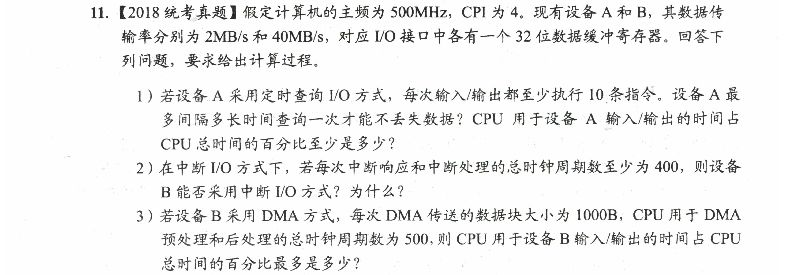

- **若准备数据的时间小于取走数据的时间，则数据会被刷新，造成丢失**
  - 准备数据的时间：**①缓冲区大小**$\div$ **②I/O速率**=**③最大准备数据时间**，单位
    $n(10^{-9}) s,\mu(10^{-6}) s,m(10^{-3})s$
    等，每轮的查询时间必须小于等于这个时间，才能来得及把数据取走
    - 可以理解为工人把货物一个个搬过来，缓冲区大小就是仓库大小，I/O速率是工人的速度，没来得及取走数据只能放在外面容易丢
    - 若取**④取走数据的时间**=**③最大准备数据时间**，则**⑤每秒的查询次数**最小，**⑤每秒的查询次数**至少为1$\div$**④取走数据的时间**=**②I/O速率**$\div$**①缓冲区大小**
  - 取走数据的时间：每轮的查询时间
    - 中断I/O方式：中断响应和中断处理的总时间
    - DMA：会自己把数据取出
- CPU用于查询的时间占总时间的最小比例：一秒内CPU用于设备A输入/输出的所需时钟周期占总时钟周期(即主频)的比率
  - 先算出一次数据传送所用的时钟周期
  - 然后算出每秒的总数据传输次数（即每秒申请的中断次数）
  - 相乘得到用于中断的开销时钟周期
  - 除以主频即为所求
- DMA方式
  - 后处理包含对DMA中断的处理
  - DMA⑤每秒的查询次数最多为②I/O速率$\div$①缓冲区大小

## 输入输出基本概念\*

### I/O系统发展

1. 早期，CPU和I/O串行工作，分散连接：
   - 程序查询方式：由CPU通过程序不断查询I/O设备是否已做好准备，从而控制I/O设备与主机交换信息。

2. 接口模块和DMA阶段，CPU和I/O并行工作，总线连接：
   - 中断方式：只在I/O设备准备就绪并向CPU发出中断请求时才予以响应。
   - DMA方式：主存和/O设备之间有一条直接数据通路，当主存和I/O设备交换信息时，无需调用中断服务程序。

3. 具有I/O通道结构，在系统中设有通道控制部件，每个通道都挂接若干外设，主机在执行I/O命令时，只需启动有关通道，通道将执行通道程序，从而完成I/O操作。

4. 具有I/O处理机。

   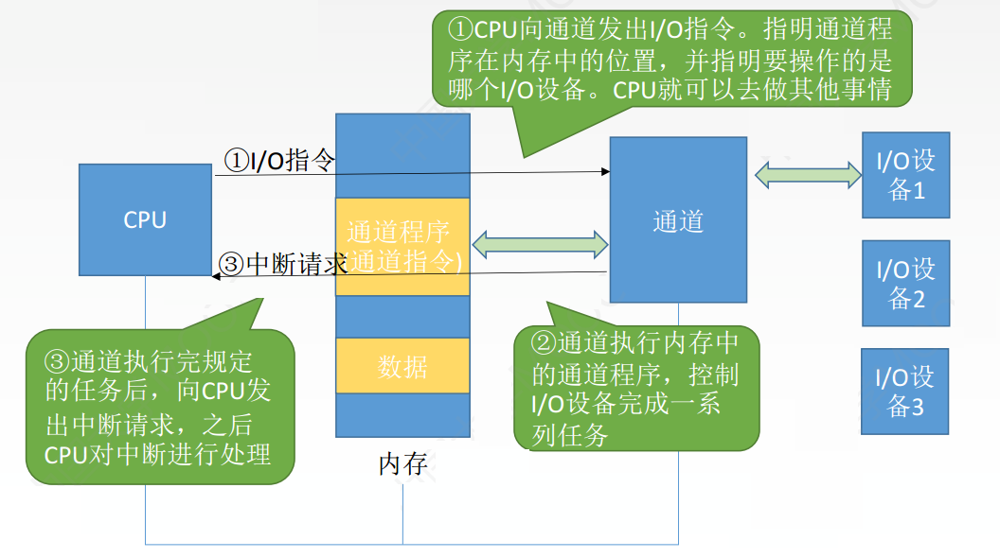

### I/O系统组成

1. I/O软件：
   - 包括驱动程序、用户程序、管理程序、升级补丁等。

   - 通常采用I/O指令和通道指令实现CPU和I/O设备的信息交换：

   - I/O指令：
     - CPU指令的一部分。
     - 机器指令的一部分。
     - 反映CPU与I/O设备交换信息的特点。
     - 分为操作码（表明识别I/O指令）+命令码（执行的操作）+设备码（操作的设备）。（与一般指令格式不同）

   - 通道指令（通道程序）：
     - 通道自身的指令。
     - 指出数据的首地址、传送字数、操作作命令。
     - 通道指令提前编制好放在主存中。
     - 通道指令由通道执行。由CPU执行启动I/O设备的指令，通道执行通道指令代替CPU对I/O设备进行管理。
     - 只有具备通道的I/O系统才能执行。

     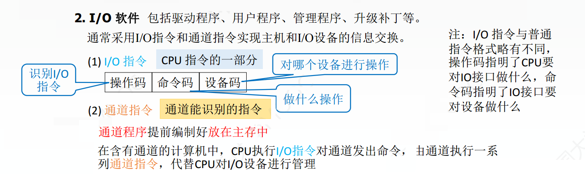

2. I/O硬件：
   - I/O接口。

   - 设备控制器：通过设备控制器，I/O设备与主板的系统总线相联。

   - 外设。

     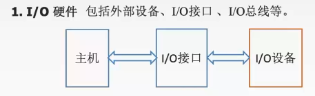

## 外部设备\*

外部设备也称外围设备，是除了主机以外的、能直接或间接与计算机交换信息的装置。

### 输入设备

用于向计算机系统输入命令和文本、数据等信息的部件。键盘和鼠标是最基本的输入设备。

#### 键盘

- 键盘是最常用的输入设备，通过它可发出命令或输入数据。
- 键盘通常以矩阵的形式排列按键，每个键用符号标明它的含义和作用。
- 每个键相当于一个开关，当按下键时，电信号连通；当松开键时，弹簧把键弹起，电信号断开。
- 键盘输入信息可分为三个步骤：
  1. 查出按下的是哪个键。
  2. 将该键翻译成能被主机接收的编码，如ASCII码。
  3. 将编码传送给主机。

#### 鼠标

- 鼠标是常用的定位输入设备，它把用户的操作与计算机屏幕上的位置信息相联系。
- 常用的鼠标有机械式和光电式两种。
- 工作原理：当鼠标在平面上移动时，其底部传感器把运动的方向和距离检测出来，从而控制光标做相应运动。

### 输出设备

用于将计算机系统中的信息输出到计算机外部进行显示、交换等的部件，显示器和打印机是最基本的输出设备。

#### 显示器

按显示设备所用的显示器件分类：

- 阴极射线管（CRT）显示器：
  - CRT显示器主要由电子枪、偏转线圈、荫罩、高压石墨电极和荧光粉涂层及玻璃外壳 $5$ 部分组成。

  - 具有可视角度大、无坏点、色彩还原度高、色度均匀、可调节的多分辨率模式、响应时间极短~等目前LCD难以超过的优点~。
    - ~~时代变了~~

    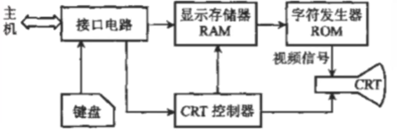

- 液晶显示器（LCD）：
  - 利用液晶的电光效应，由图像信号电压直接控制薄膜晶体管，再间接控制液品分子的光学特性来实现图像的显示。
  - 体积小、重量轻、省电、无辐射、绿色环保、画面柔、不伤眼等。

- LED显示器：通过控制半导体发光二极管进行显示，用来显示文字、图形、图像等各种信息。

- LCD、LED是两种不同的显示技术，LCD是由液态晶体组成的显示屏，而LED则是由发光二极管组成的显示屏。与LCD相比，LED显示器在亮度、功耗、可视角度和刷新速率等方面都更具优势。

按所显示的信息内容分类：

- 字符显示器：
  - 显示字符的方法以点阵为基础。点阵是指由 $m\times n$ 个点组成的阵列。
    - 点阵的多少取决于显示字符的质量和字符窗口的大小。

    - 字符窗口是指每个字符在屏幕上所占的点数，它包括字符显示点阵和字符间隔。

  - 将点阵存入由ROM构成的字符发生器中，在CRT进行光栅扫描的过程中，从字符发生器中依次读出某个字符的点阵，按照点阵中
    $0$ 和$1$代码不同控制扫描电子束的开或关，从而在屏幕上显示出字符。
    - 对应于每个字符窗口，所需显示字符的ASCII代码被存放在视频存储器VRAM中，以备刷新。

    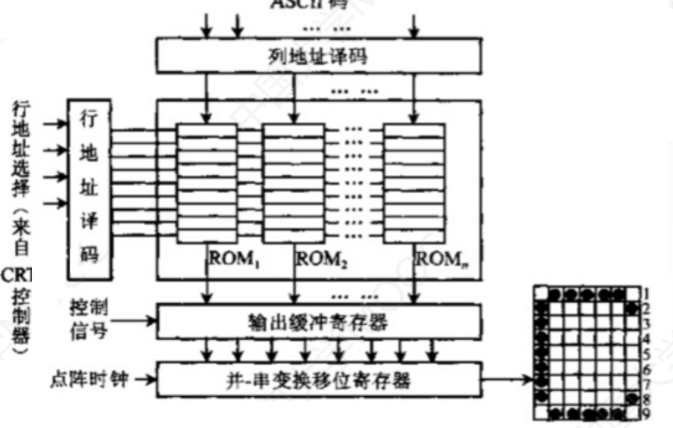

- 图形显示器：
  - 将所显示图形的一组坐标点和绘图命令组成显示文件存放在缓冲存储器中，缓存中的显示文件传送给矢量（线段）产生器，产生相应的模拟电压，直接控制电子束在屏幕上的移动。
    - 为了在屏幕上保留持久稳定的图像，需要按一定的频率对屏幕进行反复刷新。
  - 这种显示器的优点是分辨率高且显示的曲线平滑。目前高质量的图形显示器采用这种随机扫描方式。
  - 缺点是当显示复杂图形时，会有闪烁感。
  - 按扫描方式不同可分为：光栅扫描显示器、随机扫描显示器。

- 图像显示器。

参数：

- 屏幕大小：以对角线长度表示，常用的有 $12\sim29$ 英寸等。
- 分辨率：所能表示的像素个数，屏幕上的每一个光点就是一个像素，以宽、高的像素的乘积表示，例如，$800\times600 $、$
  1024\times768 $和$ 1280\times1024$等。
- 灰度级：指黑白显示器中所显示的像素点的亮暗差别，在彩色显示器中则表现为颜色的不同，灰度级越多，图像层次越清楚逼真，典型的有
  $8$ 位（$256 $级）、$ 16 $位等。$ n$位可以表示 $2^n$ 种不同的亮度或颜色。
  - 即每个像素点需要多少个比特位表示

- 刷新：光点只能保持极短的时间便会消失，为此必须在光点消失之前再重新扫描显示一遍，这个过程称为刷新。
- 刷新频率：单位时间内扫描整个屏幕内容的次数，按照人的视觉生理，刷新频率大于 $30Hz$
  时才不会感到闪烁，通常显示器刷新频率在 $60$ 到$120Hz$。
- 显示存储器（VRAM）：也称刷新存储器，为了不断提高刷新图像的信号，必须把一帧图像信息存储在刷新存储器中。其存储容量由图像分辨率和灰度级决定，分辨率越高，灰度级越多，刷新存储器容量越大。
  - VRAM容量=分辨率×灰度级位数。
    - 刷新存储器中存储单元的字长取决于显示的颜色数，颜色数为$m $，字长为$ n$，二者的关系为$2^n=m$。
    - 例如像素的颜色数为$256 $，$ 256=2^8 $，因此刷新存储器单元字长为$ 8$位即 $1$ 个字节$(1B)$
  - VRAM带宽=分辨率×灰度级位数(先化为字节)×帧频。即显存带宽，单位为MB/s
  - 现代计算机中，显存除了作为当前帧的缓存还会用于保存即将渲染的图像数据
  - 集成显卡计算机中，通常分配一片内存作为显存

每个存储汉字数据的汉字内码占$2B $，表示汉字形体的字形码以$ 16\times16 $点阵表示，为$ 32B$大小。

#### 打印机

打印机是计算机的输出设备之一，用于将计算机处理结果打印在相关介质上。

按印字原理不同可分为：

- 击打式打印机：
  - 利用机械动作使印字机构与色带和纸相撞而打印字符。
  - 优点：设备成本低；印字质量好。
  - 缺点：噪声大；速度慢。
- 非击打式打印机:
  - 采用电、磁、光、喷墨等物理、化学方法来印刷字符。
  - 优点：速度快；噪声小。
  - 缺点：成本高。

按打印机工作方式不同可分为：

- 串行打印机：
  - 逐字打印。
  - 速度慢。
- 行式打印机：
  - 逐行打印。
  - 速度快。

按工作方式可分为：

- 针式打印机：
  - 原理：在联机状态下，主机发出打印命令，经接口、检测和控制电路，间歇驱动纵向送纸和打印头横向移动，同时驱动打印机间歇冲击色带，在纸上打印出所需内容。
  - 特点：针式打印机擅长“多层复写打印”，实现各种票据或蜡纸等的打印。它工作原理简单，造价低廉，耗材（色带）便宜，但打印分辨率和打印速度不够。
- 喷墨式打印机：
  - 原理：带电的喷墨雾点经过电极偏转后，直接在纸上形成所需字形。彩色喷墨打印机基于三基色原理，即分别喷射
    $3$ 种颜色墨滴，按一定的比例混合出所要求的颜色。
  - 特点：打印噪声小，可实现高质量彩色打印，通常打印速度比针式打印机快；但防水性差，高质量打印需要专用打印纸。
- 激光打印机：
  - 原理：计算机输出的二进制信息，经过调制后的激光束扫描，在感光鼓上形成潜像，再经过显影、转印和定影，便在纸上得到所需的字符或图像。
  - 特点：打印质量高、速度快、噪声小、处理能力强；但耗材多、价格较贵、不能复写打印多份，且对纸张的要求高。激光打印机是将激光技术和电子显像技术相结合的产物。感光鼓（也称为硒鼓)是激光打印机的核心部件。

### 外存设备

- 是指除计算机内存及CPU缓存等以外的存储器。硬磁盘、光盘等是最基本的外存设备。
- 计算机的外存储器又称为辅助存储器，目前主要使用磁表面存储器。
- 所谓“磁表面存储”，是指把某些磁性材料薄薄地涂在金属铝或塑料表面上作为载磁体来存储信息。磁盘存储器、磁带存储器和磁鼓存储器均属于磁表面存储器。
- 磁表面存储器的优点:
  1. 存储容量大，位价格低。
  2. 记录介质可以重复使用。
  3. 记录信息可以长期保存而不丢失，甚至可以脱机存档。
  4. 非破坏性读出，读出时不需要再生。
- 磁表面存储器的缺点:
  1. 存取速度慢。
  2. 机械结构复杂。
  3. 对工作环境要求较高。
- 原理：当磁头和磁性记录介质有相对运动时，通过电磁转换完成读/写操作。
- 编码方法：按某种方案（规律），把一连串的二进制信息变换成存储介质磁层中一个磁化翻转状态的序列，并使读/写控制电路容易、可靠地实现转换。
- 磁记录方式：通常采用调频制（FM）和改进型调频制（MFM）的记录方式。

#### 磁盘存储器

- 磁盘设备的组成：
  - 存储区域：一块硬盘含有若干个记录面，每个记录面划分为若干条磁道，而每条磁道又划分为若干个扇区。
  - 扇区（也称块）是磁盘读写的最小单位，也就是说磁盘按块存取。
    - 磁头数（Heads）：即记录面数，表示硬盘总共有多少个磁头，磁头用于读取/写入盘片上记录面的信息，一个记录面对应一个磁头。
    - 柱面数（Cylinders）：表示硬盘每一面盘片上有多少条磁道，一个盘组中，不同记录面的相同编号（位置）的诸磁道构成一个圆柱面。
    - 扇区数（Sectors）：表示每一条磁道上有多少个扇区。
  - 硬盘存储器：
    - 硬盘存储器由磁盘驱动器、磁盘控制器和盘片组成。
    - 磁盘驱动器：核心部件是磁头组件和盘片组件，温彻斯特盘是一种可移动头固定盘片的硬盘存储器。
    - 磁盘控制器：是硬盘存储器和主机的接口，主流的标准有IDE、SCSI、SATA等。
- 磁盘的性能指标：
  - 磁盘容量：一个磁盘所能存储的字节总数称为磁盘容量。
    - 非格式化容量是指磁记录表面可以利用的磁化单元总数。
    - 格式化容量是指按照某种特定的记录格式所能存储信息的总量。
  - 记录密度：指盘片单位面积上记录的二进制的信息量。
    - 道密度：沿磁盘半径方向单位长度上的磁道数。
    - 位密度：磁道单位长度上能记录的二进制代码位数。
    - 面密度：位密度和道密度的乘积。
    - 磁盘最里面的位密度最大，最外面的位密度最低。注意虽然每一道的道密度不同，但是每一道所含的数据量是一样的。
  - 平均存取时间=寻道时间（磁头移动到目的磁道）+旋转延迟时间（磁头定位到所在扇区）+传输时间（传输数据所花费的时间）。
  - 数据传输率：磁盘存储器在单位时间内向主机传送数据的字节数，称为数据传输率。
- 磁盘地址：
  - 主机向磁盘控制器发送寻址信息，磁盘的地址=驱动器号+柱面（磁道）号+盘面号+扇区号。
  - 若系统中有 $4$ 个驱动器，每个驱动器带一个磁盘，每个磁盘 $256$
    个磁道、$16 $个盘面，每个盘面划分为$ 16 $个扇区，则每个扇区地址要$ 18 $位二进制代码：驱动器号（$
    2bit $）+柱面（磁道）号（$ 8bit $）+盘面号（$ 4bit $）+扇区号（$ 4bit$）。
- 磁盘工作过程：
  - 硬盘的主要操作是寻址、读盘、写盘。每个操作都对应一个控制字，硬盘工作时，第一步是取控制字，第二步是执行控制字。
  - 硬盘属于机械式部件，其读写操作是串行的，不可能在同一时刻既读又写，也不可能在同一时刻读两组数据或写两组数据。

#### 磁盘阵列

- RAID（廉价冗余磁盘阵列）是将多个独立的物理磁盘组成一个独立的逻辑盘，数据在多个物理盘上分割交叉存储、并行访问，具有更好的存储性能、可靠性和安全性。
- RAID的分级如下所示。在RAID1到RAID5的几种方案中，无论何时有磁盘损坏，都可以随时拔出受损的磁盘再插入好的磁盘，而数据不会损坏：
  - RAID0：无冗余和无校验的磁盘阵列。
  - RAID1：镜像磁盘阵列。
  - RAID2：采用纠错的海明码的磁盘阵列。
  - RAID3：位交叉奇偶校验的磁盘阵列。
  - RAID4：块交叉奇偶校验的磁盘阵列。
  - RAID5：无独立校验的奇偶校验磁盘阵列。

#### 光盘存储器

- 光盘存储器是利用光学原理读/写信息的存储装置，它采用聚焦激光束对盘式介质以非接触的方式记录信息。
- 光盘存储系统：
  - 光盘片：
    - 透明的聚合物基片。
    - 铝合金反射层。
    - 漆膜保护层的固盘。
  - 光盘驱动器。
  - 光盘控制器。
  - 光盘驱动软件。
- 特点：
  - 存储密度高。
  - 携带方便。
  - 成本低。
  - 容量大。
  - 存储期限长。
  - 容易保存。
- 光盘的类型如下：
  - CD-ROM：只读型光盘，只能读出其中内容，不能写入或修改。
  - CD-R：只可写入一次信息，之后不可修改。
  - CD-RW：可读可写光盘，可以重复读写。
  - DVD-ROM：高容量的CD-ROM，DVD表示通用数字化多功能光盘。

#### 固态硬盘

- 在微小型高档笔记本电脑中，采用高性能Flash Memory作为硬盘来记录数据，这种“硬盘”称固态硬盘。
- 固态硬盘除了需要Flash Memory外，还需要其他硬件和软件的支持。
- 闪存（Flash Memory）是在E2PROM的基础上发展起来的，本质上是只读存储器。

## I/O接口

即I/O控制器，是主机和外设之间的交接界面，通过接口可以实现主机和外设之间的信息交换。

### 接口基本概念

#### I/O接口的功能

I/O接口的主要功能如下：

1.  **选址功能**：进行地址译码和设备选择。
    - CPU送来选择外设的地址码后，接口必须对地址进行译码以产生设备选择信息，使主机能和指定外设交换信息。
    - 因为IO总线与所有的接口电路相连接，所以CPU要通过设备选择线上的设备码确定要选择那一个接口，当设备选择线上的设备码和本设备的设备码相同时，这个接口应该对此做出响应，发出设备响应信号SEL。
2.  实现主机和外设的通信联络控制。
    - 解决主机与外设时序配合问题，协调不同工作速度的外设和主机之间交换信息，以保证整个计算机系统能统一、协调地工作。
3.  实现数据缓冲。
    - CPU与外设之间的速度往往不匹配，为消除速度差异，接口必须设置数据缓冲寄存器，用于数据的暂存，以避免因速度不一致而丢失数据。
4.  **信号/数据**格式的转换。
    - 外设与主机两者的电平、数据格式都可能存在差异
    - 接口应提供计算机与外设的信号格式的转换功能
      - 如电平转换、并/串或串/并转换、模/数或数/模转换等。
5.  传送控制命令和状态信息。
    - CPU要启动某一外设时，通过接口中的命令寄存器向外设发出启动命令
    - 外设准备就绪时，则将内容为`准备好`的状态信息送回接口中的状态寄存器
    - 并反馈给CPU外设向CPU提出中断请求时，CPU也应有相应的响应信号反馈给外设。
    - **包括I/O操作的定时**

> ①选址功能、②传送命令功能、③传送数据功能、④反映I/O设备工作状态的功能

#### I/O接口的基本结构

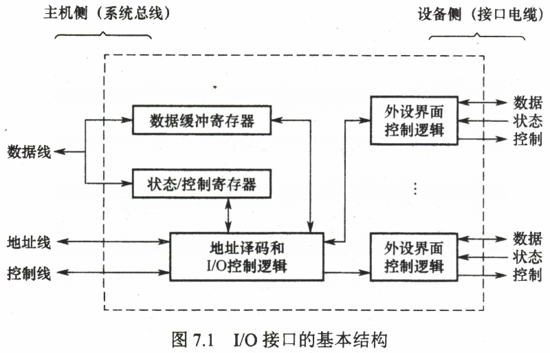

1. 主机侧---I/O总线---内部接口：内部接口与系统总线相连，实质上是与内存、CPU相连。~数据的传输方式只能是并行传输。~
   - ~~时代变了~~，从 $2000$
     年后总线技术慢慢从并行向串行转换，所以**数据的传输方式可能是并行传输也有可能是串行传输**
   - 磁盘驱动器向盘片磁道记录数据时采用**串行方式**写入。
2. 设备侧-外部接口：外部接通过接口电缆与外设相连，外部接口的数据传输可能是串行方式，因此I/O接口需具有串/并转换功能。
3. CPU与I/O接口之间通过数据线、地址线、命令线、状态线和控制线连接。
   1. 数据总线：在数据缓冲寄存器与内存或CPU的寄存器之间进行数据传送
      - 它们承载着从 CPU 发送到 I/O 接口（或从 I/O 接口发送到 CPU）的读写数据、状态字、控制字、中断类型字。
      - **数据线的宽度（即位数）决定了一次可以传输的数据量，通常是以字节或字（多字节）为单位**。
      - 同时接口和设备的状态信息被记录在状态寄存器中，通过数据线将状态信息送到CPU
      - **CPU对外设的控制命令也通过数据线传送**，一般将其送到I/O接口的**控制寄存器**
   2. 地址线：地址线用于指示要访问的内存地址或 I/O 设备的寄存器地址。
      - 和读/写控制信号一起被送到I/O接口的控制逻辑部件，通过控制线传送来的读/写信号确认是读寄存器还是写寄存器
      - 此外控制线还会传送一些仲裁信号和握手信号
      - CPU 通过地址线向 I/O 接口发送地址信息，以指示它希望访问的特定位置。
      - 地址线的位数决定了 CPU 可以寻址的内存或 I/O 空间的大小。

   3. 状态线：状态线用于从 I/O 接口向 CPU 报告特定的状态或条件。
      - 例如，I/O 接口可以通过状态线向 CPU 报告数据传输完成、设备准备就绪或发生错误等状态。
      - CPU 可以通过检查状态线上的信号来了解 I/O 设备的状态并作出相应的处理。

   4. 控制线：控制线用于传递控制信号，指示 I/O 设备的特定操作或状态。
      - 这些信号可以包括读取、写入、复位、使能等操作。
      - 控制线的状态可以触发 I/O 设备执行相应的操作。
      - CPU 通过控制线向 I/O 设备发送控制信号，以控制数据的流动和设备的行为。

      - **读写I/O端口的信号和中断请求信号**

4. I/O接口与外部设备通过数据线相连，I/O接口向外设通过命令线传递命令，外设向I/O接口通过状态线传递状态。
5. 控制寄存器、状态寄存器在使用时间上是错开的，因此有的I/O接口中可将二者合二为一
6. I/O控制器中的各种寄存器也被称为I/O端口
   - 如数据缓存端口(数据缓冲寄存器)，控制端口(控制寄存器)、状态端口(状态寄存器)
   - CPU同外设之间的信息传送实质是对接口中的某些寄存器（即端口）进行读或写。
7. 常见**I/O接口/I/O控制器**：打印机适配器，网络控制器，可编程中断控制器

> 接口和端口是两个不同的概念。端口是指接口电路中可以进行读/写的寄存器，若干端口加上相应的控制逻辑才可以组成接口。

#### I/O接口类型

- 按数据传送方式：
  - 并行接口：一个字节或一个字所有位同时传送。
  - 串行接口：一位一位地传送。
  - 这里所说的数据传送方式指的是外设和接口一侧的传送方式~，而在主机和接口一侧，数据总是并行传送的。~接口要完成数据格式转换。
    - 同上，时代变了
- 按主机访问I/O设备的控制方式：
  - 程序查询接口。
  - 中断接口。
  - DMA接口。
- 按功能选择的灵活性：
  - 可编程接口。
  - 不可编程接口。

### I/O端口与I/O地址

- 接口Interface：
  - 端口Port：接口电路中可以被CPU直接访问的寄存器
    - 数据端口：可读可写。
    - 控制端口：只写。
    - 状态端口：只读。
  - 若干端口加上相应的**控制逻辑电路**组成接口。

I/O端口要想能够被CPU访间，必须要有端口地址，每一个端口都对应着一个端口地址。

[^统一编址和独立编址]:
    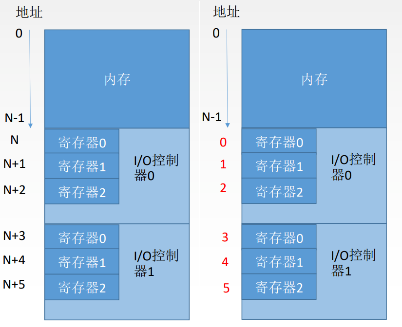

> [!IMPORTANT] **I/O 端口编址方式**：
>
> 1. **统一编址** (Memory-mapped
>    I/O)：将 I/O 端口视为内存单元，使用访存指令。不占用 I/O 指令，但占用内存空间。常用于 **RISC**。
> 2. **独立编址** (I/O-mapped I/O)：I/O 端口与内存地址空间独立，使用专门的 I/O 指令（如 IN,
>    OUT）。不占用内存空间，但指令少，控制复杂。

## I/O方式

即主机和I/O设备之间的数据传送的控制方式。

常用的I/O方式有程序查询、程序中断、DMA和通道等，其中前两种方式更依赖于CPU中程序指令的执行。

### 程序查询方式

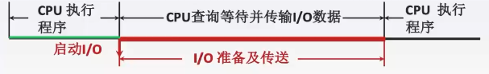

- 独占查询（Polling）：
  - 独占查询是一种基本的 I/O 方式，其中 CPU 不断地查询 I/O 设备的状态，以确定是否就绪进行数据的传输或接收。
  - CPU 使用指令周期中的一部分时间来轮询（查询） I/O 设备的状态，通常通过读取**状态寄存器**或者查询**状态线**来获取设备的状态信息。
  - 如果 I/O 设备就绪，CPU 就会执行相应的数据传输或接收操作，如果设备不就绪，CPU 将继续查询直到设备就绪为止。
  - 独占查询方式需要占用大量的 CPU 时间，因为 CPU 必须不断地查询设备的状态，这可能导致 CPU 的效率较低。

- 定时查询（Timing）：
  - 定时查询是一种改进的 I/O 方式，其中 CPU 在设定的时间间隔内周期性地查询 I/O 设备的状态。
  - CPU 在规定的时间间隔内发出查询请求，然后继续执行其他任务，直到查询结束后再次发起查询。
  - 定时查询方式使用定时器或者计数器来控制查询的时间间隔，可以更好地利用 CPU 的时间，避免不必要的查询操作，提高了 CPU 的效率。
  - 如果 I/O 设备就绪，CPU就会执行相应的数据传输或接收操作；如果设备不就绪，CPU 将等待下一次查询时机。

- x86中的I/O指令实例:

  ```asm
  IN Rd,Rs  #把IO端口Rs的数据输入到CPU寄存器Rd
  OUT Rd,Rs #把CPU寄存器Rs的数据输出到IO端口Rd
  ```

- 过程：
  1. CPU执行初始化程序，并预置传送参数：设置计数器、设置数据首地址。
  2. 向I/O接口发送命令字，启动I/O设备。
  3. CPU从接口读取设备状态信息。
  4. CPU不断查询I/O设备状态，直到外设准备就绪。CPU一旦启动I/O，必须停止现行程序的运行，并在现行程序中插入一段程序。
     - 主要特点：CPU有“踏步”等待现象，CPU与I/O串行工作。
  5. 状态就绪后传输一次数据，一般为一个字。
  6. 修改地址和计数器参数。
  7. 判断传送是否结束（一般计数器为 $0$ 时结束）。如果没有结束则转第三步，直到计数器为$0$。

  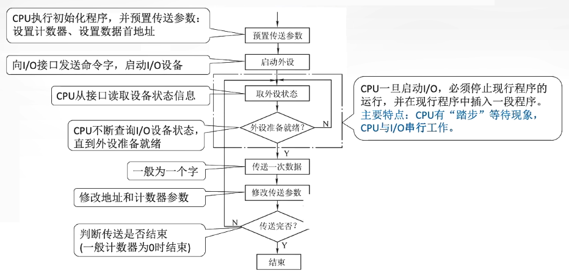

- 优点：接口设计简单、设备量少。

- 缺点：
  - CPU在信息传送过程中要花费很多时间用于查询和等待
  - 而且在一段时间内只能和一台外设交换信息
  - 效率低。

> 完成读写的流程
>
> 1. CPU向控制器发出读指令
>    - 于是设备启动，并且状态寄存器设为$1$（未就绪）。
>      - 状态寄存器值为 $1$ 表示正在忙碌
>    - $CPU\to I/O$
> 2. 轮询检查控制器的状态
>    - 其实就是在不断地执行程序的循环
>    - 读取I/O模块的状态，若状态位一直是$1$，说明设备还没准备好要输入的数据
>      - $I/O\to CPU$
>    - 于是CPU会不断地轮询
>    - I/O设备发生可能发生错误，所以需要处理错误
> 3. 输入设备准备好数据后将数据传给控制器，并报告自身状态。
> 4. 控制器将输入的数据放到数据寄存器中，并将状态改为$0$（已就绪）。
> 5. CPU发现程序已就绪，将数据寄存器中的内容读入CPU寄存器中
>    - $I/O\to CPU$
> 6. 再把CPU寄存器中的内容放入内存
>    - $CPU\to$存储器
> 7. 若还要继续读入数据，则CPU继续发出读指令。
>
>   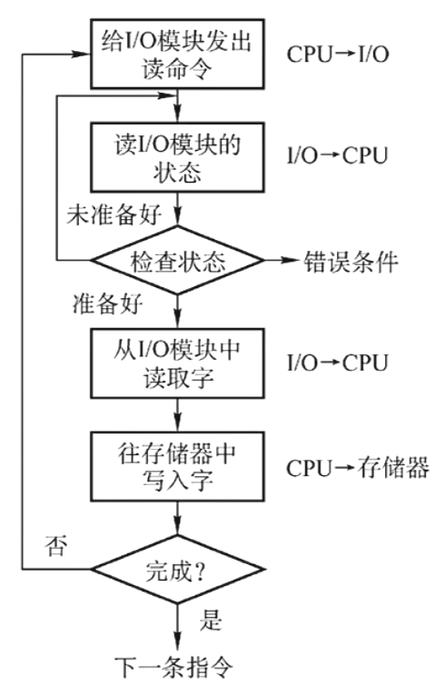

### 程序中断方式

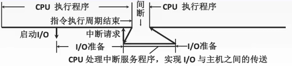

工作流程:

1. 中断请求：中断源向CPU发送中断请求信号。
   - CPU根据**中断标志位**判断中断来自谁
2. 中断响应：响应中断的条件。
   - 中断判优：多个中断源同时提出请求时通过中断判优逻辑响应一个中断源。
3. 中断处理：
   - 中断隐指令。
   - 中断服务程序。

#### 中断和异常

- 程序中断是指在计算机执行现行程序的过程中，出现某些急需处理的异常情况或特殊请求，CPU暂时中止现行程序，而转去对这些异常情况或特殊请求进行处理，在处理完毕后CPU又自动返回到**现行程序的断点处**，继续执行原程序。
- 内中断（**异常**、例外、陷入）信号来自CPU内部，与当前执行的命令有关，必须立刻处理，且对于无法恢复故障的需要终止进程。
  - 三种分类
    - 陷阱、自陷Trap：是一种事先安排的"异常"事件，用于在用户态下调用操作系统内核程序，此时会执行一条特殊的指令一一陷入指令，如**条件陷阱指令**引起的**访管中断**。

    - 故障Fault：通常是由指令执行引起的异常，如**非法操作码、缺页故障、除数为零、运算溢出**等。
    - 终止Abort：是指出现了使得CPU无法继续执行的硬件故障，如**控制器出错、存储器校验错**等。

  - 异常由指令在执行中产生，而中断不与指令相关，也不阻止指令的完成。
  - 异常的检测由CPU完成，不需要外部信号通知，中断必须CPU通过总线获取中断源标记信息才能知道中断的类型。
  - **异常是不可屏蔽的中断**，而通过INTR信号线发出的中断是可屏蔽的中断。

- 外中断（**中断**）是来自CPU外部的设备向CPU发出的中断请求，通常用于信息的输入和输出，**与当前执行的命令无关**。
  - **可屏蔽中断**INTR是指**通过INTR线发出的中断请求**，通过改变屏蔽字可以实现多重中断，从而使得中断处理更加灵活。
    - 可屏蔽中断的优先级最低，在关中断模式下不会被响应
    - 在关中断状态下，中断请求信号被屏蔽，不会触发相应的中断服务例程，这意味着**当关中断状态被激活时，任何中断请求都会被忽略**，直到中断被重新允许。
      - 关中断作用：实现原子操作
  - **非屏蔽中断 NMI**是指**通过NMI线发出的中断请求**，通常是紧急的硬件故障，如**电源掉电**等
  - 常见外中断：
    - 外设请求：如I/O操作完成时发出的中断信号。
    - **时钟中断：时间片已到**。
    - 人工干预。
- 随着计算机的发展，中断技术不断被赋予新的功能，主要功能有：
  1.  实现CPU与I/O设备的并行工作。
  2.  处理硬件故障和软件错误。
  3.  实现人机交互，用户干预机器需要用到中断系统。
  4.  实现多道程序、分时操作，多道程序的切换需借助于中断系统。
  5.  实时处理需要借助中断系统来实现快速响应。
  6.  实现应用程序和操作系统(管态程序)的切换，称为“软中断”。 多处理器系统中各处理器之间的信息交流和任务切换。
- 常见中断事件
  - 外部事件如按Esc键以退出运行的程序等，属于外中断
  - 虚拟存储器失效如缺页等，会发出缺页中断，属于内中断
  - 浮点数上溢，表示超过了浮点数的表示范围，属于内中断
    - 浮点数运算下溢，直接当作机器零处理，而**不会引发中断**

  - 需要请求操作系统服务时会引起**访管中断**，属于内中断
    - 需要进行I/O操作时

  - I/O操作完成时发出的中断信号属于外设请求，是外中断
  - 定时器/时间片到时描述的是时钟中断，属于外中断
  - 网络数据包到达描述的是CPU执行指令以外的事件，属于外中断

#### 中断请求

- 中断请求标记：
  - 每个**中断源**向CPU发出中断请求的时间是随机的。
    - **中断源**是请求CPU中断的设备或事件，**一台计算机允许有多个中断源**。
  - 为了记录中断事件并区分不同的中断源，中断系统需对每个中断源设置中断请求标记触发器INTR
    - 当其状态为“$1$"时，表示中断源有请求。
    - 这些触发器可组成中断请求标记寄存器，该寄存器可集中在CPU中，也可分散在各个中断源中。
  - 对于外中断，CPU是在统一的时刻即每条指令执行阶段结束前向接口发出中断查询信号，以获取I/O的中断请求，也就是说，CPU响应中断的时间是在每条指令执行阶段的结束时刻。
- 中断判优，即多个中断发生时处理顺序的次序：中断响应的判优通常由硬件**排队器**实现
  - 中断判优既可以用硬件实现，也可用软件实现。
  - 硬件实现是通过硬件排队器实现的，它既可以设置在CPU中，也可以分散在各个中断源中。

  - 软件实现是通过查询程序实现的。

- 中断优先级：
  1. **不可屏蔽中断** > 内部**异常** > **可屏蔽中断**
     - 内部异常中，**硬件故障 > 软件中断**
  2. DMA请求>I/O设备传送的中断请求。
  3. 在I/O传送类中断请求中，**高速设备>低速设备，输入设备>输出设备，实时设备>普通设备**。

#### 响应中断的条件

> [!IMPORTANT] **CPU 响应中断的三个必要条件**：
>
> 1. **中断源有中断请求**：$INTR = 1$。
> 2. **CPU 允许中断**：即开中断，$IF = 1$。
> 3. **指令执行结束**：一条指令执行完毕，且没有更紧迫的任务（如 DMA 请求）。

中断隐指令指 CPU 在响应中断后在执行中断服务程序前的准备操作。由硬件实现，不是指令系统的真实指令，没有操作码，也不能被用户使用。

> [!NOTE]
> **I/O 中断响应时间**：I/O 设备的就绪时间是随机的，但 CPU 仅在**每条指令执行阶段结束前**向接口发出中断查询信号。即 CPU 响应中断的时间是在每条指令执行阶段的结束时刻（异常除外）。

#### 中断处理过程

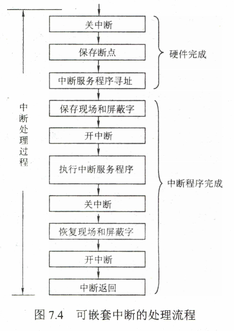

> [!IMPORTANT] **中断处理全过程**：
>
> 1. **关中断**（硬件）：防止现场保护时被打断。
> 2. **保存断点**（硬件）：保存 PC 到堆栈或特定单元。
> 3. **引出中断服务程序**（硬件）：识别中断源（向量法或软件查询法）。
> 4. **保存现场和屏蔽字**（软件）：保存通用寄存器内容。
> 5. **开中断**（软件）：允许中断嵌套（多重中断）。
> 6. **执行中断服务程序**（软件）：具体业务处理。
> 7. **关中断**（软件）：恢复现场前防止被打断。
> 8. **恢复现场和屏蔽字**（软件）：恢复寄存器内容。
> 9. **开中断、中断返回**（软件）：返回断点继续执行。

---

- **中断隐指令**的主要任务（$1 $到$ 3$）：由硬件自动完成
  1. 关中断：在中断服务程序中，为了保护中断现场（即CPU主要寄存器中的内容）期间不被新的中断所打断，必须关中断，从而保证被中断的程序在中断服务程序执行完毕之后能接着正确地执行下去。
     - 在保护断点和现场的过程中，CPU不能响应更高级中断源的中断请求
     - 否则，若断点或现场保存不完整，在中断服务程序结束后，就不能正确地恢复并继续执行现行程序

  2. 保存断点：为了保证在中断服务程序执行完毕后能正确地返回到原来的程序，必须将原来程序的断点（即程序计数器PC的内容）保存起来。
     - 可以存入堆栈寄存器，也可以存入指定单元。
     - 异常指令通常并没有执行成功，**异常处理后要重新执行**，所以其**断点是当前指令的地址**，**中断的断点则是下一条指令的地址**。

  3. 引出中断服务程序：识别中断源，引出中断服务程序的实质就是取出中断服务程序的入口地址(起始地址)并传送给**程序计数器**PC。有两种方法识别中断源：
     1. 软件查询法/非向量中断。
        - 由测试程序按一定优先排队次序检查各个设备的“中断触发器”。
        - 当遇到第一个‘1’标志时，即找到了优先进行处理的中断源，通常取出其设备码，根据设备码转入相应的中断服务程序。

     2. 硬件向量法：每个中断有类型号，每个中断类型号对应一个中断服务程序，每个程序有一个入口地址，CPU需要找到这个地址，这就是**中断向量**（**中断向量**是中断服务程序的入口地址，**中断向量地址**是中断服务程序入口地址的地址）。
        - 由中断向量地址形成硬件产生中断向量地址（中断类型号），再由向量地址找到入口地址。

        - 系统中保存中断向量的存储器就是中断向量表。
          - **中断向量就是服务程序的入口地址，中断向量地址是入口地址的地址**
        - **采用中断向量法的中断被称为向量中断**

     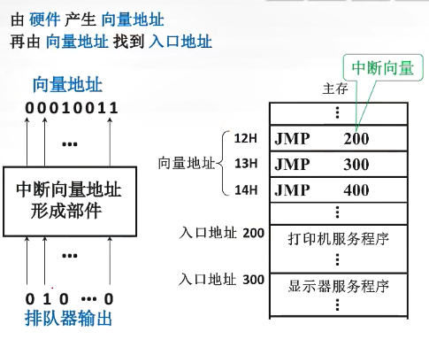

- 中断服务程序的任务（$4 $到$ 9$）：由中断服务程序完成 4. 保存现场和中断屏蔽字：

         - **保存程序断点PC由中断隐指令完成**

         - 可以使用堆栈，也可以使用特定存储单元。
         - **现场和断点都不能被中断服务程序破坏**。
         - **现场信息是用户可见的寄存器的内容**，现场信息因为用指令可直接访问，所以通常在中断服务程序中通过指令把它们保存到栈中，即**由软件实现**
             - 保存通用寄存器和状态寄存器的内容，由中断服务程序完成，例如保存ACC寄存器的值
         - 而**断点信息**由CPU在中断响应时自动保存到栈或专门寄存器中，即**由硬件实现**。

  5.  开中断。允许更高级中断请求得到响应，实现中断嵌套。

  6.  中断服务（设备服务）：主体部分，如通过程序控制需打印的字符代码送入打印机的缓冲存储器中。
      - 此时可能修改ACC寄存器的值

  7.  关中断。保证在恢复现场和屏蔽字时不被中断。

  8.  恢复现场：通过出栈指令或取数指令把之前保存的信息送回寄存器中。
      - 恢复ACC寄存器的值

  9.  开中断，中断返回：通过中断返回指令回到原程序断点处。

#### 多重中断技术

- 单重中断：执行中断服务程序时不响应新的中断请求。

- 多重中断：又称中断嵌套，执行中断服务程序时可响应新的中断请求。

- 中断屏蔽技术：主要用于多重中断，CPU要具备多重中断的功能，须满足下列条件：
  1.  在中断服务程序中提前设置开中断指令。
  2.  优先级别高的中断源有权中断优先级别低的中断源。

- 所有屏蔽触发器组合在一起，便构成一个屏蔽字寄存器，屏蔽字寄存器的内容称为屏蔽字。

- 中断屏蔽标志**可以改变**多个中断服务**程序执行完的次序**，但是**不能改变开始执行的次序**，因为中断请求响应顺序由排队器控制。
  - 即**无法改变中断请求优先级**

  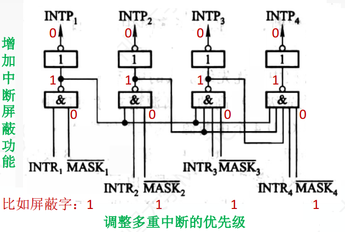

- 屏蔽字设置规律：
  - **`1`表示屏蔽该中断源的请求，`0`表示可以正常申请**。
  - 每个中断源对应一个屏蔽字（在处理该中断源的中断服务程序时，屏蔽寄存器中的内容为该中断源对应的屏蔽字）。
  - 屏蔽字中 $1$ 越多，优先级越高。每个屏蔽字中至少有一个$1$（至少要能屏蔽自身的中断）。
    - 即**自己不可以中断自己**

- 在保护现场关中断，在执行中断处理程序时开中断。

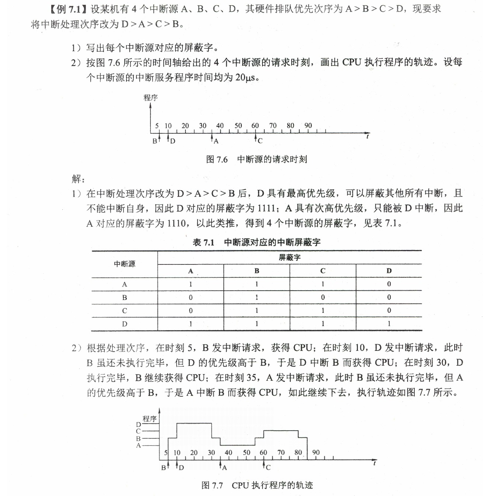

#### 程序中断I/O方式实现

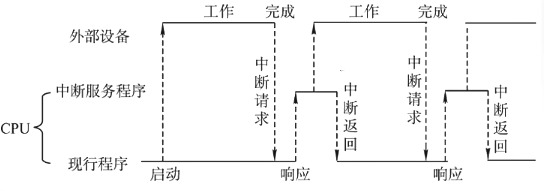

- 思想：允许I/O设备主动打断CPU的运行并请求服务，从而"解放”
  CPU，使得其向I/O控制器发送读命令后可以继续做其他有用的工作
  - 外设为某进程准备数据时，可令该进程阻塞，CPU运行其他进程

- 完成读写的流程
  1. 由于I/O设备速度很慢，因此在CPU发出读/写命令后，可将等待I/O的进程阻塞，先切换到别的进程执行
     - $CPU\to I/O$
  2. 当I/O完成后，控制器会向CPU发出一个中断信号，CPU检测到中断信号后，会保存当前进程的运行环境信息，转去执行中断处理程序处理该中断
     - $I/O\to CPU$
  3. 处理中断的过程中，CPU从I/O控制器读一个字的数据传送到CPU寄存器，再写入主存
     - $I/O\to CPU$
  4. 接着，CPU恢复等待I/O的进程（或其他进程）的运行环境，然后继续执行
     - $CPU\to$存储器

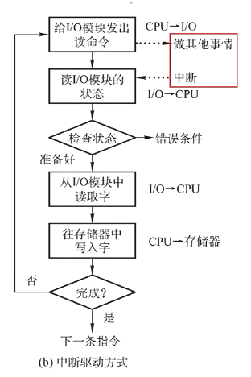

- 【注意】：
  - **CPU会在每个**指令周期**的末尾检查中断**。
  - 中断处理过程中需要保存、恢复进程的运行环境，这个过程是需要一定时间开销的
    - 可见，如果中断发生的频率太高，也会降低系统性能。
  - 若中断处理程序的执行时间大于请求中断的周期时间，会丢失数据，不能采用程序中断I/O方式
  - **若准备数据的时间小于中断响应和中断处理时间总和，则数据会被刷新，造成丢失**
- CPU干预的频率
  - 每次I/O操作开始之前、完成之后需要CPU介入
  - 等待I/O完成的过程中CPU**可以切换到别的进程执行**。
- 数据传送的单位：每次读/写一个字。
- 数据的流向：
  - 读操作（数据输入）:
    - I/O设备→CPU的寄存器→内存
  - 写操作（数据输出）
    - 内存→CPU的寄存器→I/O设备。
- 主要缺点和主要优点：
  - 优点：CPU和I/O设备可并行工作，CPU利用率得到明显提升。
    - 与“程序直接控制方式”相比，在“中断驱动方式”中，I/O控制器会通过中断信号主动报告I/O已完成，CPU不需要不停地轮询。
  - 缺点：由于**每个字在I/O设备与内存之间的传输，都需要经过CPU**，导致频繁的中断处理**依然会消耗较多的CPU时间**。

### DMA方式

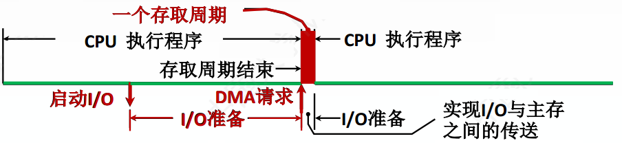

DMA方式优先级高于中断方式，这样处理速度更快。

> **CPU在每个**存储周期**结束后检查是否有DMA请求**
>
> **CPU在每个**指令周期**结束后检查是否有中断请求**

#### DMA控制器

- 因为每一个数据都要中断一次，对于快速I/O设备有大量数据时CPU需要大量中断服务。
- 所以使用硬件——DMA控制器控制大量数据传输。
- 直到完成一整块的数据读写才会向CPU发送一次中断请求
  - **磁盘控制器中的数据缓冲区每充满一次，DMA控制器就需要发出一次总线请求**

- 在DMA方式中，当I/O设备需要进行数据传送时，通过DMA控制器（DMA接口）向CPU提出DMA传送请求，CPU响应之后将让出系统总线，由DMA控制器接管总线进行数据传送
  - 在DMA传送过程中，DMA控制器将接管CPU的地址总线、数据总线和控制总线，CPU的主存控制信号被禁止使用。
  - 而当DMA传送结束后，将恢复CPU的一切权利并开始执行其操作。
  - **DMA控制器必须具有控制系统总线的能力**

- 其主要流程/功能如下：
  1. 接受外设发出的DMA请求，并向CPU发出总线请求。
  2. 在每个存储周期（机器周期）后CPU检查是否存在DMA请求，若有则响应此总线请求，发出总线响应倍号，接管总线控制权，进入DMA操作周期。
  3. 确定传送数据的主存单元地址及长度，并能自动修改主存地址计数和传送长度计数。
  4. 规定数据在主存和外设间的传送方向，发出读写等控制信号，执行数据传送操作。
  5. 向CPU报告DMA操作的结束，发出中断。

DMA控制时，CPU对主存没有控制权，而DMA有。

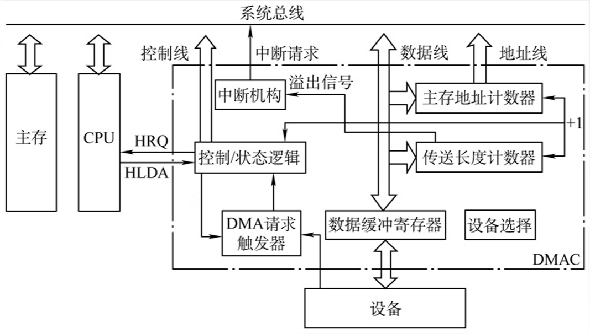

如上图为DMA控制器内部结构:

- 控制/状态逻辑：由控制和时序电路及状态标志组成，用于指定传送方向，修改传送参数，并对DMA请求信号和CPU响应信号进行协调和同步。
- DMA请求触发器：每当I/O设备准备好数据后给出一个控制信号，使DMA请求触发器置位（为$1$）。
- 主存地址计数器AR：存放交换的数据的主存地址，能自动加减$1$。
- 传送长度计数器WC：用来记录传送数据的长度，计数溢出时，数据即传送完毕，自动发中断请求信号。
- 数据缓冲寄存器DR：用于暂存每次传送的数据。
- 中断机构：当一个数据块传送完毕后触发中断机构，向CPU提出中断请求。

#### DMA传送方式

- 主存和DMA控制器之间有一条专用数据通路，因此**主存和I/O设备之间交换信息时，不通过CPU**。
  - 读操作（数据输入）:I/O设备→内存。

  - 写操作（数据输出）:内存→I/O设备。

- 但当I/O设备和CPU同时访问主存时，可能发生冲突，为了有效地使用主存，DMA控制器与CPU通常采用以下三种方法使用主存：
  1. 停止CPU访问主存：当I/O设备有DMA请求时，由DMA控制器向CPU发送一个停止信号， 使CPU脱离总线，停止访问主存，直到DMA传送一块数据结束
     - 控制简单。

     - CPU处于不工作状态或保持状态。

     - 未充分发挥CPU对主存的利用率。

       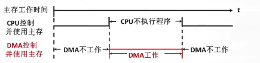

  2. 周期挪用（周期窃取）：当I/O接口没有DMA请求时，CPU按程序要求访问内存，一旦I/O接口有DMA请求，则I/O接口挪用一个或几个周期
     - **周期挪用指主存的**存取周期\*\*\*\*

     - 当I/O设备有DMA请求时，会遇到3种情况
       1. CPU此时不访存：不冲突。
          - 如CPU正在执行乘法指令
       2. CPU正在访存：此时必须**待存取周期结束后**，CPU再将总线占有权让出给DMA。
       3. CPU、DMA同时请求访存：DMA的I/O访存优先，挪用几个存取周期。传输一个字后立刻释放总线，是一种单字传送方式。
          - I/O访存优先级高于CPU访存，因为**I/O不立即访存就可能丢失数据**

     - 缺点：数据输入或输出过程中实际占用了CPU时间

       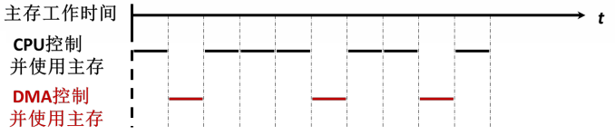

  3. DMA和CPU交替访存：将一个CPU周期分为两个周期，一个给DMA使用一个给CPU使用：
     - 例如，若CPU的工作周期是$1.2\mu s $，主存的存取周期小于$ 0.6\mu
       s$，则可将一个CPU周期分为C1和C2两个周期，其中C1专供DMA访存，C2专供CPU访存

     - **不需要总线使用权的申请、建立和归还过程**。

     - 效率高，但实现起来有困难，基本上不被使用。

     - 适用于CPU的工作周期比主存存取周期长的情况

       

#### DMA传送过程

> [!WARNING] 图片资源丢失 (原路径: [!WARNING] 资源丢失: image-20230913221800727 (原路径:
> (C:/Users/willi/AppData/Roaming/Typora/typora-user-images/image-20230913221800727.png) ))

内存→数据总线→DMAC（DMA控制器）→外设。

CPU只在开始和结尾参与控制，DMA控制整个传输过程，分为预处理、数据传送和后处理3个阶段：

1.  预处理：由CPU完成一些必要的准备工作
    - 本阶段工作
      1.  测试I/O设备状态，初始化DMA控制器
          - CPU执行几条I/O指令，用以测试I/O设备状态
          - 初始化DMA控制器中的有关寄存器、设置传送方向、启动该设备等

      2.  CPU继续执行原来的程序，直到I/O设备准备好
      3.  I/O设备向DMA控制器发送DMA请求
      4.  再由DMA控制器向CPU发送总线请求（有时将这两个过程统称为DMA请求），用以传输数据。

    - 数据流向
      - 主存起始地址 $\rightarrow$ 主存地址寄存器AR。

      - I/O设备地址$\rightarrow DAR$。

      - 传送数据个数 $\rightarrow$ 传送长度计数器WC。

      - 启动I/O设备

2.  数据传送：继续执行主程序同时完成一批数据的传送。
    - 详细流程，以数据输入为例：
      1.  设备将数据输入**数据缓冲寄存器**DR中。
      2.  写满后向**DMA请求触发器**发送DMA请求。
      3.  **DMA控制器**向CPU申请总线控制权发送HRQ信号。
      4.  CPU将总线控制权交给**DMA控制器**，发送HLDA信号，**DMA控制器**接管总线。
      5.  **DMA控制器**将地址从主存地址计数器上送到地址线上，将数据从**数据缓冲寄存器DMAC**送到数据线上。
      6.  修改地址和长度参数并返回**传送长度计数器**WC和**主存地址计数器**AR中。
      7.  若**传送长度计数器**WC溢出（传输结束），则向中断机构发出溢出信号，中断机构经总线向CPU发出中断信号。
    - **DMA的数据传输可以以单字节（或字）为基本单位，也可以以数据块为基本单位**。
    - 对于以数据块为单位的传送（如硬盘），DMA占用总线后的数据输入和输出操作都是通过循环来实现的。
    - 需要指出的是，这一循环也是由DMA控制器（而非通过CPU执行程序）实现的，即**数据传送阶段完全由DMA （硬件）控制**

3.  后处理：
    - DMA控制器向CPU发送中断请求，CPU执行中断服务程序做DMA结束处理
      - 包括校验送入主存的数据是否正确、测试传送过程中是否出错（错误则转诊断程序）及决定是否继续使用DMA传送其他数据等

#### DMA方式特点

- 主存和DMA接口之间有一条直接数据通路——DMA总线。
- 由于DMA方式传送数据不需要经过CPU，因此**不必中断现行程序**，I/O与主机并行工作，程序和传送并行工作。
- 只有DMA方式是靠硬件电路实现的
- DMA方式只能用于数据传输，它不具有对异常事件的处理能力
  - 不能中断现行程序，而键盘和鼠标均要求CPU立即响应，因此无法采用DMA方式

- DMA方式具有下列特点:
  1. 它使主存与CPU的固定联系脱钩，**主存既可被CPU访问，又可被外设访问**。
  2. 在数据块传送时，主存地址的确定、传送数据的计数等都由硬件电路直接实现。
  3. 主存中要开辟专用缓冲区，及时供给和接收外设的数据。
  4. DMA传送速度快，**CPU和外设并行工作**，提高了系统效率。
  5. DMA在传送开始前要通过程序进行预处理，结束后要通过中断方式进行后处理。
  6. **不用保护和恢复现场**。
  7. 不能立即响应，所以**不适合键盘和鼠标**这种情景。

### I/O方式对比

> [!IMPORTANT] **I/O 方式对比**：| 特性 | 程序查询 | 程序中断 | DMA | | :--- | :--- | :--- | :--- |
> | **CPU干预** | 频繁查询（踏步等待） | 仅在数据传输时介入 | 仅在预处理/后处理介入 | | **数据流向**
> | I/O <-> CPU <-> 内存 | I/O <-> CPU <-> 内存 | I/O <-> 内存 (直接) | | **响应时刻**
> | 随查询指令 | 指令执行结束 | 存储周期结束 | | **并行性** | 串行 |
> CPU与I/O并行，程序与传送串行 | 全并行 | | **主要应用** | 低速设备 | 中/低速设备 | 高速设备 |

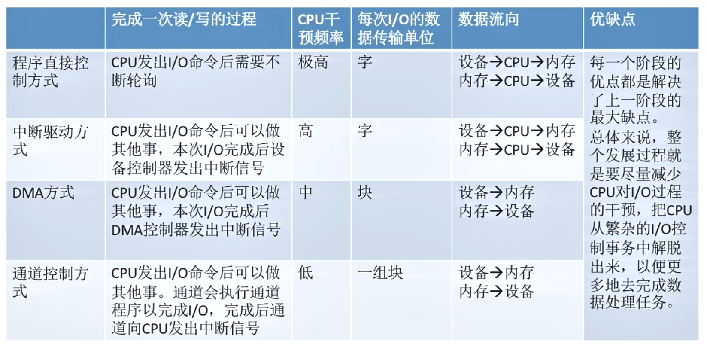

DMA方式与中断控制方式的区别：

1.  中断控制方式在每个数据传送完成后中断CPU，而DMA控制方式则在所要求传送的一批数据全部传送结束时中断CPU。
2.  中断控制方式的数据传送在中断处理时由CPU控制完成，而DMA控制方式则在DMA控制器的控制下完成。
    - 不过，在DMA控制方式中，**数据传送的方向、存放数据的内存始址及传送数据的长度等信息仍然由CPU控制**。

3.  DMA方式以存储器为核心，中断控制方式以CPU为核心，因此DMA方式能与CPU并行工作。

4.  DMA方式传输批量的数据，中断控制方式的传输则以字节为单位。

5.  从数据传送来看，中断方式靠程序传送，DMA方式靠硬件传送

6.  中断方式具有处理异常事件的能力，而DMA方式仅局限于数据的传送，无法处理异常事件

7.  DMA请求的优先级高于中断请求。

8.  对中断请求的响应只能发生在每条指令执行结束时（执行周期后），而对DMA请求的响应可以发生在任意一个机器周期结束时（取指、间址、执行周期后均可）

9.  中断方式是程序的切换，需要保护和恢复现场；而DMA方式不中断现行程序，无需保护现场，除了预处理和后处理，其他时候不占用任何CPU资源。

DMA方式与通道方式的区别：

1.  在DMA控制方式中，在DMA控制器控制下设备和主存之间可以成批地进行数据交换而不用CPU干预，这样既减轻了CPU的负担，又大大提高了I/O数据传送的速度。
2.  通道控制方式与DMA控制方式类似，也**是一种以内存为中心实现设备与内存直接交换数据的控制方式**。
3.  不过在通道控制方式中，CPU只需发出启动指令，指出通道相应的操作和I/O设备，该指令就可以启动通道并使通道从内存中调出相应的通道程序执行。
4.  与DMA控制方式相比，**通道控制方式所需的CPU干预更少**，并且**一个通道可以控制多台设备**，进一步减轻了CPU的负担。
5.  另外，对通道来说，可以**使用一些指令灵活改变通道程序**，这一点DMA控制方式无法做到。

下面用一个例子来总结这4种I/O方式。想象一位客户要去裁缝店做一批衣服的情形

1.  采用程序控制方式时，裁缝没有客户的联系方式，客户必须每隔一段时间去裁缝店看看裁缝把衣服做好了没有，这就浪费了客户不少的时间。
2.  采用中断方式时，裁缝有客户的联系方式，每当他完成一件衣服后，给客户打一个电话，让客户去拿，与程序直接控制能省去客户不少麻烦， 但每完成一件衣服就让客户去拿一次，仍然比较浪费客户的时间。
3.  采用DMA方式时，客户花钱雇一位单线秘书，并向秘书交代好把衣服放在哪里（存放仓库），裁缝要联系就直接联系秘书， 秘书负责把衣服取回来并放在合适的位置，每处理完
    $100$ 件衣服，秘书就要给客户报告一次（大大节省了客户的时间）。
4.  采用通道方式时，秘书拥有更高的自主权，与DMA方式相比，他可以决定把衣服存放在哪里，而不需要客户操心。而且，何时向客户报告，是处理完
    $100$ 件衣服就报告， 还是处理完 $10000$
    件衣服才报告，秘书是可以决定的。客户有可能在多个裁缝那里订了货，一位DMA类的秘书只能负责与一位裁缝沟通，但通道类秘书却可以与多名裁缝进行沟通。
